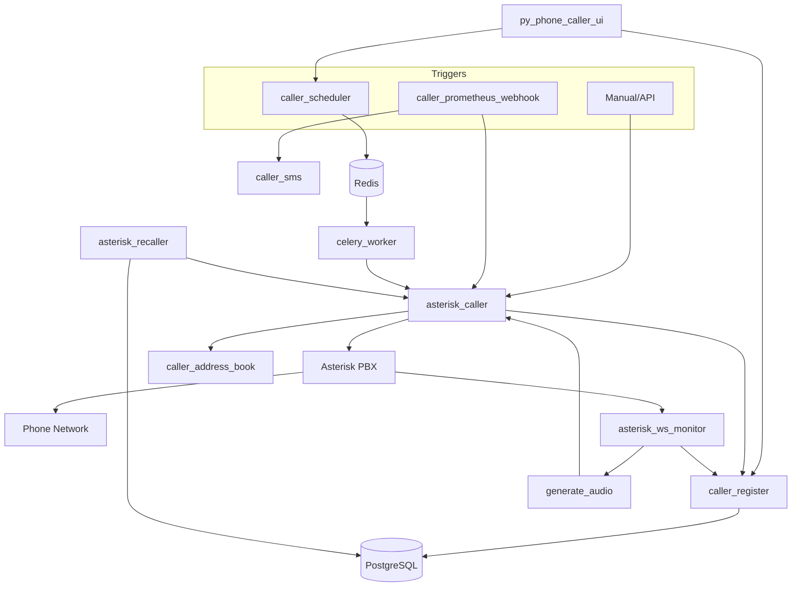

# py-phone-caller

Automated phone call and SMS alerting platform for Asterisk-based environments.

> [!WARNING]
> **Security Notice**: This solution is designed to run inside a trusted network segment.
> Only the Web UI should be exposed, and it must be protected by authentication and a reverse proxy.
> All other services should remain private.

## Overview

py-phone-caller is a Python-based alerting platform that turns events into outbound phone calls and SMS messages _(USB GSM Modem and Twilio)_ through Asterisk PBX _(phone calls)_. It can be triggered manually (API/UI), scheduled for later delivery, or driven by Prometheus Alertmanager _(Nagios or Zabbix)_.

The system is built as a set of microservices that communicate over HTTP and queue work with Celery/Redis. Text-to-speech (TTS) services generate the audio played in calls, and a web UI provides operational visibility.

## Key Features

- Outbound calls via Asterisk ARI with retry and escalation logic.
- Prometheus Alertmanager webhook integration.
- Multi-engine TTS gTTS, AWS Polly, Facebook MMS, Piper, Kokoro.
- SMS delivery via Twilio or an on-premise USB modem backend.
- Scheduling and queue-backed processing with Celery/Redis.
- Contact and on-call rotation management.
- Web UI for call history, scheduling, users, and events.

## Architecture



## Components

| Component | Purpose | Docs |
| --- | --- | --- |
| `asterisk_caller` | Places outbound calls via Asterisk ARI and plays audio. | [README](src/asterisk_caller/README.md) |
| `asterisk_ws_monitor` | Consumes ARI WebSocket events and triggers playback/audio generation. | [README](src/asterisk_ws_monitor/README.md) |
| `asterisk_recaller` | Retries failed or unacknowledged calls and escalates to backups. | [README](src/asterisk_recaller/README.md) |
| `caller_register` | Central registry for call attempts, status, and metadata. | [README](src/caller_register/README.md) |
| `caller_scheduler` | Schedules future calls through Celery tasks. | [README](src/caller_scheduler/README.md) |
| `celery_worker` | Executes queued and scheduled call tasks. | [src/README.md](src/README.md) |
| `caller_sms` | SMS notifications via Twilio or on-premise modem backend. | [README](src/caller_sms/README.md) |
| `caller_prometheus_webhook` | Alertmanager-compatible webhook for calls and SMS. | [README](src/caller_prometheus_webhook/README.md) |
| `caller_address_book` | Contact and on-call rotation management. | [README](src/caller_address_book/README.md) |
| `generate_audio` | Text-to-speech audio generation for call playback. | [README](src/generate_audio/README.md) |
| `py_phone_caller_ui` | Web UI for operations, scheduling, and users. | [README](src/py_phone_caller_ui/README.md) |
| `py_phone_caller_utils` | Shared library for config, DB, TTS, SMS, and telemetry. | [README](src/py-phone-caller-utils/README.md) |

## Deployment Options

- Ansible all-in-one stack: `assets/ansible/deploy_all/README.md`
- Ansible roles: `assets/ansible/asterisk_py-phone-caller/README.md` and `assets/ansible/on-vm_py-phone-caller/README.md`
- Docker Compose stack (Asterisk external): `assets/docker-compose/README.md`

## Quick Start

Pick one path.

### Option A: Docker Compose (fastest, external Asterisk required)

1. Configure Asterisk access used by the containers:
   - `src/config/settings.toml`: set `[commons] asterisk_host`, `asterisk_user`, and `asterisk_web_port` if different.
   - `src/config/.secrets.toml`: set `[commons] asterisk_pass` to your ARI password.
   - If Asterisk runs on the Docker host, use `asterisk_host = "host.containers.internal"`.
   - Asterisk setup details: `assets/ansible/asterisk_py-phone-caller/README.md`
2. Create the Compose environment file:
   ```bash
   cd assets/docker-compose
   cat > .env <<'EOF'
   POSTGRES_PASSWORD=change_me
   CADDY_DOMAIN_NAME=py-phone-caller.lan
   EOF
   ```
3. Build and start the stack:
   ```bash
   docker compose build
   docker compose up -d
   ```
4. Verify services are healthy:
   ```bash
   docker compose ps
   ```
5. Open the UI and retrieve the admin password:
   - UI: http://localhost:5000 (or the Caddy domain you set).
   - Admin email defaults to `admin@py-phone-caller.link` (change via `ui_admin_user`).
   - First-run password is generated and logged by `py_phone_caller_ui`:
     ```bash
     docker compose logs -f py_phone_caller_ui
     ```

### Option B: Ansible all-in-one (installs Asterisk and the stack)

1. Go to the playbook directory:
   ```bash
   cd assets/ansible/deploy_all
   ```
2. Install required collection:
   ```bash
   ansible-galaxy collection install community.general
   ```
3. Edit the inventory:
   - `assets/ansible/on-vm_py-phone-caller/inventory`
4. Edit `deploy_py-phone-caller_stack.yml` and set at least:
   - `ari_password`
   - `sip_username`
   - `sip_password`
   - `py_phone_caller_config.commons.asterisk_user` (if you do not use the default)
   - `py_phone_caller_config.commons.asterisk_host`
   - `py_phone_caller_config.commons.asterisk_pass`
   - `py_phone_caller_config.database.db_password`
   - Make sure `ari_password` and `py_phone_caller_config.commons.asterisk_pass` match.
5. Run the deployment:
   ```bash
   ansible-playbook deploy_py-phone-caller_stack.yml
   ```
6. Open the UI and retrieve the admin password:
   - UI: http://<host>:5000
   - Admin email defaults to `admin@py-phone-caller.link` (change via `ui_admin_user`).
   - First-run password is logged by the UI service:
     ```bash
     journalctl -u py-phone-caller-py_phone_caller_ui.service -n 200 --no-pager
     ```

## Configuration

- Primary settings file: `src/config/settings.toml`
- Override config location with `CALLER_CONFIG_DIR` or `CALLER_CONFIG`
- Core dependencies: Asterisk PBX with ARI enabled, PostgreSQL, Redis
- Optional integrations: Twilio credentials and TTS model downloads

## Project Status

- Core call and SMS flows are stable when deployed in a trusted network.
- Deployment automation and container orchestration are still evolving.
- Operating the stack requires Asterisk/FreePBX and Linux admin knowledge.

## Documentation

- `docs/py-phone-caller_2025.05.md` - Full architecture and call/SMS flow details.
- `docs/web-ui-tour/README.md` - Web UI walkthrough.
- `docs/virtualbox-setup.md` - Local lab setup guidance.
- `LICENSE` - BSD 3-Clause license.

## Further Readings

- [Source architecture overview](https://github.com/jcfdeb/py-phone-caller/tree/main/src#readme) - High-level tour of the `src/` microservices and how they fit together.
- [Asterisk Caller](https://github.com/jcfdeb/py-phone-caller/blob/main/src/asterisk_caller/README.md) - HTTP service that places outbound calls and plays audio via Asterisk ARI.
- [Asterisk Recaller](https://github.com/jcfdeb/py-phone-caller/blob/main/src/asterisk_recaller/README.md) - Background worker that retries failed calls and escalates to backup contacts.
- [Asterisk WS Monitor](https://github.com/jcfdeb/py-phone-caller/blob/main/src/asterisk_ws_monitor/README.md) - WebSocket listener for ARI events that triggers audio generation and playback.
- [Caller Address Book](https://github.com/jcfdeb/py-phone-caller/blob/main/src/caller_address_book/README.md) - Contact and on-call rotation service with CSV import/export.
- [Caller Prometheus Webhook](https://github.com/jcfdeb/py-phone-caller/blob/main/src/caller_prometheus_webhook/README.md) - Alertmanager webhook that turns Prometheus alerts into calls and SMS.
- [Caller Register](https://github.com/jcfdeb/py-phone-caller/blob/main/src/caller_register/README.md) - Call registry service for call attempts, statuses, and scheduled calls.
- [Caller Scheduler](https://github.com/jcfdeb/py-phone-caller/blob/main/src/caller_scheduler/README.md) - Celery-backed scheduler for future call execution.
- [Caller SMS](https://github.com/jcfdeb/py-phone-caller/blob/main/src/caller_sms/README.md) - SMS gateway service with Twilio and on-premise modem backends.
- [Generate Audio](https://github.com/jcfdeb/py-phone-caller/blob/main/src/generate_audio/README.md) - Text-to-speech service for generating call audio files.
- [py-phone-caller-utils](https://github.com/jcfdeb/py-phone-caller/blob/main/src/py-phone-caller-utils/README.md) - Shared utility library for config, DB, TTS, SMS, and telemetry helpers.
- [py_phone_caller_ui](https://github.com/jcfdeb/py-phone-caller/blob/main/src/py_phone_caller_ui/README.md) - Flask web UI for calls, schedules, users, and WS events.
- [Ansible: deploy all](https://github.com/jcfdeb/py-phone-caller/blob/main/assets/ansible/deploy_all/README.md) - One-command Ansible playbook for the full Asterisk + py-phone-caller stack.
- [Ansible: Asterisk role](https://github.com/jcfdeb/py-phone-caller/blob/main/assets/ansible/asterisk_py-phone-caller/README.md) - Role to install and configure Asterisk PBX for this system.
- [Ansible: py-phone-caller role](https://github.com/jcfdeb/py-phone-caller/blob/main/assets/ansible/on-vm_py-phone-caller/README.md) - Role to deploy the microservices stack on a VM or server.
- [Docker Compose stack](https://github.com/jcfdeb/py-phone-caller/blob/main/assets/docker-compose/README.md) - Containerized full-stack deployment (requires an external Asterisk).
- [Fedora 34 + Podman (OLD)](https://github.com/jcfdeb/py-phone-caller/blob/main/docs/fedora34-server-with-podman_though-ansible.md) - Legacy but detailed guide for FreePBX configuration and system setup.
