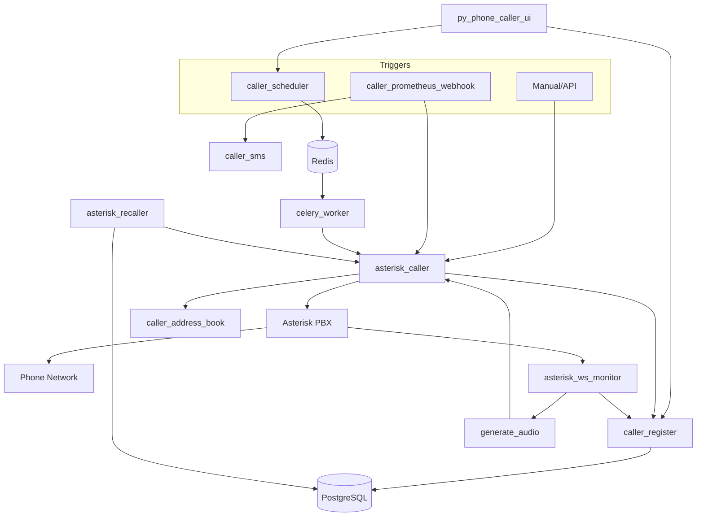

# py-phone-caller

Automated phone call and SMS alerting platform for Asterisk-based environments.

> [!WARNING]
> **Security Notice**: This solution is designed to run inside a trusted network segment.
> Only the Web UI should be exposed, and it must be protected by authentication and a reverse proxy.
> All other services should remain private.

## Overview

py-phone-caller is a Python-based alerting platform that turns events into outbound phone calls and SMS messages _(USB GSM Modem and Twilio)_ through Asterisk PBX _(phone calls)_. It can be triggered manually (API/UI), scheduled for later delivery, or driven by Prometheus Alertmanager _(Nagios or Zabbix)_.

The system is built as a set of microservices that communicate over HTTP and queue work with Celery/Redis. Text-to-speech (TTS) services generate the audio played in calls, and a web UI provides operational visibility.

## Key Features

- Outbound calls via Asterisk ARI with retry and escalation logic.
- Prometheus Alertmanager webhook integration.
- Multi-engine TTS gTTS, AWS Polly, Facebook MMS, Piper, Kokoro.
- SMS delivery via Twilio or an on-premise USB modem backend.
- Scheduling and queue-backed processing with Celery/Redis.
- Contact and on-call rotation management.
- Web UI for call history, scheduling, users, and events.

## Architecture


```mermaid
flowchart TB
    subgraph Triggers
        CPW[caller_prometheus_webhook]
        API[Manual/API]
        SCH[caller_scheduler]
    end

    UI[py_phone_caller_ui] --> SCH
    UI --> CR

    API --> AC[asterisk_caller]
    CPW --> AC
    CPW --> SMS[caller_sms]
    SCH --> RQ[(Redis)]
    RQ --> CW[celery_worker]
    CW --> AC

    AC --> AST[Asterisk PBX]
    AST --> PSTN[Phone Network]

    AST --> WSM[asterisk_ws_monitor]
    WSM --> GA[generate_audio]
    GA --> AC

    AC --> CR[caller_register]
    WSM --> CR
    AR[asterisk_recaller] --> AC

    CR --> DB[(PostgreSQL)]
    AR --> DB

    AC --> CAB[caller_address_book]
```

## Components

| Component | Purpose | Docs |
| --- | --- | --- |
| `asterisk_caller` | Places outbound calls via Asterisk ARI and plays audio. | [README](src/asterisk_caller/README.md) |
| `asterisk_ws_monitor` | Consumes ARI WebSocket events and triggers playback/audio generation. | [README](src/asterisk_ws_monitor/README.md) |
| `asterisk_recaller` | Retries failed or unacknowledged calls and escalates to backups. | [README](src/asterisk_recaller/README.md) |
| `caller_register` | Central registry for call attempts, status, and metadata. | [README](src/caller_register/README.md) |
| `caller_scheduler` | Schedules future calls through Celery tasks. | [README](src/caller_scheduler/README.md) |
| `celery_worker` | Executes queued and scheduled call tasks. | [src/README.md](src/README.md) |
| `caller_sms` | SMS notifications via Twilio or on-premise modem backend. | [README](src/caller_sms/README.md) |
| `caller_prometheus_webhook` | Alertmanager-compatible webhook for calls and SMS. | [README](src/caller_prometheus_webhook/README.md) |
| `caller_address_book` | Contact and on-call rotation management. | [README](src/caller_address_book/README.md) |
| `generate_audio` | Text-to-speech audio generation for call playback. | [README](src/generate_audio/README.md) |
| `py_phone_caller_ui` | Web UI for operations, scheduling, and users. | [README](src/py_phone_caller_ui/README.md) |
| `py_phone_caller_utils` | Shared library for config, DB, TTS, SMS, and telemetry. | [README](src/py-phone-caller-utils/README.md) |

## Prerequisites & Requirements (What You Need to Run)

Depending on your environment and the features you plan to enable (outbound voice calls, SMS messaging, local neural TTS vs. cloud TTS, monitoring alerts), here is what you need to run **py-phone-caller**:

### 1. Core System & Compute
- **Linux Operating System**: Ubuntu (22.04 / 24.04 / 26.04 LTS), Debian 12, RHEL / Rocky Linux (9 / 10), AlmaLinux (9 / 10), or openSUSE.
- **Hardware Resources**:
  - **Minimum**: 2 vCPUs, 4 GB RAM, 20 GB SSD storage.
  - **Recommended**: 4+ vCPUs, 8 GB RAM (for fast neural speech synthesis), 50 GB SSD storage.
- **Runtime Environment**:
  - **Containerized**: Docker Engine 24+ with Docker Compose v2 (`docker compose`), **OR** Podman 4.5+ with Podman Compose (`podman compose`).
  - **Native Systemd**: Python 3.14+ managed via [uv](https://docs.astral.sh/uv/) and Systemd.

### 2. Telephony & Infrastructure (Required for Phone Calls)
- **Asterisk PBX (v18+ / v20+) or FreePBX**:
  - **SIP / PJSIP Trunk**: An active SIP trunk or VoIP gateway (e.g. Twilio Elastic SIP Trunking, local telecom SIP provider, or GSM/PSTN hardware gateway) capable of placing outbound calls to landlines and mobile phones.
  - **Asterisk REST Interface (ARI)**: Enabled in `ari.conf` with HTTP/WebSocket support (default port `8088`), an ARI user (default: `py-phone-caller`), and password.
  - **Stasis Dialplan**: A context configured in `extensions.conf` to direct outbound calls into the `py-phone-caller` Stasis application.
- **PostgreSQL Database (v15+ / v17+)**:
  - Stores call logs, address book contacts, on-call schedules, SMS audit history, and web UI user accounts.
  - Relational schema tables and migrations are automatically initialized and managed via Piccolo ORM by `caller_register`.
- **Redis (v7+) or Valkey**:
  - In-memory message broker used by Celery for asynchronous call scheduling and queue workers.

### 3. Text-to-Speech (TTS) Engines: Local vs. Cloud
`generate_audio` converts alert text messages into Asterisk-compliant 8 kHz mono WAV audio files. You can choose between 100% offline local neural TTS or cloud-hosted synthesis:

| TTS Engine | Mode | What You Need | Key Benefits & Notes |
| :--- | :--- | :--- | :--- |
| **Kokoro-82M** *(Default & Recommended)* | **Local / Offline** | • CPU/RAM for inference<br>• Model weights (`kokoro-v1_0.pth` ~320MB) & voice embeddings cached in `pre_trained_models/kokoro_tts`<br>• `ffmpeg` for 8 kHz audio encoding | **Zero cloud accounts needed.** Runs 100% locally on CPU in air-gapped environments. Natural human-like speech. |
| **Piper ONNX** | **Local / Offline** | • ONNX voice model files (`.onnx` + `.onnx.json`) in `pre_trained_models/piper_tts`<br>• `ffmpeg` | Ultra-fast, lightweight neural speech synthesizer designed for local devices. |
| **Facebook MMS** | **Local / Offline** | • Hugging Face MMS model checkpoint (`facebook/mms-tts-<lang>`)<br>• `ffmpeg` | Supports over 1,000+ languages completely offline. |
| **AWS Polly** | **Cloud / Online** | • **Active AWS Account**<br>• AWS credentials (`AWS_ACCESS_KEY_ID`, `AWS_SECRET_ACCESS_KEY`, `aws_polly_region_name`)<br>• IAM permission: `polly:SynthesizeSpeech`<br>• Outbound Internet connectivity | Cloud-managed TTS service with diverse multilingual voices. |
| **gTTS** | **Cloud / Online** | • Outbound Internet access to Google Translate TTS | Lightweight cloud fallback for quick testing without API keys. |

### 4. SMS Dispatch Backends: Hardware USB Modem vs. Cloud
`caller_sms` provides two distinct SMS dispatch backends:

| SMS Backend | Mode | What You Need | Configuration & Details |
| :--- | :--- | :--- | :--- |
| **On-Premise Hardware Modem** (`on_premise`) | **Local / Offline** | • **Physical USB GSM / 3G / 4G LTE Modem** connected to the host.<br>• **Active SIM Card** with an SMS texting plan.<br>• Serial device nodes (e.g. `/dev/ttyUSB0`..`/dev/ttyUSB3`) accessible by the service user (`dialout` group).<br>• Compiled native Rust engine (`rust_engine`). | Set `caller_sms_carrier = "on_premise"` in `settings.toml`. **Zero cloud accounts needed.** High-availability modem pool with round-robin or failover strategy. Fully resilient when internet is down. |
| **Twilio Cloud SMS** (`twilio`) | **Cloud / Online** | • **Active Twilio Account**.<br>• Twilio Account SID (`twilio_account_sid`), Auth Token (`twilio_auth_token`), and an SMS-enabled sender number (`twilio_sms_from`).<br>• Outbound Internet access to `api.twilio.com`. | Set `caller_sms_carrier = "twilio"` in `settings.toml`. **Zero hardware required.** Immediate cloud dispatch worldwide. |

#### Hardware USB GSM Modem Inspection Example (`lsusb -tv`)
When using the on-premise SMS engine with a USB cellular modem (e.g., Qualcomm, Option, Huawei, SIMCom, Quectel devices), verify that the Linux kernel attaches the `option` or `qcserial` serial driver:

```text
jcf@lycaon:~> lsusb -tv
/:  Bus 05.Port 1: Dev 1, Class=root_hub, Driver=xhci_hcd/4p, 480M
    |__ Port 1: Dev 2, If 0, Class=Hub, Driver=hub/4p, 480M
        ID 2109:2813 VIA Labs, Inc. VL813 Hub
        |__ Port 4: Dev 7, If 0, Class=Vendor Specific Class, Driver=option, 480M
            ID 1e0e:9001 Qualcomm / Option
        |__ Port 4: Dev 7, If 1, Class=Vendor Specific Class, Driver=option, 480M
            ID 1e0e:9001 Qualcomm / Option
        |__ Port 4: Dev 7, If 2, Class=Vendor Specific Class, Driver=option, 480M
            ID 1e0e:9001 Qualcomm / Option
        |__ Port 4: Dev 7, If 3, Class=Vendor Specific Class, Driver=option, 480M
            ID 1e0e:9001 Qualcomm / Option
```

The native Rust engine automatically communicates over the AT command interface (`/dev/ttyUSB*`) with full UTF-8 / UCS-2 character support and active duplicate suppression.

### 5. Monitoring System Integrations (Optional)
- **Prometheus Alertmanager**: Webhook receiver configured to POST to `http://<host>:8084/alert`.
- **Nagios Core / XI**: Event handler script (`assets/scripts/nagios/nagios_event_handler_call.sh`) configured in commands.
- **Zabbix Server / Proxy**: Alert script (`assets/scripts/zabbix/zabbix_alert_call.sh`) configured in Media Types.

## Deployment Options

- Ansible all-in-one stack: `assets/ansible/deploy_all/README.md`
- Ansible roles: `assets/ansible/asterisk_py-phone-caller/README.md` and `assets/ansible/on-vm_py-phone-caller/README.md`
- Docker Compose stack (Asterisk external): `assets/docker-compose/README.md`

## Quick Start

Pick one path.

### Option A: Docker Compose (fastest, external Asterisk required)

1. Configure Asterisk access used by the containers:
   - `src/config/settings.toml`: set `[commons] asterisk_host`, `asterisk_user`, and `asterisk_web_port` if different.
   - `src/config/.secrets.toml`: set `[commons] asterisk_pass` to your ARI password.
   - If Asterisk runs on the Docker host, use `asterisk_host = "host.containers.internal"`.
   - Asterisk setup details: `assets/ansible/asterisk_py-phone-caller/README.md`
2. Create the Compose environment files:
   ```bash
   uv run python assets/scripts/config/toml_to_dynaconf_env.py \
     --input src/config/settings.toml \
     --output assets/docker-compose/env/py-phone-caller.env

   uv run python assets/scripts/config/toml_to_dynaconf_env.py \
     --ignore-missing \
     --input src/config/.secrets.toml \
     --output assets/docker-compose/env/py-phone-caller.secrets.env

   cd assets/docker-compose
   cat > .env <<'EOF'
   POSTGRES_PASSWORD=change_me
   CADDY_DOMAIN_NAME=py-phone-caller.lan
   UI_USER_RESET_PASSWORD=false
   EOF
   ```
   Set `UI_USER_RESET_PASSWORD=true` only for intentional first-time admin bootstrap or password reset, then set it back to `false` after retrieving the generated password from the UI logs.
3. Build and start the stack:
   ```bash
   docker compose build
   docker compose up -d
   ```
4. Verify services are healthy:
   ```bash
   docker compose ps
   ```
5. Open the UI and retrieve the admin password:
   - UI: http://localhost:5000 (or the Caddy domain you set).
   - Admin email defaults to `admin@py-phone-caller.link` (change via `ui_admin_user`).
   - If `UI_USER_RESET_PASSWORD=true`, the generated password is logged by `py_phone_caller_ui`:
     ```bash
     docker compose logs -f py_phone_caller_ui
     ```

### Option B: Ansible all-in-one (installs Asterisk and the stack)

1. Go to the playbook directory:
   ```bash
   cd assets/ansible/deploy_all
   ```
2. Install required collection:
   ```bash
   ansible-galaxy collection install community.general
   ```
3. Edit the inventory:
   - `assets/ansible/on-vm_py-phone-caller/inventory`
4. Edit `deploy_py-phone-caller_stack.yml` and set at least:
   - `ari_password`
   - `sip_username`
   - `sip_password`
   - `py_phone_caller_config.commons.asterisk_user` (if you do not use the default)
   - `py_phone_caller_config.commons.asterisk_host`
   - `py_phone_caller_config.commons.asterisk_pass`
   - `py_phone_caller_config.database.db_password`
   - Make sure `ari_password` and `py_phone_caller_config.commons.asterisk_pass` match.
   - For intentional first-time admin bootstrap or password reset, set `py_phone_caller_ui_reset_password: true` for one run and set it back to `false` afterwards.
5. Run the deployment:
   ```bash
   ansible-playbook deploy_py-phone-caller_stack.yml
   ```
6. Open the UI and retrieve the admin password:
   - UI: http://<host>:5000
   - Admin email defaults to `admin@py-phone-caller.link` (change via `ui_admin_user`).
   - If `py_phone_caller_ui_reset_password: true`, the generated password is logged by the UI service:
     ```bash
     journalctl -u py-phone-caller-py_phone_caller_ui.service -n 200 --no-pager
     ```

## Configuration

- Primary settings file: `src/config/settings.toml`
- Local runs can override config location with `CALLER_CONFIG_DIR` or `CALLER_CONFIG`
- Container runs should inject generated `DYNACONF_*` env files instead of baking config files into images
- Core dependencies: Asterisk PBX with ARI enabled, PostgreSQL, Redis
- Optional integrations: Twilio credentials and TTS model downloads

## Project Status

- Core call and SMS flows are stable when deployed in a trusted network.
- Deployment automation and container orchestration are still evolving.
- Operating the stack requires Asterisk/FreePBX and Linux admin knowledge.

## Documentation

- **[Master Documentation Library](doc/README.md)** - Comprehensive documentation map, architectural guides, and operational manuals.
- **[Operator Installation Guide (A to Z)](doc/OPERATOR_INSTALLATION_GUIDE.md)** - Step-by-step production installation for Ansible, Docker/Podman Compose, and Native Systemd.
- **[Architecture & Call Flows Guide](doc/architecture-and-call-flows.md)** - End-to-end call lifecycle, DTMF acknowledgment ('4' key), retry loops, and SMS flows.
- **[Services & Endpoints Reference](doc/services-and-endpoints.md)** - Complete REST API specification for all 11 microservices and health probes.
- **[FreePBX & Asterisk Setup Guide](doc/freepbx-asterisk-setup-guide.md)** - Visual configuration guide for Trunks, Extensions, Stasis Dialplan, and ARI users.
- **[Web UI Operator Tour](doc/web-ui-tour/README.md)** - Visual walkthrough of the Web Management UI, calls table, SMS dashboard, and on-call calendars.
- **[OpenTelemetry & Observability Guide](doc/opentelemetry-guide.md)** - Metrics scraping (`/metrics`), health checks (`/health`), and distributed tracing.
- **[UV Workspace & Migration Guide](doc/uv-migration-and-workspace-guide.md)** - Python 3.14 UV workspace, dependency management, and container builds.
- **[VirtualBox Local Lab Setup Guide](doc/virtualbox-setup.md)** - Local virtualization lab environment configuration.
- `LICENSE` - BSD 3-Clause license.

## Further Readings

- [Source architecture overview](src/README.md) - High-level tour of the `src/` microservices and how they fit together.
- [Asterisk Caller](src/asterisk_caller/README.md) - HTTP service that places outbound calls and plays audio via Asterisk ARI.
- [Asterisk Recaller](src/asterisk_recaller/README.md) - Background worker that retries failed calls and escalates to backup contacts.
- [Asterisk WS Monitor](src/asterisk_ws_monitor/README.md) - WebSocket listener for ARI events that triggers audio generation and playback.
- [Caller Address Book](src/caller_address_book/README.md) - Contact and on-call rotation service with CSV import/export.
- [Caller Prometheus Webhook](src/caller_prometheus_webhook/README.md) - Alertmanager webhook that turns Prometheus alerts into calls and SMS.
- [Caller Register](src/caller_register/README.md) - Call registry service for call attempts, statuses, and scheduled calls.
- [Caller Scheduler](src/caller_scheduler/README.md) - Celery-backed scheduler for future call execution.
- [Caller SMS](src/caller_sms/README.md) - SMS gateway service with Twilio and on-premise modem backends.
- [Generate Audio](src/generate_audio/README.md) - Text-to-speech service for generating call audio files.
- [py-phone-caller-utils](src/py-phone-caller-utils/README.md) - Shared utility library for config, DB, TTS, SMS, and telemetry helpers.
- [py_phone_caller_ui](src/py_phone_caller_ui/README.md) - Flask web UI for calls, schedules, users, and WS events.
- [Ansible: deploy all](assets/ansible/deploy_all/README.md) - One-command Ansible playbook for the full Asterisk + py-phone-caller stack.
- [Ansible: Asterisk role](assets/ansible/asterisk_py-phone-caller/README.md) - Role to install and configure Asterisk PBX for this system.
- [Ansible: py-phone-caller role](assets/ansible/on-vm_py-phone-caller/README.md) - Role to deploy the microservices stack on a VM or server.
- [Docker Compose stack](assets/docker-compose/README.md) - Containerized full-stack deployment (requires an external Asterisk).
