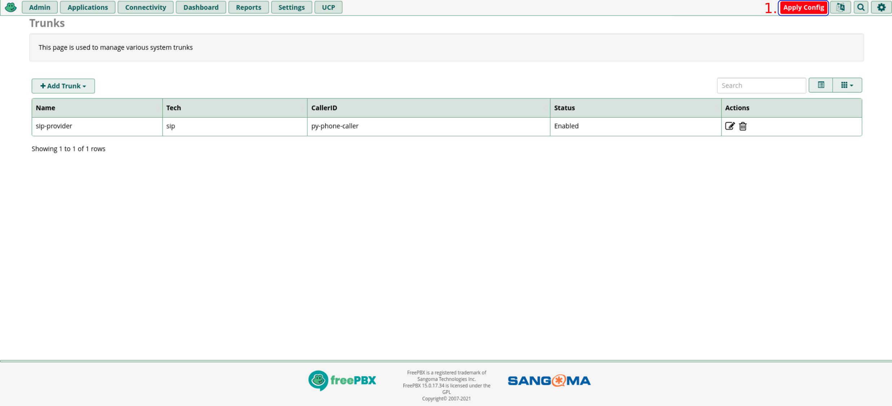
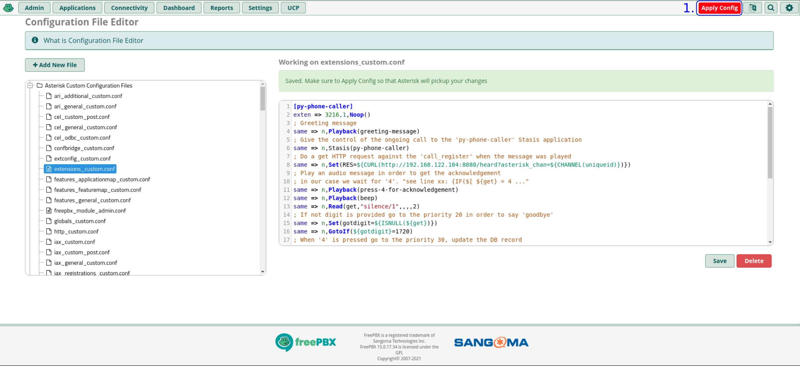

# Work In Progress - Not Yet Stable

### Preface 

#### Some assumptions 

> Please don't expose the endpoints publicly without any kind of protection. The setup is intended to be done inside your
> trusted network. 

In this use case we assume that: the system is inside a LAN and protected by a firewall without allowing connections 
from outside (*wee need to protect in some way, for example basic auth, the exposed services if we want to publish it 
in the Internet*). 

#### The Big Picture


The **py-phone-caller** components are represented using the *blue* boxes. The third party components or dependencies are 
the *green* boxes, and the *yellow* box is the receiver of the *calls/messages*.


#### A Little Description Of The Components


* **generate_audio**
  * *Role*: used to create and host the audio files player by the Asterisk PBX.
  * *Container repository*: quay.io/py-phone-caller/generate_audio
  * *FROM*: fedora:34 *(base container image)*


* **caller_sms**
  * *Role*: used to send the SMS messages through a service provider.
  * *Container repository*: quay.io/py-phone-caller/caller_sms  
  * *FROM*: redhat/ubi8:8.4-206.1626828523 *(base container image)*


* **caller_prometheus_webhook**
  * *Role*: start a call or send an SMS message when a Prometheus alert is received. 
  * *Container repository*: quay.io/py-phone-caller/caller_prometheus_webhook
  * *FROM*: redhat/ubi8:8.4-206.1626828523 *(base container image)*

> The **caller_prometheus_webhook** has 4 endpoints that behaves differently.
>
> * call_only: used to originate a single call
> * sms_only: used to send a single SMS
> * sms_before_call: first, send an SMS and later originate a call (after the amount of seconds configured in: 
> ```sms_before_call_wait_seconds```)
> * call_and_sms: used to send the SMS and place the call at the same time.


* **call_register**
  * *Role*: used to register on the PostgreSQL DB the arriving calls with useful details. 
  * *Container repository*: quay.io/py-phone-caller/call_register
  * *FROM*: redhat/ubi8:8.4-206.1626828523 *(base container image)*
  

* **asterisk_ws_monitor**
  * *Role*: this component register the Stasis application against Asterisk and also log the events to the DB *(table: 'asterisk_ws_events')*.
  * *Container repository*: quay.io/py-phone-caller/asterisk_ws_monitor
  * *FROM*: redhat/ubi8:8.4-206.1626828523 *(base container image)*

              
* **asterisk_recall**
  * *Role*: reading from the database and considering the ```times_to_dial``` and ```seconds_to_forget``` configuration 
    parameters, retries a failed or not acknowledged call *(... press 4 to acknowledge...)*.  
  * *Container repository*: quay.io/py-phone-caller/asterisk_recall
  * *FROM*: redhat/ubi8:8.4-206.1626828523 *(base container image)*

  
* **asterisk_asterisk_call**
  * *Role*: has the responsibility to place the calls against the Asterisk PBX through the REST interface. 
  * *Container repository*: quay.io/py-phone-caller/asterisk_call
  * *FROM*: redhat/ubi8:8.4-206.1626828523 *(base container image)*
            


#### Current Limitations

Right now, within current version (0.0.2) there's not a *call traffic controller*, that means if many requests arrives to
the '**asterisk_call**' can cause an *undesired behaviour* since every **Stasis application** can manage *only a call at once*. 
In order to get a usable and *safe* setup we need to send a single alert when used within the '**caller_prometheus_webhook**'
or a single HTTP POST request when invoked with an HTTP client *(for example using **curl**)*.
A kind of workaround can be keep in mind the amount of seconds configured in ```seconds_to_forget``` in order to prevent 
*collisions* in the '**asterisk_call**'.

The other solution, in order to give more resiliency to our setup, is adding many instances of the '**asterisk_call**' 
and '**asterisk_ws_monitor**', behind a '**HAProxy**' instance. Keep in mind that we need one new extension entry in 
'**extensions_custom.conf**' for every '**asterisk_call**' instance.

To be clear, to manage more than a single concurrent call *(coming to the **asterisk_call**)* we need to add one more instance of:
  * '**asterisk_call**' *(has the responsibility of the call initialization using a given custom extension, and this extension
     calls the Stasis application)*
  * '**asterisk_ws_monitor**' *(the main role is the registration of a new Stasis application instance, referenced in 
     **extensions_custom.conf**. Please use unique names)*
  * An entry in '**extensions_custom.conf**' *(in order to be used exclusively by **asterisk_call** instance and where we'll 
    reference the Stasis application name configured in ```asterisk_stasis_app```)*

> Good news, we can always use the same **configuration file** and override the setting with environmental variables that
> have priority over the values in the configuration file. 
> In order to set up an environmental variable we need to convert the lowercase keyword to uppercase, for example ```asterisk_stasis_app```
> becomes ```ASTERISK_STASIS_APP```

Maybe the previous paragraph can be a little boring, at the end of this text we'll see an example of this configuration. 
In order to be more illustrative.

> **Important**: the '**chan_pjsip**' *(PJSIP channel)* is not yet supported, in the future releases the support will be added.

#### Prerequisites

* To *send a SMS* message to a cell phone: [a Twillio account](https://www.twilio.com/sms) *(optional to send SMS messages)*.
* To *call* a cell or landline phone: some SIP trunk able to place calls to the landlines or cell phones.
* A working Internet connection. 

> About the SMS messages: by now the only service provider is Twilio, but we'll add others soon.

> About the calls to landline or cell phones: the calls can be placed by using a SIP Trunking service offering termination
> services in order to reach landline and cell phones. However, a media gateway can be used in order to achieve this goal.
> Last but no least, we need to pay some cents in order to place calls and SMS messages to the landline or cell phones. These services are rarely free.

We can spread some words regarding the ways to reach the landlines and  cell phones, generally it can be done using
the services of a provider or using a media gateway connected to the landline or with a SIM card inside the device.

* [SIP Trunking in Wikipedia](https://en.wikipedia.org/wiki/SIP_trunking)
* [Media gateway in Wikipedia](https://en.wikipedia.org/wiki/Media_gateway)

**Note**: *The 'py-phone-caller' packages hasn't any endorsement/relation by/with Twilio or FreePBX, these services/products 
was used because the easy of use and the commitment with the Open Source.*

> Good news again. if you decide to not send SMS and not place calls to paid phone networks: is possible receive calls 
> to a SIP or IAX2 extension of the PBX using a soft-phone in your cell or physical phone that supports those protocols.


### Systems used in this use case 

In order to give the opportunity to those that aren't very familiar with Asterisk we'll use one of the Asterisk
distributions called FreePBX. Is easy to setting up through the web interface.

And for components that start calls, obviously, we'll use '**Fedora Server 34**' (*you can also use Fedora Workstation but 
all the tests and working setups are running on Fedora Server or CentOS 7 with Docker. 
Soon we'll try the deployment on RHEL 8, OpenShift/Kubernetes*).

* [Fedora Server 34](https://getfedora.org/it/server/download/) 
  * *(IP Address: 192.168.122.104)*

* [FreePBX 15 (*CentOS 7 based*)](https://www.freepbx.org/downloads/) (*current version at time of this writing*)
  * [SNG7-PBX-64bit-2104-1.iso](https://downloads.freepbxdistro.org/ISO/SNG7-PBX-64bit-2104-1.iso)
  * *(IP Address: 192.168.122.234)*


> Please consider that the IP address of the Fedora Server and the Asterisk system *maybe will change* according every 
> single setup. This can be really obvious but advice those without experience is a good practice to share our knowledge.  


### Configuration of the Asterisk PBX

Some configurations are needed from the Asterisk side, in order to place calls to the cell phones or landlines we need 
to configure a **SIP Trunk**. If we choose to use only local extensions without placing calls to external phones, we need
to crate a **SIP** or **IAX2** extension.

Last but not least, a *custom extension* and an **ARI** *(Asterisk REST Interface)* user are needed to used by '**py-phone-caller**' 

#### Configuration of the SIP Trunk

> Used to place calls on the public phone network, cell or landline phones.

1. First press the "**Connectivity**" button.
2. Later press the "**Trunks**" button.


1. Press the "**+ Add Trunk**" button
2. Press the "**+ Add SIP (chan_sip) Trunk**" button


1. Configure the "**Trunk Name**" *(this mane will be referenced in the 'py-phone-caller' config. As value of
   ```asterisk_chan_type``` with a value like this "*SIP/sip-provider*")*.
2. In the "**Outbound CallerID**" we can use every preferred value.
3. Open the tab "**sip Settings**".


1. Open the "**Outgoing**" tab.
2. Configure the "**Trunk Name**" *(for consistency reasons use the same name of the previous step)*.
3. On the "**PEER Details**" section insert the correct configuration values in order to reach the SIP provider.
4. To save the configuration press the "**Submit**" button.


* **PEER Details** configuration example:
```ini
type=peer
auth=md5
username=your-username
fromuser=your-username
secret=your-password
host=sip.provider.com
port=5060
qualify=yes
insecure=very
```

1. Press the '**Apply Config**' button.



1. Wait until the reloading process is done.


At this point, we've a **Trunk** configured in order to place calls to the cell and landline phones. Remember, this kind
of configuration surely has a cost depending on the kind of the provider or device used con converge with the public phone
network *(cell or landline)*. 
 

#### Configuration of the custom **extension** to use with '**py-phone-caller**'

> Can be intended as the **caller** part

Within this configuration we'll be able to start a call and pass the control to the '**py-phone-caller**' in order to 
play a given message, in our use case the message is the '*description*' of a Prometheus alert sent by the *Alertmanager*
to the '**caller_prometheus_webhook**'.
 
1. Press the "**Admin**" buttom.
2. Choose the "**Config Edit**" option.


1. From the *left side* tree select the '**extensions_custom.conf**' option.
2. Fill the "**Working on extensions_custom.conf**" text area with the right values for our setup *(we can find the right
   values on the bellow in the text snippet)*


   
1. Check again the "**Working on extensions_custom.conf**" in order to validate the new settings.
2. Press the "**Save**" button.


1. Press the "**Apply Config**" button and wait until the configuration reloading process is done.



* *The dialplan for our use case*: 

```ini
[py-phone-caller]
exten => 3216,1,Noop()
; Greeting message
same => n,Playback(greeting-message)
; Give the control of the ongoing call to the 'py-phone-caller' Stasis application
same => n,Stasis(py-phone-caller)
; Do a get HTTP request against the 'call_register' when the message was played
same => n,Set(RES=${CURL(http://192.168.122.104:8083/heard?asterisk_chan=${CHANNEL(uniqueid)})})
; Play an audio message in order to get the acknowledgement
; in our case we wait for '4'. "see line xx: {IF($[ ${get} = 4 ..."
same => n,Playback(press-4-for-acknowledgement)
same => n,Playback(beep)
same => n,Read(get,"silence/1",,,,2)
; If not digit is provided go to the priority 20 in order to say 'goodbye'
same => n,Set(gotdigit=${ISNULL(${get})})
same => n,GotoIf(${gotdigit}=1?20)
; When '4' is pressed go to the priority 30, update the DB record
; and say Goodbye.
same => e,Playback(vm-goodbye) ; If there's an error, say goodbye
same => n,Set(NOTIFYACK=${IF($[ ${get} = 4]?3:0)})
same => n,Wait(1)
same => n,GotoIf(${NOTIFYACK}=3?30)
same => 20,Set(NOTIFYACK=2)
same => 21,Playback(vm-goodbye)
same => 22,Wait(1)
same => 23,Hangup()
; Do a get HTTP request against the 'call_register' to update the DB record
; when the call was acknowledged. 
same => 30,Set(RES=${CURL(http://192.168.122.104:8083/ack?asterisk_chan=${CHANNEL(uniqueid)})})  
same => 31,Playback(vm-goodbye)
same => 32,Wait(1)
same => 33,Hangup()
same => n,Playback(vm-goodbye)
same => n,Hangup()
```

> Wait a minute!, what's doing this custom configuration block?


1. Here we define the nome of the *context* (```[py-phone-caller]```)
2. And here we go with the first line of the *3216* extension *(we can use other extension number, the important thing
   is to use the same value on the 'py-phone-caller' config)*.
3. The PBX will play the audio file '**greeting-message.wav**' *(to be created and copied to the PBX)*.
4. This line with the ```Stasis(py-phone-caller)``` gives the control of the call to the '**py-phone-caller**'.
5. When the '**py-phone-caller**' lets *continue* the call flow through the Asterisk dialplan *(in this case within our
   custom extension)* an HTTP GET request will be done against the '**call_register**' in order to record in database when 
   the message was heard. When the audio file was played, the control of the ongoing call is returned to Asterisk. 
6. The Asterisk PBX plays the audio file '**press-4-for-acknowledgement.wav**'. 
7. As the line is showing ```Playback(beep)```, the PBX will play a **beep** in order to wait the callee input.
8. The ```Read(get,"silence/1",,,,2)``` function will read the callee input *(we're waiting a **4**)*.
9. If the calle don't press the number **4** the call is terminated.


#### Creating a standard Asterisk extension (*can be SIP or IAX2*)


> To be used as alternative of the SIP Trunk (in this case we'll call to a soft-phone or VoIP phone instead of PSTN or cell phone),
> within this setup aren't additional costs when calling this kind of extensions, because they're configured in our PBX.
> Can be used from the same network where is located the PBX, if exposed to the Internet please use a security layer as
> TLS and secure passwords.
> If you choose a soft-phone installed in your cell, be sure that your internet connection has a good quality otherwise 
> the audio quality be will poor.


> **Important**: in this case the configuration value of ```asterisk_chan_type``` will be look like ```SIP``` and not
> as ```SIP/sip-provider```. We're not using a SIP **Trunk** or *Media Gateway* in order to contact phones outside our 
> PBX system.


**Note**: this endpoint can be intended as the **callee** part, the extension or phone number to call in case of a new
          Prometheus alert or an *HTTP POST* request agains the '**asterisk_call**' *(yes, if we want, also is possible 
          start a call with **cron** or something else)*

1. Press the "**Applications**" button.


1. Select the "**Extensions**" option.


1. Press the "**+ Add Extension**" button.
2. Select the "**Add New SIP (Legacy) [chan_sip] Extension**" option.


1. Configure the "**User Extension**", generally is a number. In our case we've chosen the '**1614**'. It will be 
   referenced / used as value of ```prometheus_webhook_receivers``` in the '**caller_prometheus_webhook**' configuration
   block.
2. Configure the "**Display Name**", the text that will appear on the display of the callee phone.
3. Select a strong "**Secret**" *(the password, FreePBX provides a new one automatically)*. To be configured on your soft
   phone or SIP phone.
4. Press the "**Submit**" button.


1. Press the "**Apply Config**" button.


1. Wait until the "**Reloading**" process is done.


#### Configuration of the Asterisk **ARI** user

*Last but not least*, the **Asterisk Rest Interface** user. This user will be used within the '**asterisk_ws_monitor**'
in order to register the *Stasis application* (a permanent WebSocket connection), and by the '**asterisk_call**' in order
to initialize the calls against the Asterisk PBX *(also we can refer to it as FreePBX)*.

1. Press the "**Settings**" button.
2. Select the "**Asterisk REST Interface Users**" option.


1. Press the "**+ Add User**" button.


1. Configure the "**REST Interface User Name**", in our example '**py-phone-caller**'.
2. Configure the "**REST Interface User Password**", yet proposed by the **FreePBX** web UI, *logically we can change it 
   to other value if don't agree with the proposed default value*.
3. We choose the "**Plain Text**" option only for development environments but for production please use '**Crypt**'.
   More info about the [ARI configuration](https://wiki.asterisk.org/wiki/display/AST/Asterisk+Configuration+for+ARI#AsteriskConfigurationforARI-HTTPServer).
4. Configure the "**Read Only**" option to "**No**".
5. In order to save the changes press the "**Submit**" button.


1. Press the "**Apply Config**" button.


1. Wait until the "**Reloading**" process is done.


Now with the Asterisk *(FreePBX)* system configured we can proceed with the rest of the configuration in order to run the
'**py-phone-caller**' in our **Fedora Server** instance.

### Creating the audio files used by the custom extension 

> *you can create the audio files in your system or wherever you prefer, for this example in this guide we assume
that the files will be created and converted to wave on your system to be transferred by SSH (scp) to the Asterisk PBX*.

* **Greeting message**: "*Hello, this is a recorded message from the Alerting System. With this message for you*"
* **Press 4 for acknowledge**: "*Please, Press the number 'four' to acknowledge this call*"

In order to create the audio files we'll use the '**espeak.**' package, can be installed with:

```bash
[fedora@fedora ~]$ sudo dnf -y install espeak
```

Now we can create the needed files *(wave format)* to be copied to the Asterisk PBX.

```bash
# The first file
[fedora@fedora ~]$ espeak -s 140 -g 4 -w /tmp/greeting-message_22050.wav "Hello, this is a recorded message from the Alerting System. With this message for you"

# The second file
[fedora@fedora ~]$ espeak -s 140 -g 4 -w /tmp/press-4-for-acknowledgement_22050.wav "Please, Press the number 'four' to acknowledge this call after the beep"
```

> Why the "_22050" in file names? The '**espeak**' package creates the audio fiels with a frequency of **22050** Hz 
> Asterisk needs these files at 8000 Hz.

Modifying the audio files to be compliant with Asterisk.

```bash
[fedora@fedora ~]$ sudo dnf -y install sox
```

Resampling the audio files

```bash
# The greeting message
[fedora@fedora ~]$ sox /tmp/greeting-message_22050.wav -r 8000 -c 1 /tmp/greeting-message.wav 

# The acknowledgement request
[fedora@fedora ~]$ sox /tmp/press-4-for-acknowledgement_22050.wav -r 8000 -c 1 /tmp/press-4-for-acknowledgement.wav
```


**Note about espeak**: for more options check the *man pages* of **espeak** (```man espeak```).  However, there's a good
article on the [Fedora Magazine](https://fedoramagazine.org/add-speech-fedora-system/) regarding '*espeak*' where we can 
find examples to use within this command. 


> Maybe you or your acquaintance have a beautiful voice, in this case is a good idea do the recordings with this voice.

The files can be found also in the repository under the path: 
[assets/generic-audio-for-dialplan](https://github.com/jcfdeb/py-phone-caller/tree/main/assets/generic-audio-for-dialplan)


#### Copying the audio files used by the custom extension to FreePBX host

Now we can copy the recently created files *('/tmp/greeting-message.wav', '/tmp/press-4-for-acknowledgement.wav')* to 
the Asterisk system. 

```bash
[fedora@fedora ~]$ scp /tmp/*.wav root@192.168.122.234:
root@192.168.122.234's password:

greeting-message.wav                                                                 100%  107KB  21.7MB/s   00:00
press-4-for-acknowledgement.wav                                                      100%   77KB  21.9MB/s   00:00
```

* Login to the Asterisk *(FreePBX distribution)* System

```bash
[fedora@fedora ~]$ ssh root@192.168.122.234
root@192.168.122.234's password:
Last failed login: Tue Aug  3 23:29:04 UTC 2021 from 192.168.122.1 on ssh:notty
There was 1 failed login attempt since the last successful login.
Last login: Tue Aug  3 23:33:50 2021 from 192.168.122.1
______                   ______ ______ __   __
|  ___|                  | ___ \| ___ \\ \ / /
| |_    _ __   ___   ___ | |_/ /| |_/ / \ V /
|  _|  | '__| / _ \ / _ \|  __/ | ___ \ /   \
| |    | |   |  __/|  __/| |    | |_/ // /^\ \
\_|    |_|    \___| \___|\_|    \____/ \/   \/

NOTICE! You have 2 notifications! Please log into the UI to see them!
Current Network Configuration
+-----------+-------------------+-------------------------+
| Interface | MAC Address       | IP Addresses            |
+-----------+-------------------+-------------------------+
| eth0      | 52:54:00:F1:1C:F6 | 192.168.122.234         |
|           |                   | fe80::5054:ff:fef5:6cf1 |
+-----------+-------------------+-------------------------+
[...]

[root@freepbx ~]#
```

In our case we're using the default *Asterisk* language, English. The audio files are stored in ```/var/lib/asterisk/sounds/en``` 
we'll move the recently copied files to this folder *(the folder will change if you're using other language)*. 

* Copying the files to the right location

> With the last '**scp**' command we've placed the files under the '**/root**' folder of the Asterisk system. 

```bash
[root@freepbx ~]# mv greeting-message.wav press-4-for-acknowledgement.wav /var/lib/asterisk/sounds/en
```

* As last step on this system, we'll set the right permission for these files.

```bash
[root@freepbx ~]# chown asterisk.asterisk /var/lib/asterisk/sounds/en/{greeting-message.wav,press-4-for-acknowledgement.wav}
```

And here we've completed the configuration of the Asterisk PBX, now we can install and configure the "**py-phone-caller**"
containers through **Ansible**.  

### Installing the needed dependencies on the Fedora Server


> These steps need to be done as '**root**'


We can become **root** user by executing the following command:
```bash
[fedora@fedora-server ~]$ sudo -i
```

Since we'll run the containers with **'Podman'**, the package installation is needed. And can be done executing the
following command. 

```bash
[root@fedora-server ~]# dnf -y install podman podman-plugins podman-docker
Last metadata expiration check: 0:42:59 ago on Wed 28 Jul 2021 23:31:23 PM CEST.
Dependencies resolved.
=============================================================================================================================================================================
 Package                                            Architecture                  Version                                               Repository                      Size
=============================================================================================================================================================================
Installing:
 podman                                             x86_64                        3:3.2.3-1.fc34                                        updates                         12 M
 podman-docker                                      noarch                        3:3.2.3-1.fc34                                        updates                        177 k
 podman-plugins                                     x86_64                        3:3.2.3-1.fc34                                        updates                        2.6 M
Installing dependencies:
 conmon                                             x86_64                        2:2.0.29-2.fc34                                       updates                         53 k
 container-selinux                                  noarch                        2:2.164.1-1.git563ba3f.fc34                           updates                         48 k
 containernetworking-plugins                        x86_64                        1.0.0-0.2.rc1.fc34                                    updates                        8.9 M
 containers-common                                  noarch                        4:1-21.fc34                                           updates                         61 k
 criu                                               x86_64                        3.15-3.fc34                                           fedora                         521 k
 criu-libs                                          x86_64                        3.15-3.fc34                                           fedora                          31 k
 crun                                               x86_64                        0.20.1-1.fc34                                         updates                        172 k
 fuse-common                                        x86_64                        3.10.4-1.fc34                                         updates                        8.5 k
 fuse3                                              x86_64                        3.10.4-1.fc34                                         updates                         54 k
 fuse3-libs                                         x86_64                        3.10.4-1.fc34                                         updates                         91 k
 libbsd                                             x86_64                        0.10.0-7.fc34                                         fedora                         106 k
 libnet                                             x86_64                        1.2-2.fc34                                            fedora                          58 k
 libslirp                                           x86_64                        4.4.0-4.fc34                                          updates                         68 k
 yajl                                               x86_64                        2.1.0-16.fc34                                         fedora                          38 k
Installing weak dependencies:
 catatonit                                          x86_64                        0.1.5-4.fc34                                          fedora                         305 k
 fuse-overlayfs                                     x86_64                        1.5.0-1.fc34                                          fedora                          75 k
 slirp4netns                                        x86_64                        1.1.9-1.fc34                                          fedora                          57 k

Transaction Summary
=============================================================================================================================================================================
Install  20 Packages

Total download size: 25 M
Installed size: 123 M
[...]
```

The installation of '**py-phone-caller**' is done through **Ansible** and some data regarding the calls and the Stasis
application events are stored in **PostgreSQL**. In order to have the needed packages we can issue the following command.

```bash
[root@fedora-server ~]# dnf install -y ansible python3-psycopg2 postgresql
Last metadata expiration check: 0:38:54 ago on Wed 28 Jul 2021 23:41:48 PM CEST.
Dependencies resolved.
=============================================================================================================================================================================
 Package                                           Architecture                       Version                                      Repository                           Size
=============================================================================================================================================================================
Installing:
 ansible                                           noarch                             2.9.23-1.fc34                                updates                              15 M
 python3-psycopg2                                  x86_64                             2.8.6-3.fc34                                 fedora                              183 k
Installing dependencies:
 libpq                                             x86_64                             13.3-1.fc34                                  updates                             202 k
 libsodium                                         x86_64                             1.0.18-7.fc34                                fedora                              165 k
 python3-babel                                     noarch                             2.9.1-1.fc34                                 updates                             5.8 M
 python3-bcrypt                                    x86_64                             3.1.7-7.fc34                                 fedora                               44 k
 python3-cffi                                      x86_64                             1.14.5-1.fc34                                fedora                              244 k
 python3-chardet                                   noarch                             4.0.0-1.fc34                                 fedora                              214 k
 python3-cryptography                              x86_64                             3.4.6-1.fc34                                 fedora                              1.4 M
 python3-idna                                      noarch                             2.10-3.fc34                                  fedora                               99 k
 python3-jinja2                                    noarch                             2.11.3-1.fc34                                fedora                              493 k
 python3-jmespath                                  noarch                             0.10.0-1.fc34                                updates                              46 k
 python3-markupsafe                                x86_64                             1.1.1-10.fc34                                fedora                               32 k
 python3-ntlm-auth                                 noarch                             1.5.0-2.fc34                                 fedora                               53 k
 python3-ply                                       noarch                             3.11-11.fc34                                 fedora                              103 k
 python3-pycparser                                 noarch                             2.20-3.fc34                                  fedora                              126 k
 python3-pynacl                                    x86_64                             1.4.0-2.fc34                                 fedora                              110 k
 python3-pysocks                                   noarch                             1.7.1-8.fc34                                 fedora                               35 k
 python3-pytz                                      noarch                             2021.1-2.fc34                                fedora                               49 k
 python3-pyyaml                                    x86_64                             5.4.1-2.fc34                                 fedora                              194 k
 python3-requests                                  noarch                             2.25.1-1.fc34                                fedora                              114 k
 python3-requests_ntlm                             noarch                             1.1.0-14.fc34                                fedora                               18 k
 python3-urllib3                                   noarch                             1.25.10-5.fc34                               updates                             174 k
 python3-xmltodict                                 noarch                             0.12.0-11.fc34                               fedora                               23 k
 sshpass                                           x86_64                             1.09-1.fc34                                  fedora                               27 k
Installing weak dependencies:
 python3-paramiko                                  noarch                             2.7.2-4.fc34                                 fedora                              287 k
 python3-pyasn1                                    noarch                             0.4.8-4.fc34                                 fedora                              133 k
 python3-winrm                                     noarch                             0.4.1-2.fc34                                 fedora                               79 k

Transaction Summary
=============================================================================================================================================================================
Install  28 Packages

Total download size: 25 M
Installed size: 144 M

[...]
```

Dropping the '**root**' privileges

```bash
[root@fedora-server ~]# exit
logout
```

Installing the **Ansible** role to manage '**podman**'

```bash
[fedora@fedora-server ~]$ ansible-galaxy collection install containers.podman
Process install dependency map
Starting collection install process
Installing 'containers.podman:1.6.1' to '/home/fedora/.ansible/collections/ansible_collections/containers/podman'
```

Installing the **Ansible** role to manage '**PostgreSQL**'

```bash
[fedora@fedora-server ~]$ ansible-galaxy collection install community.postgresql
Process install dependency map
Starting collection install process
Installing 'community.postgresql:1.4.0' to '/home/fedora/.ansible/collections/ansible_collections/community/postgresql'
```


Running our first container... 
```bash
[fedora@fedora-server ~]$ podman run hello-world
Resolved "hello-world" as an alias (/etc/containers/registries.conf.d/000-shortnames.conf)
Trying to pull docker.io/library/hello-world:latest...
Getting image source signatures
Copying blob b8dfde127a29 done  
Copying config d1165f2212 done  
Writing manifest to image destination
Storing signatures

Hello from Docker!
This message shows that your installation appears to be working correctly.

To generate this message, Docker took the following steps:
 1. The Docker client contacted the Docker daemon.
 2. The Docker daemon pulled the "hello-world" image from the Docker Hub.
    (amd64)
 3. The Docker daemon created a new container from that image which runs the
    executable that produces the output you are currently reading.
 4. The Docker daemon streamed that output to the Docker client, which sent it
    to your terminal.

To try something more ambitious, you can run an Ubuntu container with:
 $ docker run -it ubuntu bash

Share images, automate workflows, and more with a free Docker ID:
 https://hub.docker.com/

For more examples and ideas, visit:
 https://docs.docker.com/get-started/
```


Creating a folder to place the installation *playbook*

```bash
[fedora@fedora-server ~]$ mkdir ansible_py-phone-caller
```


Getting the 3 files in order to install the '**py-phone-caller**' through **Ansible**

    * caller_config.toml.jinja2
    * py-phone-caller-podman.yml
    * py_phone_caller_vars_file.yml


```bash
[fedora@fedora-server ~]$ cd ansible_py-phone-caller/
```

* Getting the file: ‘**caller_config.toml.jinja2**’ 
  * from the URL: https://raw.githubusercontent.com/jcfdeb/py-phone-caller/main/assets/ansible/rh/caller_config.toml.jinja2
  
```bash
[fedora@fedora-server ansible_py-phone-caller]$ wget https://raw.githubusercontent.com/jcfdeb/py-phone-caller/main/assets/ansible/rh/caller_config.toml.jinja2
--2021-07-28 23:48:11--  https://raw.githubusercontent.com/jcfdeb/py-phone-caller/main/assets/ansible/rh/caller_config.toml.jinja2
Resolving raw.githubusercontent.com (raw.githubusercontent.com)... 185.199.108.133, 185.199.109.133, 185.199.110.133, ...
Connecting to raw.githubusercontent.com (raw.githubusercontent.com)|185.199.108.133|:443... connected.
HTTP request sent, awaiting response... 200 OK
Length: 3730 (3.6K) [text/plain]
Saving to: ‘caller_config.toml.jinja2’

caller_config.toml.jinja2                   100%[========================================================================================>]   3.64K  --.-KB/s    in 0s      

2021-07-28 23:48:11 (20.4 MB/s) - ‘caller_config.toml.jinja2’ saved [3730/3730]
```

* Getting the file: ‘**py-phone-caller-podman.yml**’
  * from the URL: https://raw.githubusercontent.com/jcfdeb/py-phone-caller/main/assets/ansible/rh/py-phone-caller-podman.yml

```bash
[fedora@fedora-server ansible_py-phone-caller]$ wget https://raw.githubusercontent.com/jcfdeb/py-phone-caller/main/assets/ansible/rh/py-phone-caller-podman.yml
--2021-07-28 23:49:55--  https://raw.githubusercontent.com/jcfdeb/py-phone-caller/main/assets/ansible/rh/py-phone-caller-podman.yml
Resolving raw.githubusercontent.com (raw.githubusercontent.com)... 185.199.109.133, 185.199.108.133, 185.199.111.133, ...
Connecting to raw.githubusercontent.com (raw.githubusercontent.com)|185.199.109.133|:443... connected.
HTTP request sent, awaiting response... 200 OK
Length: 10793 (11K) [text/plain]
Saving to: ‘py-phone-caller-podman.yml’

py-phone-caller-podman.yml                  100%[========================================================================================>]  10.54K  --.-KB/s    in 0s      

2021-07-28 23:49:55 (25.7 MB/s) - ‘py-phone-caller-podman.yml’ saved [10793/10793]
```

* Getting the file: ‘**py_phone_caller_vars_file.yml**’
  * from the URL: https://raw.githubusercontent.com/jcfdeb/py-phone-caller/main/assets/ansible/rh/py_phone_caller_vars_file.yml

```bash
[fedora@fedora-server ansible_py-phone-caller]$ wget https://raw.githubusercontent.com/jcfdeb/py-phone-caller/main/assets/ansible/rh/py_phone_caller_vars_file.yml
--2021-07-28 23:51:20--  https://raw.githubusercontent.com/jcfdeb/py-phone-caller/main/assets/ansible/rh/py_phone_caller_vars_file.yml
Resolving raw.githubusercontent.com (raw.githubusercontent.com)... 185.199.111.133, 185.199.110.133, 185.199.109.133, ...
Connecting to raw.githubusercontent.com (raw.githubusercontent.com)|185.199.111.133|:443... connected.
HTTP request sent, awaiting response... 200 OK
Length: 7149 (7.0K) [text/plain]
Saving to: ‘py_phone_caller_vars_file.yml’

py_phone_caller_vars_file.yml               100%[========================================================================================>]   6.98K  --.-KB/s    in 0s      

2021-07-28 23:51:20 (14.6 MB/s) - ‘py_phone_caller_vars_file.yml’ saved [7149/7149]
```


* The varialbes file '**py_phone_caller_vars_file.yml**'


```yaml
---
# Variables files for the 'py-phone-caller' installed through Podman

ansible_python_interpreter: /usr/bin/python3

# Podman / 'py-phone-caller' vars
container_host: 192.168.122.104
installation_user: fedora
installation_folder: "/home/{{ installation_user }}"
installation_folder_name: py-phone-caller
caller_config_toml_template_url: "https://raw.githubusercontent.com/jcfdeb/py-phone-caller/9c0bb97110cef988adfd23a6c0cb8e25168bbdfc/assets/ansible/rh/caller_config.toml.jinja2"
py_phone_caller_config_tmp_path: /tmp/caller_config.toml.jinja
py_phone_caller_config_path: "{{ installation_folder }}/{{ installation_folder_name }}/config/caller_config.toml"
config_mounted_in_container: /opt/py-phone-caller/config/caller_config.toml:Z
py_phone_caller_version: 0.0.2
container_registry_url: quay.io/py-phone-caller
py_phone_caller_network: py-phone-caller
py_phone_caller_subnet: 172.19.0.0/24
asterisk_ws_monitor_ip: 172.19.0.10
asterisk_recall_ip: 172.19.0.11
postgres_ip: 172.19.0.50
generate_audio_ip: 172.19.0.82
call_register_ip: 172.19.0.83
asterisk_call_ip: 172.19.0.81
caller_prometheus_webhook_ip: 172.19.0.84
caller_sms_ip: 172.19.0.85

# PostgreSQL container vars
db_schema_url: "https://raw.githubusercontent.com/jcfdeb/py-phone-caller/main/assets/DB/db-schema.sql"
postgresql_container_image: "docker.io/library/postgres:13.3-alpine3.14"
postgresql_login_host: 127.0.0.1
postgresql_admin: postgres
postgresql_admin_pass: Use-A-Secure-Password-Here

# SystemD user integration
container_asterisk_call_service_url: "https://raw.githubusercontent.com/jcfdeb/py-phone-caller/main/assets/systemd-units/as-non-root-container/container-asterisk_call.service"
container_asterisk_call_register_service_url: "https://raw.githubusercontent.com/jcfdeb/py-phone-caller/main/assets/systemd-units/as-non-root-container/container-asterisk_call_register.service"
container_asterisk_recall_service_url: "https://raw.githubusercontent.com/jcfdeb/py-phone-caller/main/assets/systemd-units/as-non-root-container/container-asterisk_recall.service"
container_asterisk_ws_monitor_service_url: "https://raw.githubusercontent.com/jcfdeb/py-phone-caller/main/assets/systemd-units/as-non-root-container/container-asterisk_ws_monitor.service"
container_caller_prometheus_webhook_service_url: "https://raw.githubusercontent.com/jcfdeb/py-phone-caller/main/assets/systemd-units/as-non-root-container/container-caller_prometheus_webhook.service"
container_caller_sms_service_url: "https://raw.githubusercontent.com/jcfdeb/py-phone-caller/main/assets/systemd-units/as-non-root-container/container-caller_sms.service"
container_generate_audio_service_url: "https://raw.githubusercontent.com/jcfdeb/py-phone-caller/main/assets/systemd-units/as-non-root-container/container-generate_audio.service"
container_postgres_13_service_url: "https://raw.githubusercontent.com/jcfdeb/py-phone-caller/main/assets/systemd-units/as-non-root-container/container-postgres_13.service"

systemd_user_path: "/home/{{ installation_user }}/.config/systemd/user"
container_asterisk_call_service_unit: "container-asterisk_call.service"
container_asterisk_call_register_service_unit: "container-asterisk_call_register.service"
container_asterisk_recall_service_unit: "container-asterisk_recall.service"
container_asterisk_ws_monitor_service_unit: "container-asterisk_ws_monitor.service"
container_caller_prometheus_webhook_service_unit: "container-caller_prometheus_webhook.service"
container_caller_sms_service_unit: "container-caller_sms.service"
container_generate_audio_service_unit: "container-generate_audio.service"
container_postgres_13_service_unit: "container-postgres_13.service"

# py-phone-caller - 'caller_config.toml' vars
# [commons]
asterisk_user: "py-phone-caller"
asterisk_pass: "Use-A-Secure-Password-Here"
asterisk_host: "192.168.122.234"
asterisk_web_port: "8088"
asterisk_http_scheme: "http"

# [asterisk_call]
asterisk_ari_channels: "ari/channels"
asterisk_ari_play: "play?media=sound"
asterisk_context: "py-phone-caller"
asterisk_extension: "3216"
asterisk_chan_type: "SIP/sip-provider"
asterisk_callerid: "Py-Phone-Caller"
asterisk_call_http_scheme: "http"
asterisk_call_host: "{{ container_host }}"
asterisk_call_port: "8081"
asterisk_call_app_route_asterisk_init: "asterisk_init"
asterisk_call_app_route_play: "play"
seconds_to_forget: 300
client_timeout_total: 5 # For 'ClientTimeout(total=5)'

# [call_register]
call_register_http_scheme: "http"
call_register_host: "{{ container_host }}"
call_register_port: "8083"
call_register_app_route_register_call: "register_call"
call_register_app_route_voice_message: "msg"
call_register_app_route_acknowledge: "ack"
call_register_app_route_heard: "heard"

# [asterisk_ws_monitor]
asterisk_stasis_app: "py-phone-caller"

# [asterisk_recall]
times_to_dial: 3

# [generate_audio]
generate_audio_http_scheme: "http"
generate_audio_host: "{{ container_host }}"
generate_audio_port: "8082"
generate_audio_app_route: "make_audio"
gcloud_tts_language_code: "es"
serving_audio_folder: "audio"
num_of_cpus: 4

# [caller_prometheus_webhook]
prometheus_webhook_port: "8084"
prometheus_webhook_app_route_call_only: "call_only"
prometheus_webhook_app_route_sms_only: "sms_only"
prometheus_webhook_app_route_sms_before_call: "sms_before_call"
prometheus_webhook_app_route_call_and_sms: "call_and_sms"
prometheus_webhook_receivers: '[ "+123456789" ]'

# [caller_sms]
caller_sms_http_scheme: "http"
caller_sms_host: "{{ container_host }}"
caller_sms_port: "8085"
caller_sms_app_route: "send_sms"
sms_before_call_wait_seconds: 120
caller_sms_carrier: "twilio"
twilio_account_sid: "Your-Twilio-account-sid"
twilio_auth_token: "Your-Twilio-auth-token"
twilio_sms_from: "+1987654321"

# [database]
db_host: "{{ postgres_ip }}"
db_name: "py_phone_caller"
db_user: "py_phone_caller"
db_password: 'Use-A-Secure-Password-Here'
db_max_size: 50
db_max_inactive_connection_lifetime: 30.0

# [logger]
log_formatter: "%(asctime)s %(message)s"
acknowledge_error: "Lost parameter, Usage: Method: POST - http://ADDRESS/ack?asterisk_chan=[The Asterisk Channel ID]"
heard_error: "Lost parameter, Usage: Method: POST - http://ADDRESS/heard?asterisk_chan=[The Asterisk Channel ID]"
registercall_error: "Lost parameter, Usage: Method: POST - http://ADDRESS/?phone=[Destination Phone Number]&messagge=[Alert Message Text]&asterisk_chan=[The Asterisk Channel ID]"
voice_message_error: "Lost parameter, Usage: Method: POST - http://ADDRESS/msg?asterisk_chan=[The Asterisk Channel ID]"
asterisk_call_error: "Lost parameter, Usage: Method: POST - http://ADDRESS/asterisk?phone=[Destination Phone Number]&messagge=[Alert Message Text]"
asterisk_play_error: "Lost parameter, Usage: Method: POST - http://ADDRESS/play?asterisk_chan=[The Asterisk Channel ID]&msg_chk_sum=[The message cecksum]"
generate_audio_error: "Lost parameter, Usage: Method: POST - http://ADDRESS/make_audio?messagge=[Alert Message Text]&msg_chk_sum=[The message cecksum]"
caller_sms_error: "Lost parameter, Usage: Method: POST - http://ADDRESS/?phone=[Destination Phone Number]&messagge=[Alert Message Text]"
lost_directory_error: "The folder to serve the audio files was not found."
```

* Installing and configuring the '**py-phone-caller**' with **Ansible**.

Whit [Ansible](https://www.ansible.com/resources/get-started), a really cool configuration management and orchestration 
tool, we can install and configure almost automatically all the **py-phone-caller** components. Once all the parameters 
are set in the ```assets/ansible/rh/py_phone_caller_vars_file.yml``` after a few minutes through '**ansible-playbook**'
we get the '**py-phone-caller**' configured and ready to be used.

*Variables that we may change (in the 'assets/ansible/rh/py_phone_caller_vars_file.yml' file)*:

```ini
[...]
# Podman / 'py-phone-caller' vars
[...]
container_host: 192.168.122.104 # Here we need to configure the IP address of our Fedora Server instance
installation_user: fedora # The user within the installation will be done. 

[...]

# PostgreSQL container vars
[...]
postgresql_admin_pass: Use-A-Secure-Password-Here # The administrative password for PostgreSQL (user: postgres)

[...]
# py-phone-caller - 'caller_config.toml' vars
# [commons]
asterisk_pass: "Use-A-Secure-Password-Here" # The password for the 'py-phone-caller' Asterisk ARI user
asterisk_host: "192.168.122.234" # The IP address of the Asterisk (in our case FreePBX) instance.
[...]

# [caller_sms]
# Only if we want send SMS through Twilio
[...] 
twilio_account_sid: "Your-Twilio-account-sid" # The Twilio SID
twilio_auth_token: "Your-Twilio-auth-token" # The Twilio auth token 
twilio_sms_from: "+1987654321" # The Twilio number
[...]

# [database]
[...]
db_password: 'Use-A-Secure-Password-Here' # The password for the PostgreSQL 'py-phone-caller' user. 
[...]
```

In order to install the '**py-phone-caller**' we need to run the *ansible-playbook*, as the following example.

* Output of the ``` ansible-playbook --connection=local --limit=127.0.0.1 --inventory=127.0.0.1, ansible_py-phone-caller/py-phone-caller-podman.yml```
  command.

```bash
[fedora@fedora ~]$ ansible-playbook --connection=local --limit=127.0.0.1 --inventory=127.0.0.1, ansible_py-phone-caller/py-phone-caller-podman.yml

PLAY [Configuring 'py-phone-caller' installed through 'Podman'] *************************************************************************************************************

TASK [Gathering Facts] ******************************************************************************************************************************************************
ok: [127.0.0.1]

TASK [Creating the 'py-phone-caller' directory tree at '/home/fedora/py-phone-caller'] **************************************************************************************
changed: [127.0.0.1]

TASK [Check that the 'caller_config.toml' exists] ***************************************************************************************************************************
ok: [127.0.0.1]

TASK [Download the 'caller_config.toml' template file] **********************************************************************************************************************
changed: [127.0.0.1]

TASK [Creating the configuration file 'caller_config.toml' through a template] **********************************************************************************************
changed: [127.0.0.1]

TASK [Creating the 'py-phone-caller' container network] *********************************************************************************************************************
changed: [127.0.0.1]

TASK [Checking if the 'pgdata' volume exists] *******************************************************************************************************************************
fatal: [127.0.0.1]: FAILED! => {"changed": true, "cmd": ["podman", "volume", "inspect", "pgdata"], "delta": "0:00:00.059469", "end": "2021-07-28 22:04:44.174686", "msg": "non-zero return code", "rc": 125, "start": "2021-07-28 22:04:44.115217", "stderr": "Error: error inspecting object: no such volume pgdata", "stderr_lines": ["Error: error inspecting object: no such volume pgdata"], "stdout": "[]", "stdout_lines": ["[]"]}

TASK [Creating the 'pgdata' volume for the PostgreSQL container] ************************************************************************************************************
changed: [127.0.0.1]

TASK [Creating the 'postgres_13' container] *********************************************************************************************************************************
changed: [127.0.0.1]

TASK [Creating the 'asterisk_call' container] *******************************************************************************************************************************
changed: [127.0.0.1]

TASK [Creating the 'caller_prometheus_webhook' container] *******************************************************************************************************************
changed: [127.0.0.1]

TASK [Creating the 'caller_sms' container] **********************************************************************************************************************************
changed: [127.0.0.1]

TASK [Creating the 'generate_audio' container] ******************************************************************************************************************************
changed: [127.0.0.1]

TASK [Creating the 'py_phone_caller' PostgreSQL user] ***********************************************************************************************************************
changed: [127.0.0.1]

TASK [Gattering info about the 'py_phone_caller' DB (if exists)] ************************************************************************************************************
fatal: [127.0.0.1]: FAILED! => {"changed": false, "msg": "unable to connect to database: FATAL:  database \"py_phone_caller\" does not exist\n"}

TASK [Download the dumped 'py_phone_caller' DB schema (SQL format)] *********************************************************************************************************
changed: [127.0.0.1]

TASK [Creating the 'py_phone_caller' DB] ************************************************************************************************************************************
changed: [127.0.0.1]

TASK [Restoring the 'py_phone_caller' DB by restoring a dump of the schema] *************************************************************************************************
changed: [127.0.0.1]

TASK [Creating the 'asterisk_ws_monitor' container] *************************************************************************************************************************
changed: [127.0.0.1]

TASK [Creating the 'asterisk_recall' container] *****************************************************************************************************************************
changed: [127.0.0.1]

TASK [Creating the 'call_register' container] *******************************************************************************************************************************
changed: [127.0.0.1]

TASK [Creating the Systemd user folder] *************************************************************************************************************************************
changed: [127.0.0.1]

TASK [Download the Systemd Unit files] **************************************************************************************************************************************
changed: [127.0.0.1] => (item={'url': 'https://raw.githubusercontent.com/jcfdeb/py-phone-caller/main/assets/systemd-units/as-non-root-container/container-asterisk_call.service', 'path': 'container-asterisk_call.service'})
changed: [127.0.0.1] => (item={'url': 'https://raw.githubusercontent.com/jcfdeb/py-phone-caller/main/assets/systemd-units/as-non-root-container/container-asterisk_call_register.service', 'path': 'container-asterisk_call_register.service'})
changed: [127.0.0.1] => (item={'url': 'https://raw.githubusercontent.com/jcfdeb/py-phone-caller/main/assets/systemd-units/as-non-root-container/container-asterisk_recall.service', 'path': 'container-asterisk_recall.service'})
changed: [127.0.0.1] => (item={'url': 'https://raw.githubusercontent.com/jcfdeb/py-phone-caller/main/assets/systemd-units/as-non-root-container/container-asterisk_ws_monitor.service', 'path': 'container-asterisk_ws_monitor.service'})
changed: [127.0.0.1] => (item={'url': 'https://raw.githubusercontent.com/jcfdeb/py-phone-caller/main/assets/systemd-units/as-non-root-container/container-caller_prometheus_webhook.service', 'path': 'container-caller_prometheus_webhook.service'})
changed: [127.0.0.1] => (item={'url': 'https://raw.githubusercontent.com/jcfdeb/py-phone-caller/main/assets/systemd-units/as-non-root-container/container-caller_sms.service', 'path': 'container-caller_sms.service'})
changed: [127.0.0.1] => (item={'url': 'https://raw.githubusercontent.com/jcfdeb/py-phone-caller/main/assets/systemd-units/as-non-root-container/container-generate_audio.service', 'path': 'container-generate_audio.service'})
changed: [127.0.0.1] => (item={'url': 'https://raw.githubusercontent.com/jcfdeb/py-phone-caller/main/assets/systemd-units/as-non-root-container/container-postgres_13.service', 'path': 'container-postgres_13.service'})

TASK [Enable and run the user SystemD services for 'py-phone-caller'] *******************************************************************************************************
changed: [127.0.0.1] => (item=container-asterisk_call.service)
changed: [127.0.0.1] => (item=container-asterisk_call_register.service)
changed: [127.0.0.1] => (item=container-asterisk_recall.service)
changed: [127.0.0.1] => (item=container-asterisk_ws_monitor.service)
changed: [127.0.0.1] => (item=container-caller_prometheus_webhook.service)
changed: [127.0.0.1] => (item=container-caller_sms.service)
changed: [127.0.0.1] => (item=container-generate_audio.service)
changed: [127.0.0.1] => (item=container-postgres_13.service)

TASK [Deleting the '/tmp' files] ********************************************************************************************************************************************
changed: [127.0.0.1] => (item=/tmp/db-schema.sql)
changed: [127.0.0.1] => (item=/tmp/caller_config.toml.jinja)

PLAY RECAP ******************************************************************************************************************************************************************
127.0.0.1                  : ok=23   changed=21   unreachable=0    failed=0    skipped=0    rescued=2    ignored=0   
```


* Firewalld rules to allow the needed connections 

```bash
[fedora@fedora-server ~]$ sudo firewall-cmd --add-source="192.168.122.0/24" --permanent
success

[fedora@fedora-server ~]$ sudo firewall-cmd --add-source="172.19.0.0/24" --permanent
success

[fedora@fedora-server ~]$ sudo firewall-cmd --add-port=8081/tcp --permanent
success

[fedora@fedora-server ~]$ sudo firewall-cmd --add-port=8082/tcp --permanent
success

[fedora@fedora-server ~]$ sudo firewall-cmd --add-port=8083/tcp --permanent
success

[fedora@fedora-server ~]$ sudo firewall-cmd --add-port=8084/tcp --permanent
success

[fedora@fedora-server ~]$ sudo firewall-cmd --reload
success
```


### Installing and Configuring the Prometheus Monitoring Stack

> The most steps of this section need to be done on the Fedora Server using the '**root**' account or an user with '**sudo**'
> permissions.

In this section we'll install and configure the last piece of this use case, using [Prometheus](https://prometheus.io/docs/introduction/overview/), 
the [Node Expoter](https://prometheus.io/docs/guides/node-exporter/) and the [Alertmanager](https://prometheus.io/docs/alerting/latest/overview/).
We'll be able to monitor, collect metrics and alert *(through the Alertmanager triggering the caller_prometheus_webhook)* if some 
metric is violating a condition defined on the *alerting rules*.

Packages to be installed:

* golang-github-prometheus
* golang-github-prometheus-alertmanager 
* golang-github-prometheus-node-exporter

Issuing the following command will install all the needed packages:


```bash
[fedora@fedora ~]$ sudo dnf -y install golang-github-prometheus golang-github-prometheus-alertmanager golang-github-prometheus-node-exporter

Last metadata expiration check: 0:17:09 ago on Thu 12 Aug 2021 21:23:21 PM CEST.
Dependencies resolved.
=============================================================================================================================================================================
 Package                                                        Architecture                   Version                                 Repository                       Size
=============================================================================================================================================================================
Installing:
 golang-github-prometheus                                       x86_64                         2.24.1-6.fc34                           updates                          31 M
 golang-github-prometheus-alertmanager                          x86_64                         0.21.0-3.fc34                           fedora                           13 M
 golang-github-prometheus-node-exporter                         x86_64                         1.1.1-2.fc34                            fedora                          4.5 M

Transaction Summary
=============================================================================================================================================================================
Install  3 Packages

Total download size: 48 M
Installed size: 212 M
Downloading Packages:
[...]
```
Now we need to do some configurations in order to get it working as needed. 

> Before we can view a small diagram in order to understand in a better way how these components works 

```text
Node Exporter <-- Prometheus --> Alertmanager --> caller_prometheus_webhook
```

In few words, the **Node Exporter** exposes the *metrics* of the **Fedora Server** system, **Prometheus** does a periodic
*pull* of these metrics. If some alerting rules are defined and one or many metrics violates a condition, **Prometheus** 
will send a request to the **Alertmanager**. From there the **caller_prometheus_webhook** will be triggered by the 
**Alertmanager**.


##### The Prometheus Alertmanager

The role of this component is trigger the different notification systems (e-mail, PagerDuty, Slack, VictorOps, etc ) and 
is also able to make a *POST* Request to any kind of [*webhook receiver*](https://prometheus.io/docs/alerting/latest/configuration/#webhook_config)
as the '**aller_prometheus_webhook**' in order to place a call or send an SMS message *(or do whatever you want)*. 

> A very useful of this component is the ability of silence the alerts *(form the web interface)* in firing state, when 
> someone takes action to solve the issue regarding the alert we can '*silence*' this alert preventing a new notification 
> after 3 hours *(is the default configuration of the 'Alertmanager' -> ```repeat_interval: 3h ```)* 


* And here, the list of the packages contents: 

```bash
[root@fedora ~]# dnf repoquery -l golang-github-prometheus-alertmanager
Last metadata expiration check: 0:50:29 ago on Thu 12 Aug 2021 04:23:21 PM CEST.
/usr/bin/alertmanager
/usr/bin/amtool
/usr/lib/.build-id
/usr/lib/.build-id/0b
/usr/lib/.build-id/0b/275747139b1a6f1b398166b54ee83f625e1d4e
/usr/lib/.build-id/4d
/usr/lib/.build-id/4d/be93dda0226df14625b47ea1a6747eacd1e0d1
/usr/share/doc/golang-github-prometheus-alertmanager
/usr/share/doc/golang-github-prometheus-alertmanager/CHANGELOG.md
/usr/share/doc/golang-github-prometheus-alertmanager/MAINTAINERS.md
/usr/share/doc/golang-github-prometheus-alertmanager/README.md
/usr/share/doc/golang-github-prometheus-alertmanager/doc
/usr/share/doc/golang-github-prometheus-alertmanager/doc/arch.svg
/usr/share/doc/golang-github-prometheus-alertmanager/doc/arch.xml
/usr/share/doc/golang-github-prometheus-alertmanager/doc/design
/usr/share/doc/golang-github-prometheus-alertmanager/doc/design/secure-cluster-traffic.md
/usr/share/doc/golang-github-prometheus-alertmanager/doc/examples
/usr/share/doc/golang-github-prometheus-alertmanager/doc/examples/simple.yml
/usr/share/doc/golang-github-prometheus-alertmanager/examples
/usr/share/doc/golang-github-prometheus-alertmanager/examples/ha
/usr/share/doc/golang-github-prometheus-alertmanager/examples/ha/alertmanager.yml
/usr/share/doc/golang-github-prometheus-alertmanager/examples/ha/send_alerts.sh
/usr/share/doc/golang-github-prometheus-alertmanager/examples/webhook
/usr/share/doc/golang-github-prometheus-alertmanager/examples/webhook/echo.go
/usr/share/licenses/golang-github-prometheus-alertmanager
/usr/share/licenses/golang-github-prometheus-alertmanager/COPYRIGHT.txt
/usr/share/licenses/golang-github-prometheus-alertmanager/LICENSE
/usr/share/licenses/golang-github-prometheus-alertmanager/NOTICE
```

From the previous code snippet we can see that there's not a Systemd service file, folder to store the data, and the 
configuration folder. We'll create them manually.

* Creating the configuration folder and the 'data' folder *(in order to get keep the monitoring data in the same place
  the 'data' directory will be created at ```/var/lib/prometheus/```)*.

```bash
[root@fedora ~]# mkdir -p /etc/alertmanager/template /var/lib/prometheus/alertmanager/data
```

* The binary will executed as the 'prometheus' user, we need to change the permissions of the recently created data
  directory.

```bash
[root@fedora ~]# chown -R prometheus. /var/lib/prometheus/alertmanager
```

* For the initial configuration we'll take the example file from the package files tree.

```bash
[root@fedora ~]# cp /usr/share/doc/golang-github-prometheus-alertmanager/doc/examples/simple.yml /etc/alertmanager/alertmanager.yml
```

We need to add some configuration blocks to this file '*/etc/alertmanager/alertmanager.yml*', those blocks are:

* On the routes section:
```yaml
[...]
  # py-phone-caller example
  - match:
      severity: disaster
    receiver: py-phone-caller
[...]
```

* On the receivers section: 
```yaml
[...]
- name: 'py-phone-caller'
  webhook_configs:
  # Onr of the endpoints of 'caller_prometheus_webhook'
  - url: 'http://127.0.0.1:8084/sms_before_call' 
    send_resolved: false 
[...]
```

* The complete file: **/etc/alertmanager/alertmanager.yml** 

> Please consider, this is an example file and several blocks can be removed because they aren't used. For your use case
> it will work fine. The unused parts wasn't removed in order to show a complete landscape of this file. 

```yaml
global:
  # The smarthost and SMTP sender used for mail notifications.
  smtp_smarthost: 'localhost:25'
  smtp_from: 'alertmanager@example.org'
  smtp_auth_username: 'alertmanager'
  smtp_auth_password: 'password'

# The directory from which notification templates are read.
templates: 
- '/etc/alertmanager/template/*.tmpl'

# The root route on which each incoming alert enters.
route:
  # The labels by which incoming alerts are grouped together. For example,
  # multiple alerts coming in for cluster=A and alertname=LatencyHigh would
  # be batched into a single group.
  #
  # To aggregate by all possible labels use '...' as the sole label name.
  # This effectively disables aggregation entirely, passing through all
  # alerts as-is. This is unlikely to be what you want, unless you have
  # a very low alert volume or your upstream notification system performs
  # its own grouping. Example: group_by: [...]
  group_by: ['alertname', 'cluster', 'service']

  # When a new group of alerts is created by an incoming alert, wait at
  # least 'group_wait' to send the initial notification.
  # This way ensures that you get multiple alerts for the same group that start
  # firing shortly after another are batched together on the first 
  # notification.
  group_wait: 30s

  # When the first notification was sent, wait 'group_interval' to send a batch
  # of new alerts that started firing for that group.
  group_interval: 5m

  # If an alert has successfully been sent, wait 'repeat_interval' to
  # resend them.
  repeat_interval: 3h 

  # A default receiver
  receiver: team-X-mails

  # All the above attributes are inherited by all child routes and can 
  # overwritten on each.

  # The child route trees.
  routes:
  # This routes performs a regular expression match on alert labels to
  # catch alerts that are related to a list of services.
  - match_re:
      service: ^(foo1|foo2|baz)$
    receiver: team-X-mails
    # The service has a sub-route for critical alerts, any alerts
    # that do not match, i.e. severity != critical, fall-back to the
    # parent node and are sent to 'team-X-mails'
    routes:
    - match:
        severity: critical
      receiver: team-X-pager
  - match:
      service: files
    receiver: team-Y-mails


  # py-phone-caller example
  - match:
      severity: disaster
    receiver: py-phone-caller


    routes:
    - match:
        severity: critical
      receiver: team-Y-pager

  # This route handles all alerts coming from a database service. If there's
  # no team to handle it, it defaults to the DB team.
  - match:
      service: database
    receiver: team-DB-pager
    # Also group alerts by affected database.
    group_by: [alertname, cluster, database]
    routes:
    - match:
        owner: team-X
      receiver: team-X-pager
      continue: true
    - match:
        owner: team-Y
      receiver: team-Y-pager


# Inhibition rules allow to mute a set of alerts given that another alert is
# firing.
# We use this to mute any warning-level notifications if the same alert is 
# already critical.
inhibit_rules:
- source_match:
    severity: 'critical'
  target_match:
    severity: 'warning'
  # Apply inhibition if the alertname is the same.
  # CAUTION: 
  #   If all label names listed in `equal` are missing 
  #   from both the source and target alerts,
  #   the inhibition rule will apply!
  equal: ['alertname', 'cluster', 'service']


receivers:
- name: 'team-X-mails'
  email_configs:
  - to: 'team-X+alerts@example.org'

- name: 'team-X-pager'
  email_configs:
  - to: 'team-X+alerts-critical@example.org'
  pagerduty_configs:
  - service_key: <team-X-key>

- name: 'team-Y-mails'
  email_configs:
  - to: 'team-Y+alerts@example.org'

- name: 'team-Y-pager'
  pagerduty_configs:
  - service_key: <team-Y-key>

- name: 'team-DB-pager'
  pagerduty_configs:
  - service_key: <team-DB-key>

- name: 'py-phone-caller'
  webhook_configs:
  # Onr of the endpoints of 'caller_prometheus_webhook'
  - url: 'http://127.0.0.1:8084/sms_before_call' 
    send_resolved: false 
```

We can take as Systemd Service file template, the '*prometheus.service*' service unit. 
By running ```systemctl cat prometheus.service```.

```bash
[root@fedora ~]# systemctl cat prometheus.service
# /usr/lib/systemd/system/prometheus.service
[Unit]
Description=Prometheus service monitoring system and time series database
Documentation=https://prometheus.io/docs/introduction/overview/ man:prometheus(1)
Wants=network-online.target
After=network-online.target

[Service]
Restart=on-failure
EnvironmentFile=/etc/sysconfig/prometheus
User=prometheus
Group=prometheus
ExecStart=/usr/bin/prometheus \
          --config.file=${CONFIG_FILE} \
          --storage.tsdb.path=${STORAGE_TSDB_PATH} \
          --web.console.libraries=${WEB_CONSOLE_LIBRARIES_PATH} \
          --web.console.templates=${WEB_CONSOLE_TEMPLATES_PATH} \
          --web.listen-address=${WEB_LISTEN_ADDRESS}
ExecReload=/bin/kill -HUP $MAINPID
TimeoutStopSec=20s
SendSIGKILL=no

[Install]
WantedBy=multi-user.target
```


* File: **/etc/systemd/system/alertmanager.service**

We need to change only some lines, using the file paths recently crated/copied for the '*Alertmanager*' 

```unit file (systemd)
[Unit]
Description=Alertmanager for the Prometheus monitoring system 
Documentation=https://prometheus.io/docs/alerting/latest/alertmanager/ 
Wants=network-online.target
After=network-online.target

[Service]
Restart=on-failure
User=prometheus
Group=prometheus
ExecStart=/usr/bin/alertmanager --config.file="/etc/alertmanager/alertmanager.yml" --storage.path="/var/lib/prometheus/alertmanager/data"
ExecReload=/bin/kill -HUP $MAINPID
TimeoutStopSec=20s
SendSIGKILL=no

[Install]
WantedBy=multi-user.target
```

* Enabling the '**alertmanager.service**' service

```bash
[root@fedora ~]# systemctl enable --now alertmanager.service
Created symlink /etc/systemd/system/multi-user.target.wants/alertmanager.service → /etc/systemd/system/alertmanager.service.
```

* Getting information about the '**alertmanager.service**' service *(useful to check if the service is running fine)*

```bash
[root@fedora ~]# systemctl status alertmanager.service
● alertmanager.service - Alertmanager for the Prometheus monitoring system
     Loaded: loaded (/etc/systemd/system/alertmanager.service; enabled; vendor preset: disabled)
     Active: active (running) since Thu 2021-08-12 21:44:32 CEST; 1s ago
       Docs: https://prometheus.io/docs/alerting/latest/alertmanager/
   Main PID: 49281 (alertmanager)
      Tasks: 11 (limit: 4647)
     Memory: 16.2M
        CPU: 86ms
     CGroup: /system.slice/alertmanager.service
             └─49281 /usr/bin/alertmanager --config.file=/etc/alertmanager/alertmanager.yml --storage.path=/var/lib/prometheus/alertmanager/data

Aug 12 21:44:32 fedora systemd[1]: Started Alertmanager for the Prometheus monitoring system.
Aug 12 21:44:32 fedora alertmanager[49281]: level=info ts=2021-08-12T19:44:32.390Z caller=main.go:216 msg="Starting Alertmanager" version="(version=, branch=, revision=)"
Aug 12 21:44:32 fedora alertmanager[49281]: level=info ts=2021-08-12T19:44:32.390Z caller=main.go:217 build_context="(go=go1.16rc1, user=, date=)"
Aug 12 21:44:32 fedora alertmanager[49281]: level=info ts=2021-08-12T19:44:32.391Z caller=cluster.go:161 component=cluster msg="setting advertise address explicitly" addr=1>
Aug 12 21:44:32 fedora alertmanager[49281]: level=info ts=2021-08-12T19:44:32.392Z caller=cluster.go:623 component=cluster msg="Waiting for gossip to settle..." interval=2s
Aug 12 21:44:32 fedora alertmanager[49281]: level=info ts=2021-08-12T19:44:32.425Z caller=coordinator.go:119 component=configuration msg="Loading configuration file" file=/>
Aug 12 21:44:32 fedora alertmanager[49281]: level=info ts=2021-08-12T19:44:32.426Z caller=coordinator.go:131 component=configuration msg="Completed loading of configuration>
Aug 12 21:44:32 fedora alertmanager[49281]: level=info ts=2021-08-12T19:44:32.430Z caller=main.go:485 msg=Listening address=:9093
```

##### The Node Exporter

Regarding this component we can say that it exposes different metrics about the host where's running. In order to learn 
more about the metrics exposed by this component you can take a look of the [README.md](https://github.com/prometheus/node_exporter#enabled-by-default)
in the Github repository.

* Enabling and starting the '**node_exporter**' serivce
```bash
[root@fedora ~]# systemctl enable --now node_exporter.service 
Created symlink /etc/systemd/system/multi-user.target.wants/node_exporter.service → /etc/systemd/system/node_exporter.service.
```


* Getting information about the '**node_exporter**' service *(recently started)*

```bash
[root@fedora ~]# systemctl status node_exporter.service 
● node_exporter.service - Node Exporter
     Loaded: loaded (/etc/systemd/system/node_exporter.service; enabled; vendor preset: disabled)
     Active: active (running) since Thu 2021-08-12 21:55:48 CEST; 7s ago
   Main PID: 49401 (node_exporter)
      Tasks: 6 (limit: 4647)
     Memory: 5.3M
        CPU: 15ms
     CGroup: /system.slice/node_exporter.service
             └─49401 /usr/sbin/node_exporter --collector.textfile.directory /var/lib/node_exporter/textfile_collector

Aug 12 21:55:48 fedora node_exporter[49401]: level=info ts=2021-08-12T19:55:48.066Z caller=node_exporter.go:113 collector=thermal_zone
Aug 12 21:55:48 fedora node_exporter[49401]: level=info ts=2021-08-12T19:55:48.066Z caller=node_exporter.go:113 collector=time
Aug 12 21:55:48 fedora node_exporter[49401]: level=info ts=2021-08-12T19:55:48.066Z caller=node_exporter.go:113 collector=timex
Aug 12 21:55:48 fedora node_exporter[49401]: level=info ts=2021-08-12T19:55:48.066Z caller=node_exporter.go:113 collector=udp_queues
Aug 12 21:55:48 fedora node_exporter[49401]: level=info ts=2021-08-12T19:55:48.066Z caller=node_exporter.go:113 collector=uname
Aug 12 21:55:48 fedora node_exporter[49401]: level=info ts=2021-08-12T19:55:48.066Z caller=node_exporter.go:113 collector=vmstat
Aug 12 21:55:48 fedora node_exporter[49401]: level=info ts=2021-08-12T19:55:48.066Z caller=node_exporter.go:113 collector=xfs
Aug 12 21:55:48 fedora node_exporter[49401]: level=info ts=2021-08-12T19:55:48.066Z caller=node_exporter.go:113 collector=zfs
Aug 12 21:55:48 fedora node_exporter[49401]: level=info ts=2021-08-12T19:55:48.066Z caller=node_exporter.go:195 msg="Listening on" address=:9100
Aug 12 21:55:48 fedora node_exporter[49401]: level=info ts=2021-08-12T19:55:48.067Z caller=tls_config.go:191 msg="TLS is disabled." http2=false
```

##### Prometheus

We need make some changes before start the **Prometheus** service we need to change the default listening port from 9090 
to other value that we prefer. The port is used by **Cockpit**.

```bash
[root@fedora ~]# ss -wenotulipas | grep :9090
tcp   LISTEN 0      4096                        *:9090                *:*     users:(("systemd",pid=1,fd=139)) ino:18756 sk:e cgroup:/system.slice/cockpit.socket v6only:0 <-
```

Changing the Prometheus port to another one *(for example the 9091/TCP)*.

* File:  **/etc/sysconfig/prometheus**
```bash
CONFIG_FILE=/etc/prometheus/prometheus.yml
STORAGE_TSDB_PATH=/var/lib/prometheus
WEB_CONSOLE_LIBRARIES_PATH=/etc/prometheus/console_libraries
WEB_CONSOLE_TEMPLATES_PATH=/etc/prometheus/consoles
WEB_LISTEN_ADDRESS=127.0.0.1:9091
```


* File: **/etc/prometheus/prometheus.yml**

The most important block to modify are the following two blocks.

* The *'alertmanagers'* block:
```yaml
[...]
alerting:
  alertmanagers:
  - static_configs:
    - targets:
       - 127.0.0.1:9093
[...]
```

* The '*scrape_configs*' block:
```yaml
[...]
  # The local node exporter
  - job_name: 'node-exporter'

    static_configs:
    - targets: ['localhost:9100']
[...]
```

* The '*rule_files*' block:
```yaml
[...]
# Load rules once and periodically evaluate them according to the global 'evaluation_interval'.
rule_files:
   - "alert_rules.yml"
[...]
```

* The entire file:
```yaml
# my global config
global:
  scrape_interval:     15s # Set the scrape interval to every 15 seconds. Default is every 1 minute.
  evaluation_interval: 15s # Evaluate rules every 15 seconds. The default is every 1 minute.
  # scrape_timeout is set to the global default (10s).

# Alertmanager configuration
alerting:
  alertmanagers:
  - static_configs:
    - targets:
       - 127.0.0.1:9093

# Load rules once and periodically evaluate them according to the global 'evaluation_interval'.
rule_files:
   - "alert_rules.yml"
  # - "first_rules.yml"
  # - "second_rules.yml"

# A scrape configuration containing exactly one endpoint to scrape:
# Here it's Prometheus itself.
scrape_configs:
  # The job name is added as a label `job=<job_name>` to any timeseries scraped from this config.
  - job_name: 'prometheus'

    # metrics_path defaults to '/metrics'
    # scheme defaults to 'http'.

    static_configs:
    - targets: ['localhost:9091']

  # The local node exporter
  - job_name: 'node-exporter'

    static_configs:
    - targets: ['localhost:9100']
```


* File: **/etc/prometheus/alert_rules.yml** 

```yaml
groups:
- name: py-phone-caller test alerts
  rules:

  - alert: NodeExporterDown  
    expr: up{job="node-exporter"} == 0
    for: 5m
    labels:
      severity: disaster
    annotations:
      summary: "The Node Exporter instance is down"
      description: "The Node Exporter instance is down, please check soon as possible"
```


* Enabling and starting the '**prometheus**' service

```bash
[root@fedora ~]# systemctl enable --now prometheus.service 
Created symlink /etc/systemd/system/multi-user.target.wants/prometheus.service → /usr/lib/systemd/system/prometheus.service.
```

* Getting information about the status of the '**prometheus**' service.

````bash
[root@fedora ~]# systemctl status prometheus.service 
● prometheus.service - Prometheus service monitoring system and time series database
     Loaded: loaded (/usr/lib/systemd/system/prometheus.service; enabled; vendor preset: disabled)
     Active: active (running) since Thu 2021-08-12 22:03:57 CEST; 6s ago
       Docs: https://prometheus.io/docs/introduction/overview/
             man:prometheus(1)
   Main PID: 49560 (prometheus)
      Tasks: 12 (limit: 4647)
     Memory: 31.9M
        CPU: 102ms
     CGroup: /system.slice/prometheus.service
             └─49560 /usr/bin/prometheus --config.file=/etc/prometheus/prometheus.yml --storage.tsdb.path=/var/lib/prometheus --web.console.libraries=/etc/prometheus/consol>

Aug 12 22:03:57 fedora prometheus[49560]: level=info ts=2021-08-12T20:03:57.753Z caller=head.go:645 component=tsdb msg="Replaying on-disk memory mappable chunks if any"
Aug 12 22:03:57 fedora prometheus[49560]: level=info ts=2021-08-12T20:03:57.753Z caller=head.go:659 component=tsdb msg="On-disk memory mappable chunks replay completed" dur>
Aug 12 22:03:57 fedora prometheus[49560]: level=info ts=2021-08-12T20:03:57.754Z caller=head.go:665 component=tsdb msg="Replaying WAL, this may take a while"
Aug 12 22:03:57 fedora prometheus[49560]: level=info ts=2021-08-12T20:03:57.754Z caller=head.go:717 component=tsdb msg="WAL segment loaded" segment=0 maxSegment=0
Aug 12 22:03:57 fedora prometheus[49560]: level=info ts=2021-08-12T20:03:57.754Z caller=head.go:722 component=tsdb msg="WAL replay completed" checkpoint_replay_duration=32.>
Aug 12 22:03:57 fedora prometheus[49560]: level=info ts=2021-08-12T20:03:57.755Z caller=main.go:758 fs_type=XFS_SUPER_MAGIC
Aug 12 22:03:57 fedora prometheus[49560]: level=info ts=2021-08-12T20:03:57.755Z caller=main.go:761 msg="TSDB started"
Aug 12 22:03:57 fedora prometheus[49560]: level=info ts=2021-08-12T20:03:57.756Z caller=main.go:887 msg="Loading configuration file" filename=/etc/prometheus/prometheus.yml
Aug 12 22:03:58 fedora prometheus[49560]: level=info ts=2021-08-12T20:03:58.005Z caller=main.go:918 msg="Completed loading of configuration file" filename=/etc/prometheus/p>
Aug 12 22:03:58 fedora prometheus[49560]: level=info ts=2021-08-12T20:03:58.006Z caller=main.go:710 msg="Server is ready to receive web requests."
````


* The firewall rules for **Prometeus** and the **Alertmanager**.

```bash
[fedora@fedora-server ~]$ sudo firewall-cmd --add-port=9091/tcp --permanent
success

[fedora@fedora-server ~]$ sudo firewall-cmd --add-port=9093/tcp --permanent
success

[fedora@fedora-server ~]$ sudo firewall-cmd --reload
success
```


### What's Happening Behind The Scenes

As always, the logs becomes very useful in order to understand what's happening with your programs, etc.


* Logs of the '**caller_prometheus_webhook**'

When an alerts is sent from **Prometheus** to the **Alermanager**, then the **Alertmanager** sends an *HTTP POST* request
to the **caller_prometheus_webhook**. In this example we've used the '**/sms_before_call**' endpoint and as consequence 
an **SMS** will be sent soon as possible and *later*, the **phone call**.

```bash
2021-08-12 18:45:01,803 Call/Message 'The Node Exporter instance is down, please check soon as possible.' for '+393312345678' through the endpoint 'sms_before_call'
2021-08-12 18:45:01,807 - 172.19.0.84 [12/Aug/2021:16:45:01 +0000] "POST /sms_before_call HTTP/1.1" 200 180 "-" "Alertmanager/"
```


* Logs of the '**caller_sms**'

When the **caller_prometheus_webhook** receives the POST request from the **Alertmanager** it does other POST requesto to 
the '**caller_sms**' to send the message to the contact configured in ```prometheus_webhook_receivers```. Through the 
SMS service provider.

```bash
2021-08-12 18:45:01,812 Sending the SMS message 'The Node Exporter instance is down, please check soon as possible.' to '+393312345678'
2021-08-12 18:45:01,862 - POST Request: https://api.twilio.com/2010-04-01/Accounts/C3RTyd674gtalirS567q25687g57980gtr53/Messages.json
2021-08-12 18:45:01,862 - PAYLOAD: {'To': '+393312345678', 'From': '+15596123456', 'Body': 'The Node Exporter instance is down, please check soon as possible.'}
2021-08-12 18:45:02,543 - POST Response: 201 {"sid": "ABcDEFGhIJKLMNoPqRsTU1234565671z", "date_created": "Thu, 12 Aug 2021 18:45:02 +0000", "date_updated": "Thu, 12 Aug 2021 18:45:02 +0000", "date_sent": null, 
                               "account_sid": "C3RTyd674gtalirS567q25687g57980gtr53", "to": "+393312345678", "from": "+15596123456", "messaging_service_sid": null, "body": "The Node Exporter instance is down, please check soon as possible.", 
                               "status": "queued", "num_segments": "1", "num_media": "0", "direction": "outbound-api", "api_version": "2010-04-01", "price": null, "price_unit": "USD", "error_code": null, "error_message": null, 
                               "uri": "/2010-04-01/Accounts/C3RTyd674gtalirS567q25687g57980gtr53/Messages/ABcDEFGhIJKLMNoPqRsTU1234565671z.json", 
                               "subresource_uris": {"media": "/2010-04-01/Accounts/C3RTyd674gtalirS567q25687g57980gtr53/Messages/ABcDEFGhIJKLMNoPqRsTU1234565671z/Media.json"}}
2021-08-12 18:45:02,544 - 172.19.0.85 [12/Aug/2021:18:45:01 +0000] "POST /None?phone=%2B393312345678&message=The+Node+Exporter+instance+is+down,+please+check+soon+as+possible. HTTP/1.1" 200 178 "-" "Python/3.9 aiohttp/3.7.4.post0"
```


* Logs of the '**asterisk_asterisk_call**'

Some seconds or minutes after the SMS *(configured in ```sms_before_call_wait_seconds```)* the **asterisk_asterisk_call**
starts the calls round against the receiver number.

> Some interesting parameters to adjust as we prefer.

* Parameters from the ```config/caller_config.toml``` file

```toml
seconds_to_forget = 300
times_to_dial = 3
```
The '**seconds_to_forget**' is the time window where the '**asterisk_recall**' will try to recall the receiver, and 
'**times_to_dial**' is the number of times to retry to call. 
 

```bash
2021-08-12 18:47:02,655 - 172.19.0.81 [12/Aug/2021:18:47:02 +0000] "POST /asterisk_init?phone=00393312345678&message=The+Node+Exporter+instance+is+down,+please+check+soon+as+possible. HTTP/1.1" 200 178 "-" "Python/3.9 aiohttp/3.7.4.post0"
2021-08-12 18:47:22,690 Asterisk server 'http://192.168.122.234:8088' response: 201. Playing audio 'e23c1ebc.wav' to the channel '1628886822.1'
2021-08-12 18:47:22,694 Restoring the call control to the PBX on the channel '1628886822.1'
2021-08-12 18:47:22,694 - 172.19.0.81 [12/Aug/2021:18:47:22 +0000] "POST /play?asterisk_chan=1628886822.1&msg_chk_sum=e23c1ebc HTTP/1.1" 200 178 "-" "Python/3.9 aiohttp/3.7.4.post0"
2021-08-12 18:48:17,711 - 172.19.0.81 [12/Aug/2021:18:48:17 +0000] "POST /asterisk_init?phone=00393312345678&message=The+Node+Exporter+instance+is+down,+please+check+soon+as+possible. HTTP/1.1" 200 178 "-" "Python/3.9 aiohttp/3.7.4.post0"
2021-08-12 18:48:32,391 Asterisk server 'http://192.168.122.234:8088' response: 201. Playing audio 'e23c1ebc.wav' to the channel '1628886897.2'
2021-08-12 18:48:32,393 - 172.19.0.81 [12/Aug/2021:18:48:32 +0000] "POST /play?asterisk_chan=1628886897.2&msg_chk_sum=e23c1ebc HTTP/1.1" 200 178 "-" "Python/3.9 aiohttp/3.7.4.post0"
2021-08-12 18:48:32,393 Restoring the call control to the PBX on the channel '1628886897.2'
```


* Logs of the '**asterisk_recall**'

When the number '**4**' is not pressed by the *receiver/callee*, this component will recall again *(```times_to_dial```)*.  

```bash
2021-08-12 18:10:56,388 - Using the default path 'config/caller_config.toml'
2021-08-12 18:48:17,679 Retry to call phone number: '00393312345678' to play the message: 'The Node Exporter instance is down, please check soon as possible.' - Total retry period: '300' seconds
```


* Logs of the '**asterisk_ws_monitor**'

This component manges and records into the database *(into the 'asterisk_ws_events' table)* the events of the Asterisk PBX
when the '**py-phone-caller**' components are managing the call. 

```bash
2021-08-12 18:47:22,695 Response for the playing audio 'e23c1ebc.wav' on the Asterisk channel '1628886822.1': '{"status": 201}'
2021-08-12 18:48:32,394 Response for the playing audio 'e23c1ebc.wav' on the Asterisk channel '1628886897.2': '{"status": 201}'
```

* Last but not least

The '**call_register**' component writes all the managed calls into the 'calls' table. An example of table structure from 
the ```assets/DB/db-schema.sql``` file:

```sql
CREATE TABLE calls (
    id integer NOT NULL,
    phone character varying(64),
    message character varying(1024),
    asterisk_chan character varying(64),
    msg_chk_sum character varying(64),
    call_chk_sum character varying(64),
    unique_chk_sum character varying(64),
    times_to_dial smallint,
    dialed_times smallint,
    seconds_to_forget integer,
    first_dial timestamp without time zone,
    last_dial timestamp without time zone,
    heard_at timestamp without time zone,
    acknowledge_at timestamp without time zone,
    cycle_done boolean DEFAULT false
);
```

### Of Course, we can use or test if this works manually 

We'll be also able to send messages and place calls from the terminal, maybe it can become useful if our intention is
to don't use the Prometheus monitoring system. We can trigger the messages or calls with Cron for example, or with other
scripts, etc.

> This is an example of the payload sent from the Prometheus Alert Manager.

* File: "**test-alert-from-the-alertmanager.json**"

````json
{
   "receiver":"webhook",
   "status":"firing",
   "alerts":[
      {
         "status":"firing",
         "labels":{
            "alertname":"TestAlertFromAlertmanager",
            "instance":"localhost:9090",
            "job":"prometheus"
         },
         "annotations":{
            "description":"This text will be an audio message in order to verify if the setup is working",
            "summary":"our summary"
         },
         "startsAt":"2021-03-02T21:52:26.558311875+01:00",
         "endsAt":"0001-01-01T00:00:00Z",
         "generatorURL":"http://prometheus:9090/graph"
      }
   ],
   "groupLabels":{
      "alertname":"TestAlertFromAlertmanager",
      "job":"prometheus"
   },
   "commonLabels":{
      "alertname":"TestAlertFromAlertmanager",
      "instance":"localhost:9090",
      "job":"prometheus"
   },
   "commonAnnotations":{
      "description":"our description",
      "summary":"our summary"
   },
   "externalURL":"http://alertmanager:9093",
   "version":"4",
   "groupKey":"{}:{alertname=\"TestAlertFromAlertmanager\", job=\"prometheus\"}"
}
````

* Doing the HTTP POST request

````bash
[fedora@fedora ~]$ curl --header "Content-Type: application/json" -X POST -d @ansible_py-phone-caller/alert.json http://127.0.0.1:8084/sms_before_call
{"status": "200"}
````


#### Start a Single Call from the shell

Also, we'll be able to start a call from the shell using the ```curl``` command. Please pay attention to format of the number
that's using the '00' and the country code '39' because we're using the Asterisk trunk without dial rules in order to modify
the number. For example if you want to place a call in the UK, the first four numbers will be '0044' and the rest of the number.

````bash
[fedora@fedora ~]$ curl -X POST "http://127.0.0.1:8081/asterisk_init?phone=00392235896425&message=New%20message%20from%20the%20Fedora%20Server%20shell"
{"status": 200}
````

#### Send a Single SMS from the shell

Something like the previous curl command is happening when we want to send a single SMS, Twilio wants the '+' sing instead
of the '00' prefix. By this reason we need to use the '%2B' string that is the encoded '+' character.

````bash
[fedora@fedora ~]$ curl -X POST "http://127.0.0.1:8085/send_sms?phone=%2B392235896425&message=New%20message%20from%20the%20Fedora%20Server%20shell"
{"status": 200}
````

Note: *maybe in future versions this will be more user-friendly.* 

### Finally, the classic 'Wrapping Up'

By following the steps of this guide we can set up a *mini* PagerDuty like system, obviously the '**py-phone-caller**' 
isn't intended to be used in mission critical environments because isn't yet ready for this kind of workloads.


Thanks for reading, I hope this article was useful for you.
