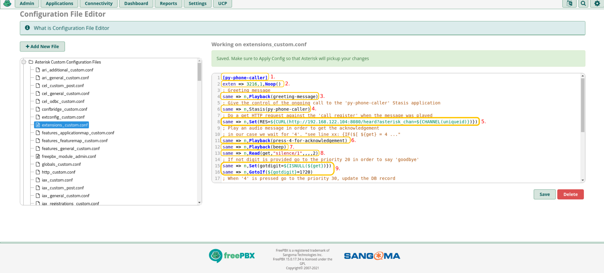
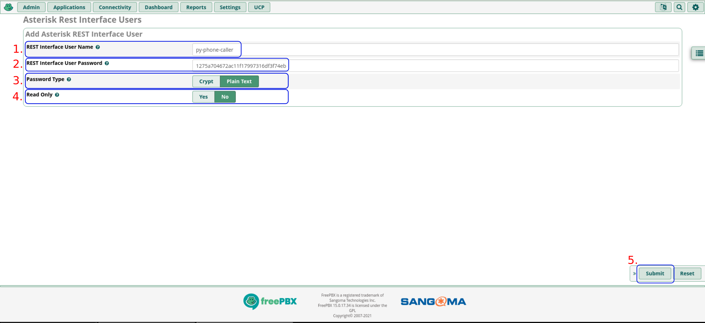
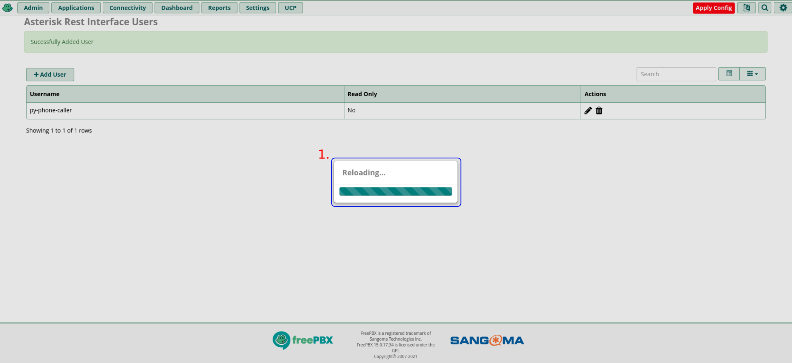

# Work in Progress - Draft

### Preface 

#### Some assumptions 

> Please don't expose the endpoints publicly without any kind of protection. The setup is intended to be done inside your
> trusted network. 

In this use case we assume that: the system is inside a LAN and protected by a firewall without allowing connections 
from outside (*wee need to protect in some way, for example basic auth, the exposed services if we want to publish it 
in the Internet*). 

#### The Big Picture


* *Work In progress*


#### Prerequisites

* To *send a SMS* message to a cell phone: [a Twillio account](https://www.twilio.com/sms) *(optional to send SMS messages)*.
* To *call* a cell or landline phone: some SIP trunk able to place calls to the landlines or cell phones.
* A working Internet connection. 

> About the SMS messages: by now the only service provider is Twilio, but we'll add others soon.

> About the calls to landline or cell phones: the calls can be placed by using a SIP Trunking service offering termination
> services in order to reach landline and cell phones. However, a media gateway can be used in order to achieve this goal.
> Last but no least, we need to pay some cents in order to place calls and SMS messages to the landline or cell phones. These services are rarely free.

We can spread some words regarding the ways to reach the landlines and  cell phones, generally it can be done using
the services of a provider or using a media gateway connected to the landline or with a SIM card inside the device.

* [SIP Trunking in Wikipedia](https://en.wikipedia.org/wiki/SIP_trunking)
* [Media gateway in Wikipedia](https://en.wikipedia.org/wiki/Media_gateway)

**Note**: *The 'py-phone-caller' packages hasn't any endorsement/relation by/with Twilio or FreePBX, these services/products 
was used because the easy of use and the commitment with the Open Source.*

### Systems used in this use case 

In order to give the opportunity to those that aren't very familiar with Asterisk we'll use one of the Asterisk
distributions called FreePBX. Is easy to setting up through the web interface.

And for components that start calls, obviously, we'll use '**Fedora Server 34**' (*you can also use Fedora Workstation but 
all the tests and working setups are running on Fedora Server or CentOS 7 with Docker. 
Soon we'll try the deployment on RHEL 8, OpenShift/Kubernetes*).

* [Fedora Server 34](https://getfedora.org/it/server/download/)

* [FreePBX 15 (*CentOS 7 based*)](https://www.freepbx.org/downloads/) (*current version at time of this writing*)
  * [SNG7-PBX-64bit-2104-1.iso](https://downloads.freepbxdistro.org/ISO/SNG7-PBX-64bit-2104-1.iso)


### Configuration of the Asterisk PBX

* Configuration of the **SIP** Trunk


* Configuration example:
```ini
type=peer
auth=md5
username=your-username
fromuser=your-username
secret=your-password
host=sip.provider.com
port=5060
qualify=yes
insecure=very
```


* Configuration of the custom **SIP extension**


* *The dialplan for our use case*: 

```ini
[py-phone-caller]
exten => 3216,1,Noop()
; Greeting message
same => n,Playback(greeting-message)
; Give the control of the ongoing call to the 'py-phone-caller' Stasis application
same => n,Stasis(py-phone-caller)
; Do a get HTTP request against the 'call_register' when the message was played
same => n,Set(RES=${CURL(http://192.168.122.104:8083/heard?asterisk_chan=${CHANNEL(uniqueid)})})
; Play an audio message in order to get the acknowledgement
; in our case we wait for '4'. "see line xx: {IF($[ ${get} = 4 ..."
same => n,Playback(press-4-for-acknowledgement)
same => n,Playback(beep)
same => n,Read(get,"silence/1",,,,2)
; If not digit is provided go to the priority 20 in order to say 'goodbye'
same => n,Set(gotdigit=${ISNULL(${get})})
same => n,GotoIf(${gotdigit}=1?20)
; When '4' is pressed go to the priority 30, update the DB record
; and say Goodbye.
same => e,Playback(vm-goodbye) ; If there's an error, say goodbye
same => n,Set(NOTIFYACK=${IF($[ ${get} = 4]?3:0)})
same => n,Wait(1)
same => n,GotoIf(${NOTIFYACK}=3?30)
same => 20,Set(NOTIFYACK=2)
same => 21,Playback(vm-goodbye)
same => 22,Wait(1)
same => 23,Hangup()
; Do a get HTTP request against the 'call_register' to update the DB record
; when the call was acknowledged. 
same => 30,Set(RES=${CURL(http://192.168.122.104:8083/ack?asterisk_chan=${CHANNEL(uniqueid)})})  
same => 31,Playback(vm-goodbye)
same => 32,Wait(1)
same => 33,Hangup()
same => n,Playback(vm-goodbye)
same => n,Hangup()
```




* Configuration of the Asterisk **ARI** user








* Creating the audio files used by the custom extension 

> *you can create the audio files in your system or wherever you prefer, for this example in this guide we assume
that the files will be created and converted to wave on your system to be transferred by SSH (scp) to the Asterisk PBX*.

* **Greeting message**: "*Hello, this is a recorded message from the Alerting System. With this message for you*"
* **Press 4 for acknowledge**: "*Please, Press the number 'four' to acknowledge this call*"

In order to create the audio files we'll use the '**gtts**' Python package, can be installed with:

```bash
[fedora@fedora ~]$ pip install gtts
Defaulting to user installation because normal site-packages is not writeable
Collecting gtts
  Downloading gTTS-2.2.3-py3-none-any.whl (25 kB)
Requirement already satisfied: click in /usr/lib/python3.9/site-packages (from gtts) (7.1.2)
Requirement already satisfied: six in /usr/lib/python3.9/site-packages (from gtts) (1.15.0)
Requirement already satisfied: requests in /usr/lib/python3.9/site-packages (from gtts) (2.25.1)
Requirement already satisfied: chardet<5,>=3.0.2 in /usr/lib/python3.9/site-packages (from requests->gtts) (4.0.0)
Requirement already satisfied: urllib3<1.27,>=1.21.1 in /usr/lib/python3.9/site-packages (from requests->gtts) (1.25.10)
Requirement already satisfied: idna<3,>=2.5 in /usr/lib/python3.9/site-packages (from requests->gtts) (2.10)
Installing collected packages: gtts
Successfully installed gtts-2.2.3
```

Now we can create the needed files to be copied to the Asterisk PBX after the conversion to wave format.

```bash
# The first file
[fedora@fedora-server ~]# gtts-cli "Hello, this is a recorded message from the Alerting System. With this message for you" > /tmp/greeting-message.mp3

# The second file
[fedora@fedora-server ~]# gtts-cli "Please, Press the number 'four' to acknowledge this call after the beep" > /tmp/press-4-for-acknowledgement.mp3
```

**Note about gtts-cli**: to change the language use '--lang es' for Spanish or '--lang it' for Italian or whatever you need. The text
need to be written in the same language that we want to generate the audio file, maybe is something obvious but is better  
have clear concepts.


To convert the MP3 files to wave, we'll use '**ffmpeg**', if isn't installed in your system, we can add it with '**dnf**'

```bash
[fedora@fedora ~]$ sudo dnf -y install ffmpeg
```

With 'ffmpeg' we can convert the MP3  to wave with properties to be compatible with Asterisk player.
We'll proceed with the greeting message.  

```bash
[fedora@fedora ~]$ ffmpeg -i /tmp/greeting-message.mp3 -ac 1 -ar 8000 /tmp/greeting-message.wav
ffmpeg version 4.4 Copyright (c) 2000-2021 the FFmpeg developers
  built with gcc 11 (GCC)
  configuration: --prefix=/usr --bindir=/usr/bin --datadir=/usr/share/ffmpeg --docdir=/usr/share/doc/ffmpeg --incdir=/usr/include/ffmpeg --libdir=/usr/lib64 --mandir=/usr/share/man --arch=x86_64 --optflags='-O2 -flto=auto -ffat-lto-objects -fexceptions -g -grecord-gcc-switches -pipe -Wall -Werror=format-security -Wp,-D_FORTIFY_SOURCE=2 -Wp,-D_GLIBCXX_ASSERTIONS -specs=/usr/lib/rpm/redhat/redhat-hardened-cc1 -fstack-protector-strong -specs=/usr/lib/rpm/redhat/redhat-annobin-cc1 -m64 -mtune=generic -fasynchronous-unwind-tables -fstack-clash-protection -fcf-protection' --extra-ldflags='-Wl,-z,relro -Wl,--as-needed -Wl,-z,now -specs=/usr/lib/rpm/redhat/redhat-hardened-ld ' --extra-cflags=' -I/usr/include/rav1e' --enable-libopencore-amrnb --enable-libopencore-amrwb --enable-libvo-amrwbenc --enable-version3 --enable-bzlib --disable-crystalhd --enable-fontconfig --enable-frei0r --enable-gcrypt --enable-gnutls --enable-ladspa --enable-libaom --enable-libdav1d --enable-libass --enable-libbluray --enable-libcdio --enable-libdrm --enable-libjack --enable-libfreetype --enable-libfribidi --enable-libgsm --enable-libmp3lame --enable-libmysofa --enable-nvenc --enable-openal --enable-opencl --enable-opengl --enable-libopenjpeg --enable-libopenmpt --enable-libopus --enable-libpulse --enable-librsvg --enable-librav1e --enable-libsmbclient --enable-version3 --enable-libsoxr --enable-libspeex --enable-libsrt --enable-libssh --enable-libsvtav1 --enable-libtheora --enable-libvorbis --enable-libv4l2 --enable-libvidstab --enable-libvmaf --enable-version3 --enable-vapoursynth --enable-libvpx --enable-vulkan --enable-libglslang --enable-libx264 --enable-libx265 --enable-libxvid --enable-libxml2 --enable-libzimg --enable-libzvbi --enable-lv2 --enable-avfilter --enable-avresample --enable-libmodplug --enable-postproc --enable-pthreads --disable-static --enable-shared --enable-gpl --disable-debug --disable-stripping --shlibdir=/usr/lib64 --enable-lto --enable-libmfx --enable-runtime-cpudetect
  libavutil      56. 70.100 / 56. 70.100
  libavcodec     58.134.100 / 58.134.100
  libavformat    58. 76.100 / 58. 76.100
  libavdevice    58. 13.100 / 58. 13.100
  libavfilter     7.110.100 /  7.110.100
  libavresample   4.  0.  0 /  4.  0.  0
  libswscale      5.  9.100 /  5.  9.100
  libswresample   3.  9.100 /  3.  9.100
  libpostproc    55.  9.100 / 55.  9.100
[mp3 @ 0x55c2c81df080] Estimating duration from bitrate, this may be inaccurate
Input #0, mp3, from 'greeting.mp3':
  Duration: 00:00:06.86, start: 0.000000, bitrate: 32 kb/s
  Stream #0:0: Audio: mp3, 24000 Hz, mono, fltp, 32 kb/s
Stream mapping:
  Stream #0:0 -> #0:0 (mp3 (mp3float) -> pcm_s16le (native))
Press [q] to stop, [?] for help
Output #0, wav, to 'greeting.wav':
  Metadata:
    ISFT            : Lavf58.76.100
  Stream #0:0: Audio: pcm_s16le ([1][0][0][0] / 0x0001), 8000 Hz, mono, s16, 128 kb/s
    Metadata:
      encoder         : Lavc58.134.100 pcm_s16le
size=     107kB time=00:00:06.86 bitrate= 128.1kbits/s speed=1.14e+03x
video:0kB audio:107kB subtitle:0kB other streams:0kB global headers:0kB muxing overhead: 0.071023%
```

Now the acknowledgement message 

```bash
[fedora@fedora ~]$ ffmpeg -i /tmp/press-4-for-acknowledgement.mp3 -ac 1 -ar 8000 /tmp/press-4-for-acknowledgement.wav
[...]
```

Getting some extra information about the audio files, only to see their properties.

```bash
# The MP3 file
[fedora@fedora ~]$ file /tmp/press-4-for-acknowledgement.mp3
greeting.mp3: MPEG ADTS, layer III, v2,  32 kbps, 24 kHz, Monaural

# The wave file
[fedora@fedora ~]$ file /tmp/press-4-for-acknowledgement.wav
greeting.wav: RIFF (little-endian) data, WAVE audio, Microsoft PCM, 16 bit, mono 8000 Hz
```

* Copying the audio files used by the custom extension

Now we can copy the recently created files *('/tmp/greeting-message.wav', '/tmp/press-4-for-acknowledgement.wav')* to 
the Asterisk system. 

```bash
[fedora@fedora ~]$ scp /tmp/*.wav root@192.168.122.234:
root@192.168.122.234's password:

greeting-message.wav                                                                 100%  107KB  21.7MB/s   00:00
press-4-for-acknowledgement.wav                                                      100%   77KB  21.9MB/s   00:00

```

* Login to the Asterisk *(FreePBX distribution)* System

```bash
[fedora@fedora ~]$ ssh root@192.168.122.234
root@192.168.122.234's password:
Last failed login: Tue Aug  3 23:29:04 UTC 2021 from 192.168.122.1 on ssh:notty
There was 1 failed login attempt since the last successful login.
Last login: Tue Aug  3 23:33:50 2021 from 192.168.122.1
______                   ______ ______ __   __
|  ___|                  | ___ \| ___ \\ \ / /
| |_    _ __   ___   ___ | |_/ /| |_/ / \ V /
|  _|  | '__| / _ \ / _ \|  __/ | ___ \ /   \
| |    | |   |  __/|  __/| |    | |_/ // /^\ \
\_|    |_|    \___| \___|\_|    \____/ \/   \/

NOTICE! You have 2 notifications! Please log into the UI to see them!
Current Network Configuration
+-----------+-------------------+-------------------------+
| Interface | MAC Address       | IP Addresses            |
+-----------+-------------------+-------------------------+
| eth0      | 52:54:00:F1:1C:F6 | 192.168.122.234         |
|           |                   | fe80::5054:ff:fef5:6cf1 |
+-----------+-------------------+-------------------------+
[...]

[root@freepbx ~]#
```

In our case we're using the default *Asterisk* language, English. The audio files are stored in ```/var/lib/asterisk/sounds/en``` 
we'll move the recently copied files to this folder *(the folder will change if you're using other language)*. 

* Copying the files to the right location

> With the last '**scp**' command we've placed the files under the '**/root**' folder of the Asterisk system. 

```bash
[root@freepbx ~]# mv greeting-message.wav press-4-for-acknowledgement.wav /var/lib/asterisk/sounds/en
```

* As last step on this system, we'll set the right permission for these files.

```bash
[root@freepbx ~]# chown asterisk.asterisk /var/lib/asterisk/sounds/en/{greeting-message.wav,press-4-for-acknowledgement.wav}
```

### Installing the needed dependencies on the Fedora Server

Steps to take as '**root**'

```bash
[fedora@fedora-server ~]$ sudo -i
```

We'll run the containers with **'Podman'**
```bash
[root@fedora-server ~]# dnf -y install podman podman-plugins podman-docker
Last metadata expiration check: 0:42:59 ago on Wed 28 Jul 2021 23:31:23 PM CEST.
Dependencies resolved.
=============================================================================================================================================================================
 Package                                            Architecture                  Version                                               Repository                      Size
=============================================================================================================================================================================
Installing:
 podman                                             x86_64                        3:3.2.3-1.fc34                                        updates                         12 M
 podman-docker                                      noarch                        3:3.2.3-1.fc34                                        updates                        177 k
 podman-plugins                                     x86_64                        3:3.2.3-1.fc34                                        updates                        2.6 M
Installing dependencies:
 conmon                                             x86_64                        2:2.0.29-2.fc34                                       updates                         53 k
 container-selinux                                  noarch                        2:2.164.1-1.git563ba3f.fc34                           updates                         48 k
 containernetworking-plugins                        x86_64                        1.0.0-0.2.rc1.fc34                                    updates                        8.9 M
 containers-common                                  noarch                        4:1-21.fc34                                           updates                         61 k
 criu                                               x86_64                        3.15-3.fc34                                           fedora                         521 k
 criu-libs                                          x86_64                        3.15-3.fc34                                           fedora                          31 k
 crun                                               x86_64                        0.20.1-1.fc34                                         updates                        172 k
 fuse-common                                        x86_64                        3.10.4-1.fc34                                         updates                        8.5 k
 fuse3                                              x86_64                        3.10.4-1.fc34                                         updates                         54 k
 fuse3-libs                                         x86_64                        3.10.4-1.fc34                                         updates                         91 k
 libbsd                                             x86_64                        0.10.0-7.fc34                                         fedora                         106 k
 libnet                                             x86_64                        1.2-2.fc34                                            fedora                          58 k
 libslirp                                           x86_64                        4.4.0-4.fc34                                          updates                         68 k
 yajl                                               x86_64                        2.1.0-16.fc34                                         fedora                          38 k
Installing weak dependencies:
 catatonit                                          x86_64                        0.1.5-4.fc34                                          fedora                         305 k
 fuse-overlayfs                                     x86_64                        1.5.0-1.fc34                                          fedora                          75 k
 slirp4netns                                        x86_64                        1.1.9-1.fc34                                          fedora                          57 k

Transaction Summary
=============================================================================================================================================================================
Install  20 Packages

Total download size: 25 M
Installed size: 123 M
[...]
```

The installation of '**py-phone-caller**' is done through **Ansible** and some data regarding the call is stored in 
**PostgreSQL**.

```bash
[root@fedora-server ~]# dnf install -y ansible python3-psycopg2 postgresql
Last metadata expiration check: 0:38:54 ago on Wed 28 Jul 2021 23:41:48 PM CEST.
Dependencies resolved.
=============================================================================================================================================================================
 Package                                           Architecture                       Version                                      Repository                           Size
=============================================================================================================================================================================
Installing:
 ansible                                           noarch                             2.9.23-1.fc34                                updates                              15 M
 python3-psycopg2                                  x86_64                             2.8.6-3.fc34                                 fedora                              183 k
Installing dependencies:
 libpq                                             x86_64                             13.3-1.fc34                                  updates                             202 k
 libsodium                                         x86_64                             1.0.18-7.fc34                                fedora                              165 k
 python3-babel                                     noarch                             2.9.1-1.fc34                                 updates                             5.8 M
 python3-bcrypt                                    x86_64                             3.1.7-7.fc34                                 fedora                               44 k
 python3-cffi                                      x86_64                             1.14.5-1.fc34                                fedora                              244 k
 python3-chardet                                   noarch                             4.0.0-1.fc34                                 fedora                              214 k
 python3-cryptography                              x86_64                             3.4.6-1.fc34                                 fedora                              1.4 M
 python3-idna                                      noarch                             2.10-3.fc34                                  fedora                               99 k
 python3-jinja2                                    noarch                             2.11.3-1.fc34                                fedora                              493 k
 python3-jmespath                                  noarch                             0.10.0-1.fc34                                updates                              46 k
 python3-markupsafe                                x86_64                             1.1.1-10.fc34                                fedora                               32 k
 python3-ntlm-auth                                 noarch                             1.5.0-2.fc34                                 fedora                               53 k
 python3-ply                                       noarch                             3.11-11.fc34                                 fedora                              103 k
 python3-pycparser                                 noarch                             2.20-3.fc34                                  fedora                              126 k
 python3-pynacl                                    x86_64                             1.4.0-2.fc34                                 fedora                              110 k
 python3-pysocks                                   noarch                             1.7.1-8.fc34                                 fedora                               35 k
 python3-pytz                                      noarch                             2021.1-2.fc34                                fedora                               49 k
 python3-pyyaml                                    x86_64                             5.4.1-2.fc34                                 fedora                              194 k
 python3-requests                                  noarch                             2.25.1-1.fc34                                fedora                              114 k
 python3-requests_ntlm                             noarch                             1.1.0-14.fc34                                fedora                               18 k
 python3-urllib3                                   noarch                             1.25.10-5.fc34                               updates                             174 k
 python3-xmltodict                                 noarch                             0.12.0-11.fc34                               fedora                               23 k
 sshpass                                           x86_64                             1.09-1.fc34                                  fedora                               27 k
Installing weak dependencies:
 python3-paramiko                                  noarch                             2.7.2-4.fc34                                 fedora                              287 k
 python3-pyasn1                                    noarch                             0.4.8-4.fc34                                 fedora                              133 k
 python3-winrm                                     noarch                             0.4.1-2.fc34                                 fedora                               79 k

Transaction Summary
=============================================================================================================================================================================
Install  28 Packages

Total download size: 25 M
Installed size: 144 M

[...]
```

Dropping the '**root**' privileges

```bash
[root@fedora-server ~]# 
logout
```

Installing the **Ansible** role to manage '**podman**'

```bash
[fedora@fedora-server ~]$ ansible-galaxy collection install containers.podman
Process install dependency map
Starting collection install process
Installing 'containers.podman:1.6.1' to '/home/fedora/.ansible/collections/ansible_collections/containers/podman'
```

Installing the **Ansible** role to manage '**PostgreSQL**'

```bash
[fedora@fedora-server ~]$ ansible-galaxy collection install community.postgresql
Process install dependency map
Starting collection install process
Installing 'community.postgresql:1.4.0' to '/home/fedora/.ansible/collections/ansible_collections/community/postgresql'
```


Running our first container... 
```bash
[fedora@fedora-server ~]$ podman run hello-world
Resolved "hello-world" as an alias (/etc/containers/registries.conf.d/000-shortnames.conf)
Trying to pull docker.io/library/hello-world:latest...
Getting image source signatures
Copying blob b8dfde127a29 done  
Copying config d1165f2212 done  
Writing manifest to image destination
Storing signatures

Hello from Docker!
This message shows that your installation appears to be working correctly.

To generate this message, Docker took the following steps:
 1. The Docker client contacted the Docker daemon.
 2. The Docker daemon pulled the "hello-world" image from the Docker Hub.
    (amd64)
 3. The Docker daemon created a new container from that image which runs the
    executable that produces the output you are currently reading.
 4. The Docker daemon streamed that output to the Docker client, which sent it
    to your terminal.

To try something more ambitious, you can run an Ubuntu container with:
 $ docker run -it ubuntu bash

Share images, automate workflows, and more with a free Docker ID:
 https://hub.docker.com/

For more examples and ideas, visit:
 https://docs.docker.com/get-started/
```


Creating a folder to place the installation *playbook*

```bash
[fedora@fedora-server ~]$ mkdir ansible_py-phone-caller
```


Getting the 3 files in order to install the '**py-phone-caller**' through **Ansible**

    * caller_config.toml.jinja2
    * py-phone-caller-podman.yml
    * py_phone_caller_vars_file.yml


```bash
[fedora@fedora-server ~]$ cd ansible_py-phone-caller/

[fedora@fedora-server ansible_py-phone-caller]$ wget https://raw.githubusercontent.com/jcfdeb/py-phone-caller/main/assets/ansible/rh/caller_config.toml.jinja2
--2021-07-28 23:48:11--  https://raw.githubusercontent.com/jcfdeb/py-phone-caller/main/assets/ansible/rh/caller_config.toml.jinja2
Resolving raw.githubusercontent.com (raw.githubusercontent.com)... 185.199.108.133, 185.199.109.133, 185.199.110.133, ...
Connecting to raw.githubusercontent.com (raw.githubusercontent.com)|185.199.108.133|:443... connected.
HTTP request sent, awaiting response... 200 OK
Length: 3730 (3.6K) [text/plain]
Saving to: ‘caller_config.toml.jinja2’

caller_config.toml.jinja2                   100%[========================================================================================>]   3.64K  --.-KB/s    in 0s      

2021-07-28 23:48:11 (20.4 MB/s) - ‘caller_config.toml.jinja2’ saved [3730/3730]


[fedora@fedora-server ansible_py-phone-caller]$ wget https://raw.githubusercontent.com/jcfdeb/py-phone-caller/main/assets/ansible/rh/py-phone-caller-podman.yml
--2021-07-28 23:49:55--  https://raw.githubusercontent.com/jcfdeb/py-phone-caller/main/assets/ansible/rh/py-phone-caller-podman.yml
Resolving raw.githubusercontent.com (raw.githubusercontent.com)... 185.199.109.133, 185.199.108.133, 185.199.111.133, ...
Connecting to raw.githubusercontent.com (raw.githubusercontent.com)|185.199.109.133|:443... connected.
HTTP request sent, awaiting response... 200 OK
Length: 10793 (11K) [text/plain]
Saving to: ‘py-phone-caller-podman.yml’

py-phone-caller-podman.yml                  100%[========================================================================================>]  10.54K  --.-KB/s    in 0s      

2021-07-28 23:49:55 (25.7 MB/s) - ‘py-phone-caller-podman.yml’ saved [10793/10793]


[fedora@fedora-server ansible_py-phone-caller]$ wget https://raw.githubusercontent.com/jcfdeb/py-phone-caller/main/assets/ansible/rh/py_phone_caller_vars_file.yml
--2021-07-28 23:51:20--  https://raw.githubusercontent.com/jcfdeb/py-phone-caller/main/assets/ansible/rh/py_phone_caller_vars_file.yml
Resolving raw.githubusercontent.com (raw.githubusercontent.com)... 185.199.111.133, 185.199.110.133, 185.199.109.133, ...
Connecting to raw.githubusercontent.com (raw.githubusercontent.com)|185.199.111.133|:443... connected.
HTTP request sent, awaiting response... 200 OK
Length: 7149 (7.0K) [text/plain]
Saving to: ‘py_phone_caller_vars_file.yml’

py_phone_caller_vars_file.yml               100%[========================================================================================>]   6.98K  --.-KB/s    in 0s      

2021-07-28 23:51:20 (14.6 MB/s) - ‘py_phone_caller_vars_file.yml’ saved [7149/7149]
```


* The varialbes file 'py_phone_caller_vars_file.yml'


```yaml
---
# Variables files for the 'py-phone-caller' installed through Podman

ansible_python_interpreter: /usr/bin/python3

# Podman / 'py-phone-caller' vars
container_host: 192.168.122.104
installation_user: fedora
installation_folder: "/home/{{ installation_user }}"
installation_folder_name: py-phone-caller
caller_config_toml_template_url: "https://raw.githubusercontent.com/jcfdeb/py-phone-caller/9c0bb97110cef988adfd23a6c0cb8e25168bbdfc/assets/ansible/rh/caller_config.toml.jinja2"
py_phone_caller_config_tmp_path: /tmp/caller_config.toml.jinja
py_phone_caller_config_path: "{{ installation_folder }}/{{ installation_folder_name }}/config/caller_config.toml"
config_mounted_in_container: /opt/py-phone-caller/config/caller_config.toml:Z
py_phone_caller_version: 0.0.1
container_registry_url: quay.io/py-phone-caller
py_phone_caller_network: py-phone-caller
py_phone_caller_subnet: 172.19.0.0/24
asterisk_ws_monitor_ip: 172.19.0.10
asterisk_recall_ip: 172.19.0.11
postgres_ip: 172.19.0.50
generate_audio_ip: 172.19.0.82
call_register_ip: 172.19.0.83
asterisk_call_ip: 172.19.0.81
caller_prometheus_webhook_ip: 172.19.0.84
caller_sms_ip: 172.19.0.85

# PostgreSQL container vars
db_schema_url: "https://raw.githubusercontent.com/jcfdeb/py-phone-caller/main/assets/DB/db-schema.sql"
postgresql_container_image: "docker.io/library/postgres:13.3-alpine3.14"
postgresql_login_host: 127.0.0.1
postgresql_admin: postgres
postgresql_admin_pass: Use-A-Secure-Password-Here

# SystemD user integration
container_asterisk_call_service_url: "https://raw.githubusercontent.com/jcfdeb/py-phone-caller/main/assets/systemd-units/as-non-root-container/container-asterisk_call.service"
container_asterisk_call_register_service_url: "https://raw.githubusercontent.com/jcfdeb/py-phone-caller/main/assets/systemd-units/as-non-root-container/container-asterisk_call_register.service"
container_asterisk_recall_service_url: "https://raw.githubusercontent.com/jcfdeb/py-phone-caller/main/assets/systemd-units/as-non-root-container/container-asterisk_recall.service"
container_asterisk_ws_monitor_service_url: "https://raw.githubusercontent.com/jcfdeb/py-phone-caller/main/assets/systemd-units/as-non-root-container/container-asterisk_ws_monitor.service"
container_caller_prometheus_webhook_service_url: "https://raw.githubusercontent.com/jcfdeb/py-phone-caller/main/assets/systemd-units/as-non-root-container/container-caller_prometheus_webhook.service"
container_caller_sms_service_url: "https://raw.githubusercontent.com/jcfdeb/py-phone-caller/main/assets/systemd-units/as-non-root-container/container-caller_sms.service"
container_generate_audio_service_url: "https://raw.githubusercontent.com/jcfdeb/py-phone-caller/main/assets/systemd-units/as-non-root-container/container-generate_audio.service"
container_postgres_13_service_url: "https://raw.githubusercontent.com/jcfdeb/py-phone-caller/main/assets/systemd-units/as-non-root-container/container-postgres_13.service"

systemd_user_path: "/home/{{ installation_user }}/.config/systemd/user"
container_asterisk_call_service_unit: "container-asterisk_call.service"
container_asterisk_call_register_service_unit: "container-asterisk_call_register.service"
container_asterisk_recall_service_unit: "container-asterisk_recall.service"
container_asterisk_ws_monitor_service_unit: "container-asterisk_ws_monitor.service"
container_caller_prometheus_webhook_service_unit: "container-caller_prometheus_webhook.service"
container_caller_sms_service_unit: "container-caller_sms.service"
container_generate_audio_service_unit: "container-generate_audio.service"
container_postgres_13_service_unit: "container-postgres_13.service"

# py-phone-caller - 'caller_config.toml' vars
# [commons]
asterisk_user: "py-phone-caller"
asterisk_pass: "Use-A-Secure-Password-Here"
asterisk_host: "192.168.122.234"
asterisk_web_port: "8088"
asterisk_http_scheme: "http"

# [asterisk_call]
asterisk_ari_channels: "ari/channels"
asterisk_ari_play: "play?media=sound"
asterisk_context: "py-phone-caller"
asterisk_extension: "3216"
asterisk_chan_type: "SIP/sip-provider"
asterisk_callerid: "Py-Phone-Caller"
asterisk_call_http_scheme: "http"
asterisk_call_host: "{{ container_host }}"
asterisk_call_port: "8081"
asterisk_call_app_route_asterisk_init: "asterisk_init"
asterisk_call_app_route_play: "play"
seconds_to_forget: 300
client_timeout_total: 5 # For 'ClientTimeout(total=5)'

# [call_register]
call_register_http_scheme: "http"
call_register_host: "{{ container_host }}"
call_register_port: "8083"
call_register_app_route_register_call: "register_call"
call_register_app_route_voice_message: "msg"
call_register_app_route_acknowledge: "ack"
call_register_app_route_heard: "heard"

# [asterisk_ws_monitor]
asterisk_stasis_app: "py-phone-caller"

# [asterisk_recall]
times_to_dial: 3

# [generate_audio]
generate_audio_http_scheme: "http"
generate_audio_host: "{{ container_host }}"
generate_audio_port: "8082"
generate_audio_app_route: "make_audio"
gcloud_tts_language_code: "es"
serving_audio_folder: "audio"
num_of_cpus: 4

# [caller_prometheus_webhook]
prometheus_webhook_port: "8084"
prometheus_webhook_app_route_call_only: "call_only"
prometheus_webhook_app_route_sms_only: "sms_only"
prometheus_webhook_app_route_sms_before_call: "sms_before_call"
prometheus_webhook_app_route_call_and_sms: "call_and_sms"
prometheus_webhook_receivers: '[ "+123456789" ]'

# [caller_sms]
caller_sms_http_scheme: "http"
caller_sms_host: "{{ container_host }}"
caller_sms_port: "8085"
caller_sms_audio_app_route: "send_sms"
sms_before_call_wait_seconds: 120
caller_sms_carrier: "twilio"
twilio_account_sid: "Your-Twilio-account-sid"
twilio_auth_token: "Your-Twilio-auth-token"
twilio_sms_from: "+1987654321"

# [database]
db_host: "{{ postgres_ip }}"
db_name: "py_phone_caller"
db_user: "py_phone_caller"
db_password: 'Use-A-Secure-Password-Here'
db_max_size: 50
db_max_inactive_connection_lifetime: 30.0

# [logger]
log_formatter: "%(asctime)s %(message)s"
acknowledge_error: "Lost parameter, Usage: Method: POST - http://ADDRESS/ack?asterisk_chan=[The Asterisk Channel ID]"
heard_error: "Lost parameter, Usage: Method: POST - http://ADDRESS/heard?asterisk_chan=[The Asterisk Channel ID]"
registercall_error: "Lost parameter, Usage: Method: POST - http://ADDRESS/?phone=[Destination Phone Number]&messagge=[Alert Message Text]&asterisk_chan=[The Asterisk Channel ID]"
voice_message_error: "Lost parameter, Usage: Method: POST - http://ADDRESS/msg?asterisk_chan=[The Asterisk Channel ID]"
asterisk_call_error: "Lost parameter, Usage: Method: POST - http://ADDRESS/asterisk?phone=[Destination Phone Number]&messagge=[Alert Message Text]"
asterisk_play_error: "Lost parameter, Usage: Method: POST - http://ADDRESS/play?asterisk_chan=[The Asterisk Channel ID]&msg_chk_sum=[The message cecksum]"
generate_audio_error: "Lost parameter, Usage: Method: POST - http://ADDRESS/make_audio?messagge=[Alert Message Text]&msg_chk_sum=[The message cecksum]"
caller_sms_error: "Lost parameter, Usage: Method: POST - http://ADDRESS/?phone=[Destination Phone Number]&messagge=[Alert Message Text]"
lost_directory_error: "The folder to serve the audio files was not found."
```

* Ansible starts to play 

```bash
[fedora@fedora ~]$ ansible-playbook --connection=local --limit=127.0.0.1 --inventory=127.0.0.1, ansible_py-phone-caller/py-phone-caller-podman.yml

PLAY [Configuring 'py-phone-caller' installed through 'Podman'] *************************************************************************************************************

TASK [Gathering Facts] ******************************************************************************************************************************************************
ok: [127.0.0.1]

TASK [Creating the 'py-phone-caller' directory tree at '/home/fedora/py-phone-caller'] **************************************************************************************
changed: [127.0.0.1]

TASK [Check that the 'caller_config.toml' exists] ***************************************************************************************************************************
ok: [127.0.0.1]

TASK [Download the 'caller_config.toml' template file] **********************************************************************************************************************
changed: [127.0.0.1]

TASK [Creating the configuration file 'caller_config.toml' through a template] **********************************************************************************************
changed: [127.0.0.1]

TASK [Creating the 'py-phone-caller' container network] *********************************************************************************************************************
changed: [127.0.0.1]

TASK [Checking if the 'pgdata' volume exists] *******************************************************************************************************************************
fatal: [127.0.0.1]: FAILED! => {"changed": true, "cmd": ["podman", "volume", "inspect", "pgdata"], "delta": "0:00:00.059469", "end": "2021-07-28 22:04:44.174686", "msg": "non-zero return code", "rc": 125, "start": "2021-07-28 22:04:44.115217", "stderr": "Error: error inspecting object: no such volume pgdata", "stderr_lines": ["Error: error inspecting object: no such volume pgdata"], "stdout": "[]", "stdout_lines": ["[]"]}

TASK [Creating the 'pgdata' volume for the PostgreSQL container] ************************************************************************************************************
changed: [127.0.0.1]

TASK [Creating the 'postgres_13' container] *********************************************************************************************************************************
changed: [127.0.0.1]

TASK [Creating the 'asterisk_call' container] *******************************************************************************************************************************
changed: [127.0.0.1]

TASK [Creating the 'caller_prometheus_webhook' container] *******************************************************************************************************************
changed: [127.0.0.1]

TASK [Creating the 'caller_sms' container] **********************************************************************************************************************************
changed: [127.0.0.1]

TASK [Creating the 'generate_audio' container] ******************************************************************************************************************************
changed: [127.0.0.1]

TASK [Creating the 'py_phone_caller' PostgreSQL user] ***********************************************************************************************************************
changed: [127.0.0.1]

TASK [Gattering info about the 'py_phone_caller' DB (if exists)] ************************************************************************************************************
fatal: [127.0.0.1]: FAILED! => {"changed": false, "msg": "unable to connect to database: FATAL:  database \"py_phone_caller\" does not exist\n"}

TASK [Download the dumped 'py_phone_caller' DB schema (SQL format)] *********************************************************************************************************
changed: [127.0.0.1]

TASK [Creating the 'py_phone_caller' DB] ************************************************************************************************************************************
changed: [127.0.0.1]

TASK [Restoring the 'py_phone_caller' DB by restoring a dump of the schema] *************************************************************************************************
changed: [127.0.0.1]

TASK [Creating the 'asterisk_ws_monitor' container] *************************************************************************************************************************
changed: [127.0.0.1]

TASK [Creating the 'asterisk_recall' container] *****************************************************************************************************************************
changed: [127.0.0.1]

TASK [Creating the 'call_register' container] *******************************************************************************************************************************
changed: [127.0.0.1]

TASK [Creating the Systemd user folder] *************************************************************************************************************************************
changed: [127.0.0.1]

TASK [Download the Systemd Unit files] **************************************************************************************************************************************
changed: [127.0.0.1] => (item={'url': 'https://raw.githubusercontent.com/jcfdeb/py-phone-caller/main/assets/systemd-units/as-non-root-container/container-asterisk_call.service', 'path': 'container-asterisk_call.service'})
changed: [127.0.0.1] => (item={'url': 'https://raw.githubusercontent.com/jcfdeb/py-phone-caller/main/assets/systemd-units/as-non-root-container/container-asterisk_call_register.service', 'path': 'container-asterisk_call_register.service'})
changed: [127.0.0.1] => (item={'url': 'https://raw.githubusercontent.com/jcfdeb/py-phone-caller/main/assets/systemd-units/as-non-root-container/container-asterisk_recall.service', 'path': 'container-asterisk_recall.service'})
changed: [127.0.0.1] => (item={'url': 'https://raw.githubusercontent.com/jcfdeb/py-phone-caller/main/assets/systemd-units/as-non-root-container/container-asterisk_ws_monitor.service', 'path': 'container-asterisk_ws_monitor.service'})
changed: [127.0.0.1] => (item={'url': 'https://raw.githubusercontent.com/jcfdeb/py-phone-caller/main/assets/systemd-units/as-non-root-container/container-caller_prometheus_webhook.service', 'path': 'container-caller_prometheus_webhook.service'})
changed: [127.0.0.1] => (item={'url': 'https://raw.githubusercontent.com/jcfdeb/py-phone-caller/main/assets/systemd-units/as-non-root-container/container-caller_sms.service', 'path': 'container-caller_sms.service'})
changed: [127.0.0.1] => (item={'url': 'https://raw.githubusercontent.com/jcfdeb/py-phone-caller/main/assets/systemd-units/as-non-root-container/container-generate_audio.service', 'path': 'container-generate_audio.service'})
changed: [127.0.0.1] => (item={'url': 'https://raw.githubusercontent.com/jcfdeb/py-phone-caller/main/assets/systemd-units/as-non-root-container/container-postgres_13.service', 'path': 'container-postgres_13.service'})

TASK [Enable and run the user SystemD services for 'py-phone-caller'] *******************************************************************************************************
changed: [127.0.0.1] => (item=container-asterisk_call.service)
changed: [127.0.0.1] => (item=container-asterisk_call_register.service)
changed: [127.0.0.1] => (item=container-asterisk_recall.service)
changed: [127.0.0.1] => (item=container-asterisk_ws_monitor.service)
changed: [127.0.0.1] => (item=container-caller_prometheus_webhook.service)
changed: [127.0.0.1] => (item=container-caller_sms.service)
changed: [127.0.0.1] => (item=container-generate_audio.service)
changed: [127.0.0.1] => (item=container-postgres_13.service)

TASK [Deleting the '/tmp' files] ********************************************************************************************************************************************
changed: [127.0.0.1] => (item=/tmp/db-schema.sql)
changed: [127.0.0.1] => (item=/tmp/caller_config.toml.jinja)

PLAY RECAP ******************************************************************************************************************************************************************
127.0.0.1                  : ok=23   changed=21   unreachable=0    failed=0    skipped=0    rescued=2    ignored=0   
```


* Firewalld rules to allow the needed connections 

```bash
[fedora@fedora-server ~]$ sudo firewall-cmd --add-source="192.168.122.0/24" --permanent
success

[fedora@fedora-server ~]$ sudo firewall-cmd --add-source="172.19.0.0/24" --permanent
success

[fedora@fedora-server ~]$ sudo firewall-cmd --add-port=8081/tcp --permanent
success

[fedora@fedora-server ~]$ sudo firewall-cmd --add-port=8082/tcp --permanent
success

[fedora@fedora-server ~]$ sudo firewall-cmd --add-port=8083/tcp --permanent
success

[fedora@fedora-server ~]$ sudo firewall-cmd --add-port=8084/tcp --permanent
success

[fedora@fedora-server ~]$ sudo firewall-cmd --reload
success
```


