# py-phone-caller Documentation

## Table of Contents
1. [Introduction](#introduction)
2. [System Architecture](#system-architecture)
3. [Components](#components)
   - [asterisk_caller](#asterisk_caller)
   - [asterisk_recaller](#asterisk_recaller)
   - [asterisk_ws_monitor](#asterisk_ws_monitor)
   - [caller_prometheus_webhook](#caller_prometheus_webhook)
   - [caller_register](#caller_register)
   - [caller_scheduler](#caller_scheduler)
   - [caller_sms](#caller_sms)
   - [generate_audio](#generate_audio)
   - [py-phone-caller-ui](#py-phone-caller-ui)
   - [py_phone_caller_utils](#py_phone_caller_utils)
4. [Configuration](#configuration)
5. [Call Flows](#call-flows)
6. [SMS Flows](#sms-flows)
7. [Prometheus Alert Flows](#prometheus-alert-flows)

## Introduction

py-phone-caller is an automated phone calling and SMS notification system built with Python. It integrates with Asterisk PBX to make automated phone calls, deliver voice messages, and send SMS notifications. The system can be triggered manually, scheduled for future execution, or automatically triggered by Prometheus alerts.

The project provides a modular architecture with components for call initiation, audio generation, call tracking, SMS sending, and a web-based user interface. It supports multiple text-to-speech engines and can be configured to retry failed calls.

## System Architecture

The py-phone-caller system consists of several interconnected components that work together to provide automated phone calling and SMS notification capabilities. The following diagram illustrates the high-level architecture of the system:

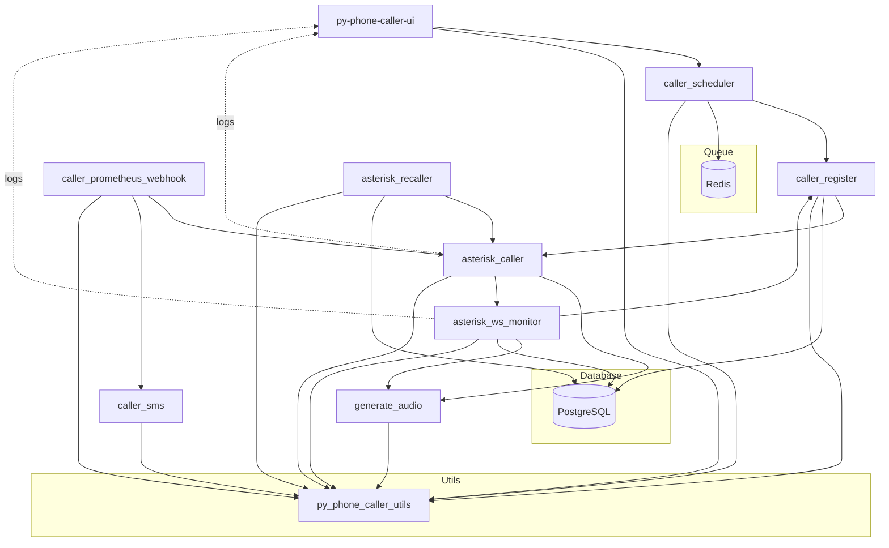
```mermaid
graph TD
    UI[py-phone-caller-ui] --> CS[caller_scheduler]
    AC[asterisk_caller] -.logs.-> UI
    WSM[asterisk_ws_monitor] -.logs.-> UI

    PW[caller_prometheus_webhook] --> AC
    PW --> SMS[caller_sms]

    CR[caller_register] --> AC
    CS --> CR

    AC --> GA[generate_audio]
    AC --> WSM

    WSM --> GA
    WSM --> CR

    AR[asterisk_recaller] --> AC

    subgraph Database
        DB[(PostgreSQL)]
    end

    CR --> DB
    WSM --> DB
    AR --> DB

    subgraph Queue
        RQ[(Redis)]
    end

    CS --> RQ

    subgraph Utils
        PCU[py_phone_caller_utils]
    end

    AC --> PCU
    AR --> PCU
    WSM --> PCU
    PW --> PCU
    CR --> PCU
    CS --> PCU
    SMS --> PCU
    GA --> PCU
    UI --> PCU
```

## Components

### asterisk_caller

#### Overview
The asterisk_caller component is responsible for initiating and managing phone calls through Asterisk. It provides a web API for placing calls and playing audio messages. The component handles the communication with Asterisk's REST Interface (ARI) to initiate calls, control call flow, and play audio messages to the caller.

#### Key Features
- Initiates outbound calls through Asterisk
- Manages call queues
- Plays audio messages during calls
- Provides HTTP endpoints for call control

#### Main Functions
- `manage_call_queue()`: Manages the call queue
- `initiate_asterisk_call()`: Initiates calls through Asterisk
- `place_call()`: HTTP endpoint for placing calls
- `asterisk_play()`: HTTP endpoint for playing audio messages
- `init_app()`: Initializes the application

#### Component Interactions
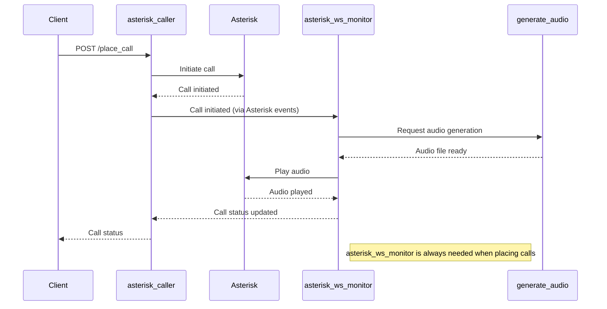
```mermaid
sequenceDiagram
    participant Client
    participant AC as asterisk_caller
    participant Asterisk
    participant WSM as asterisk_ws_monitor
    participant GA as generate_audio

    Client->>AC: POST /place_call
    AC->>Asterisk: Initiate call
    Asterisk-->>AC: Call initiated
    AC->>WSM: Call initiated (via Asterisk events)
    WSM->>GA: Request audio generation
    GA-->>WSM: Audio file ready
    WSM->>Asterisk: Play audio
    Asterisk-->>WSM: Audio played
    WSM-->>AC: Call status updated
    AC-->>Client: Call status

    Note right of WSM: asterisk_ws_monitor is always needed when placing calls
```

### asterisk_recaller

#### Overview
The asterisk_recaller component handles retrying failed phone calls. It periodically checks the database for calls that need to be retried and initiates recall attempts based on configured parameters. The component uses a strategy of waiting a certain amount of time between retry attempts and has a maximum number of retry attempts.

#### Key Features
- Monitors for failed or unanswered calls
- Implements configurable retry logic
- Spaces retry attempts over time
- Tracks retry attempts in the database

#### Main Functions
- `asterisk_recall()`: Periodically checks for calls that need to be retried
- `recall_post()`: Sends a POST request to the Asterisk call service to initiate a recall

#### Component Interactions
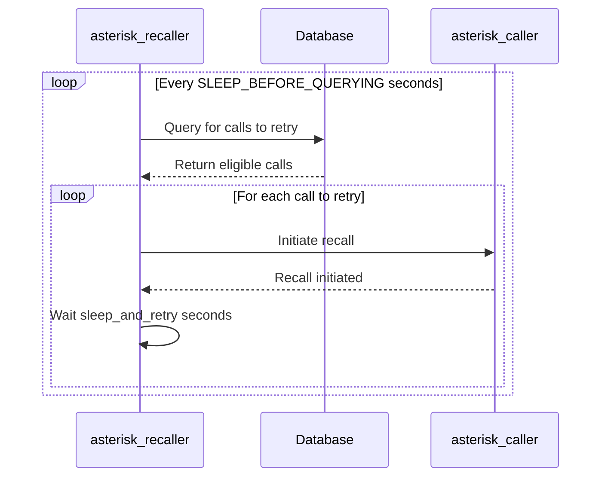
```mermaid
sequenceDiagram
    participant AR as asterisk_recaller
    participant DB as Database
    participant AC as asterisk_caller

    loop Every SLEEP_BEFORE_QUERYING seconds
        AR->>DB: Query for calls to retry
        DB-->>AR: Return eligible calls

        loop For each call to retry
            AR->>AC: Initiate recall
            AC-->>AR: Recall initiated
            AR->>AR: Wait sleep_and_retry seconds
        end
    end
```

### asterisk_ws_monitor

#### Overview
The asterisk_ws_monitor component monitors Asterisk events through a WebSocket connection. It handles various events from Asterisk, such as call initiation, and performs actions like generating audio files and playing them to the channel. It also logs events to a database and coordinates with other components like call_register.

#### Key Features
- Connects to Asterisk via WebSockets
- Monitors call events in real-time
- Triggers audio generation and playback
- Logs call events to the database

#### Main Functions
- `asterisk_ws_client()`: Establishes a WebSocket connection to Asterisk
- `generate_the_audio_file()`: Generates audio files for messages
- `play_audio_to_channel()`: Plays audio to an Asterisk channel
- `take_control_of_dialplan()`: Takes control of the Asterisk dialplan
- `querying_call_register()`: Queries the call register for call information

#### Component Interactions
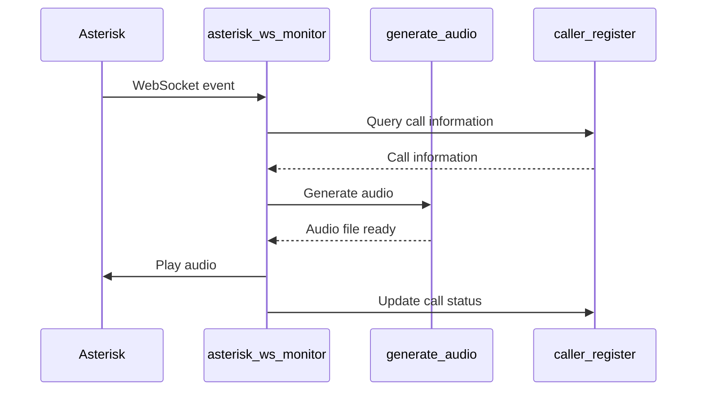
```mermaid
sequenceDiagram
    participant Asterisk
    participant WSM as asterisk_ws_monitor
    participant GA as generate_audio
    participant CR as caller_register

    Asterisk->>WSM: WebSocket event
    WSM->>CR: Query call information
    CR-->>WSM: Call information
    WSM->>GA: Generate audio
    GA-->>WSM: Audio file ready
    WSM->>Asterisk: Play audio
    WSM->>CR: Update call status
```

### caller_prometheus_webhook

#### Overview
The caller_prometheus_webhook component serves as a webhook endpoint for Prometheus alerts. It receives alert notifications from Prometheus AlertManager and can trigger different types of notifications: phone calls only, SMS only, SMS before call, or both call and SMS simultaneously. It uses a queue-based approach with producer-consumer pattern to process alerts.

#### Key Features
- Receives webhook notifications from Prometheus AlertManager
- Supports multiple notification strategies
- Processes alerts asynchronously using queues
- Integrates monitoring systems with phone/SMS notifications

#### Main Functions
- `do_call_only()`: Handles call-only notifications
- `send_the_sms()`: Sends SMS notifications
- `do_sms_before_call()`: Handles SMS-before-call notifications
- `do_call_and_sms()`: Handles simultaneous call and SMS notifications
- `process_the_queue()`: Processes the alert queue
- `data_from_alert_manager()`: Processes data from Prometheus AlertManager
- `init_app()`: Initializes the application with HTTP endpoints for different notification types

#### Component Interactions
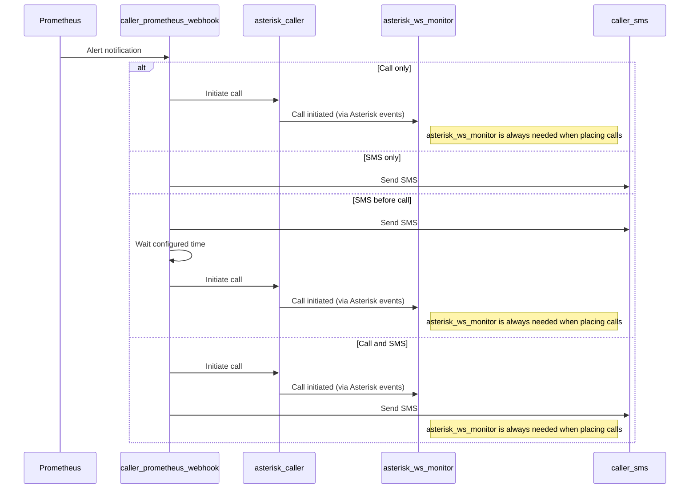
```mermaid
sequenceDiagram
    participant Prometheus
    participant PW as caller_prometheus_webhook
    participant AC as asterisk_caller
    participant WSM as asterisk_ws_monitor
    participant SMS as caller_sms

    Prometheus->>PW: Alert notification

    alt Call only
        PW->>AC: Initiate call
        AC->>WSM: Call initiated (via Asterisk events)
        Note right of WSM: asterisk_ws_monitor is always needed when placing calls
    else SMS only
        PW->>SMS: Send SMS
    else SMS before call
        PW->>SMS: Send SMS
        PW->>PW: Wait configured time
        PW->>AC: Initiate call
        AC->>WSM: Call initiated (via Asterisk events)
        Note right of WSM: asterisk_ws_monitor is always needed when placing calls
    else Call and SMS
        PW->>AC: Initiate call
        AC->>WSM: Call initiated (via Asterisk events)
        PW->>SMS: Send SMS
        Note right of WSM: asterisk_ws_monitor is always needed when placing calls
    end
```

### caller_register

#### Overview
The caller_register component manages the registration and tracking of calls in the system. It handles database operations for call records, including creating new call attempts, updating call statuses (acknowledged, heard), and managing voice messages. It also supports scheduled calls.

#### Key Features
- Maintains a registry of all calls in the system
- Tracks call statuses and outcomes
- Manages voice message associations
- Provides API for call registration and status updates

#### Main Functions
- `init_database()`: Initializes the database connection and runs migrations
- `register_call()`: Registers a new call in the system
- `acknowledge()`: Updates the acknowledgement status of a call
- `heard()`: Updates the heard status of a call
- `voice_message()`: Manages voice messages
- `scheduled_call()`: Handles scheduled calls
- `init_app()`: Initializes the application with HTTP endpoints

#### Component Interactions
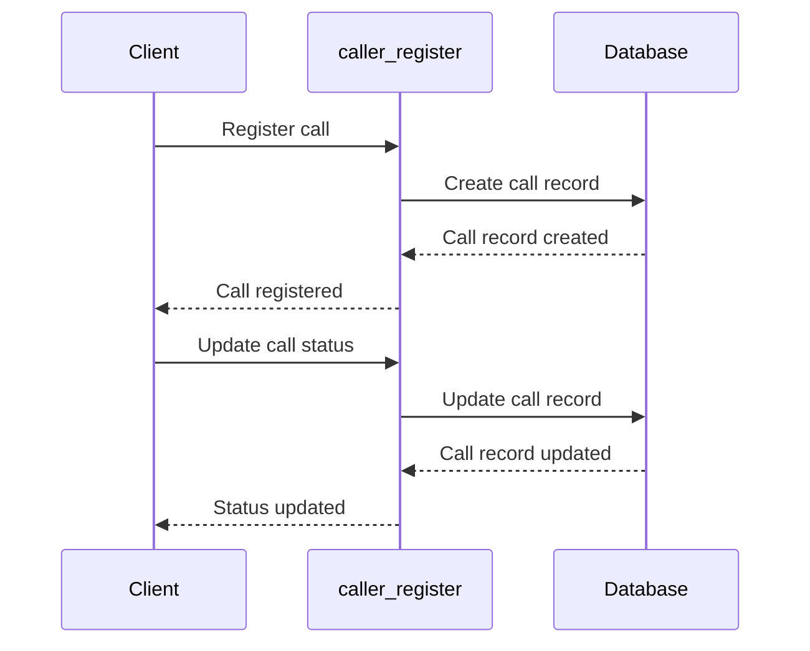
```mermaid
sequenceDiagram
    participant Client
    participant CR as caller_register
    participant DB as Database

    Client->>CR: Register call
    CR->>DB: Create call record
    DB-->>CR: Call record created
    CR-->>Client: Call registered

    Client->>CR: Update call status
    CR->>DB: Update call record
    DB-->>CR: Call record updated
    CR-->>Client: Status updated
```

### caller_scheduler

#### Overview
The caller_scheduler component provides functionality for scheduling calls to be made at a specific time in the future. It exposes a web API endpoint that accepts parameters for the phone number, message, and scheduled time. The component converts the local time to UTC and uses Celery to schedule the call task.

#### Key Features
- Schedules calls for future execution
- Handles time zone conversions
- Uses Celery for reliable task scheduling
- Provides API for scheduling calls

#### Main Functions
- `schedule_this_call()`: Handles incoming requests to schedule a call at a specified time
- `init_app()`: Initializes and configures the aiohttp web application for scheduling calls

#### Component Interactions
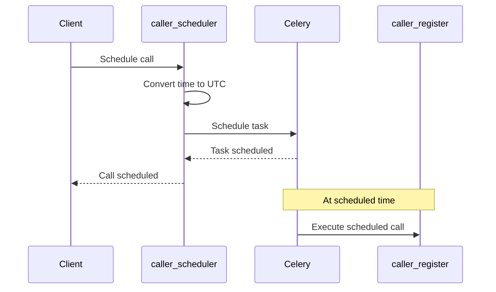
```mermaid
sequenceDiagram
    participant Client
    participant CS as caller_scheduler
    participant Celery
    participant CR as caller_register

    Client->>CS: Schedule call
    CS->>CS: Convert time to UTC
    CS->>Celery: Schedule task
    Celery-->>CS: Task scheduled
    CS-->>Client: Call scheduled

    Note over Celery,CR: At scheduled time
    Celery->>CR: Execute scheduled call
```

### caller_sms

#### Overview
The caller_sms component provides functionality for sending SMS messages. It exposes a web API endpoint that accepts parameters for the message content and recipient phone number. The component uses Twilio as the SMS provider and sends messages asynchronously using a thread pool executor.

#### Key Features
- Sends SMS notifications via Twilio
- Processes SMS requests asynchronously
- Provides API for sending SMS messages
- Can be used independently or with call notifications

#### Main Functions
- `sms_sender_async()`: Sends an SMS message asynchronously using a thread pool executor
- `send_the_sms()`: Handles incoming requests to send an SMS message to a specified phone number
- `init_app()`: Initializes and configures the aiohttp web application for sending SMS messages

#### Component Interactions
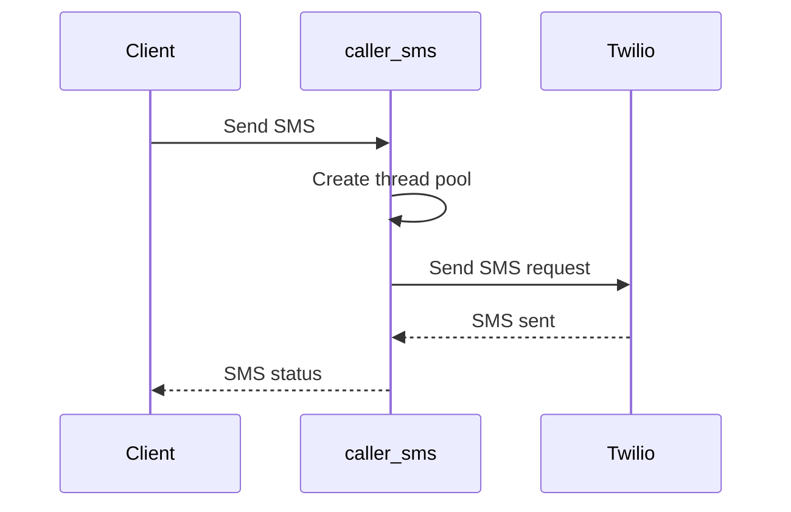
```mermaid
sequenceDiagram
    participant Client
    participant SMS as caller_sms
    participant Twilio

    Client->>SMS: Send SMS
    SMS->>SMS: Create thread pool
    SMS->>Twilio: Send SMS request
    Twilio-->>SMS: SMS sent
    SMS-->>Client: SMS status
```

### generate_audio

#### Overview
The generate_audio component is responsible for converting text messages to speech audio files. It supports multiple text-to-speech (TTS) engines including Google TTS, AWS Polly, Facebook MMS, and Piper TTS. The component exposes web API endpoints for creating audio files from text messages and checking if audio files are ready.

#### Key Features
- Converts text to speech using multiple TTS engines
- Supports multiple languages and voices
- Manages audio file storage and retrieval
- Provides API for audio generation and status checking

#### Main Functions
- `generate_tts_audio()`: Generates audio files using the selected TTS engine
- `text_to_speech_piper_tts()`: Implements the Piper TTS engine
- `is_audio_ready()`: HTTP endpoint to check if an audio file is ready
- `create_audio()`: HTTP endpoint to create an audio file from a text message
- `init_app()`: Initializes the application with HTTP endpoints

#### Component Interactions
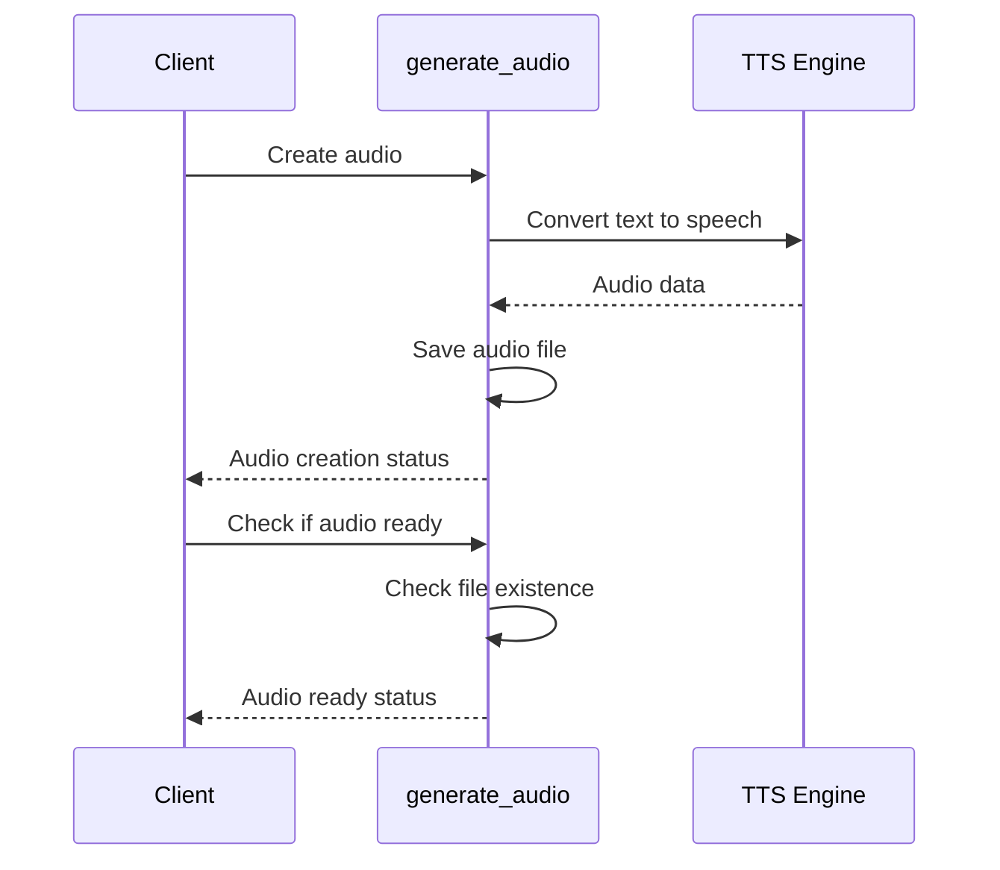
```mermaid
sequenceDiagram
    participant Client
    participant GA as generate_audio
    participant TTS as TTS Engine

    Client->>GA: Create audio
    GA->>TTS: Convert text to speech
    TTS-->>GA: Audio data
    GA->>GA: Save audio file
    GA-->>Client: Audio creation status

    Client->>GA: Check if audio ready
    GA->>GA: Check file existence
    GA-->>Client: Audio ready status
```

### py-phone-caller-ui

#### Overview
The py-phone-caller-ui component provides a web-based user interface for the py-phone-caller system. It's built using Flask and includes several sections: login, home, calls, schedule_call, users, and ws_events. The component handles user authentication using Flask-Login and ensures that an admin user exists in the system.

#### Key Features
- Web-based interface for system management
- User authentication and authorization
- Call history and management
- Call scheduling interface

#### Main Functions
- Flask application setup with several blueprints for different sections (login, home, calls, schedule_call, users, ws_events)
- `load_user()`: Loads a user for Flask-Login based on the provided user ID
- `setup_admin_user()`: Ensures that an admin user exists and resets the admin password if required

#### Component Interactions
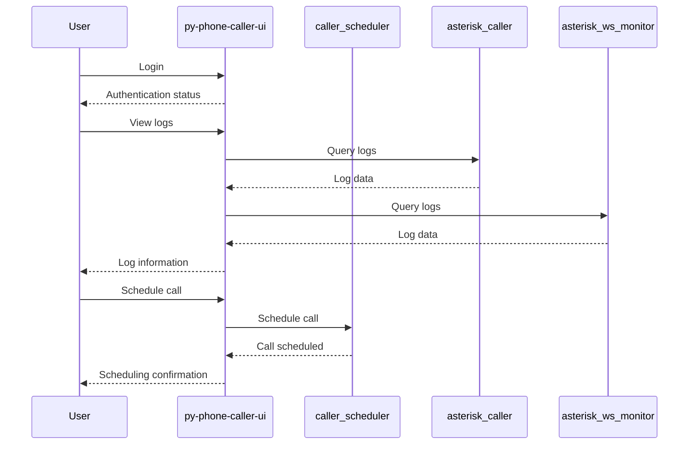
```mermaid
sequenceDiagram
    participant User
    participant UI as py-phone-caller-ui
    participant CS as caller_scheduler
    participant AC as asterisk_caller
    participant WSM as asterisk_ws_monitor

    User->>UI: Login
    UI-->>User: Authentication status

    User->>UI: View logs
    UI->>AC: Query logs
    AC-->>UI: Log data
    UI->>WSM: Query logs
    WSM-->>UI: Log data
    UI-->>User: Log information

    User->>UI: Schedule call
    UI->>CS: Schedule call
    CS-->>UI: Call scheduled
    UI-->>User: Scheduling confirmation
```

### py_phone_caller_utils

#### Overview
The py_phone_caller_utils package is a collection of utility modules used by other components in the system. It provides functionality for configuration management, database access, text-to-speech interfaces, SMS sending, and more.

#### Key Features
- Configuration management
- Database access
- Text-to-speech interfaces
- SMS functionality
- Asynchronous task processing
- User authentication

#### Subpackages and Modules
- **caller_configuration.py**: Handles loading and accessing configuration settings
- **checksums**: Provides functions for generating checksums
- **login**: Handles user authentication
- **py_phone_caller_db**: Handles database operations
- **py_phone_caller_voices**: Provides interfaces to text-to-speech engines
- **sms**: Handles SMS functionality
- **tasks**: Handles asynchronous task processing

#### Component Interactions
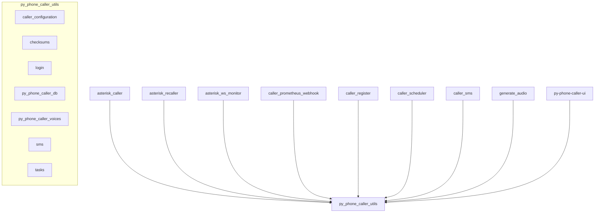
```mermaid
graph TD
    AC[asterisk_caller] --> PCU[py_phone_caller_utils]
    AR[asterisk_recaller] --> PCU
    WSM[asterisk_ws_monitor] --> PCU
    PW[caller_prometheus_webhook] --> PCU
    CR[caller_register] --> PCU
    CS[caller_scheduler] --> PCU
    SMS[caller_sms] --> PCU
    GA[generate_audio] --> PCU
    UI[py-phone-caller-ui] --> PCU

    subgraph py_phone_caller_utils
        CC[caller_configuration]
        CHK[checksums]
        LGN[login]
        DB[py_phone_caller_db]
        VOI[py_phone_caller_voices]
        SMS_U[sms]
        TSK[tasks]
    end
```

## Configuration

The py-phone-caller system is configured using a TOML configuration file located at `src/config/caller_config.toml`. This file contains settings for all components of the system, organized into sections:

- **[commons]**: Common settings like Asterisk credentials
- **[asterisk_call]**: Settings for the asterisk_caller component
- **[call_register]**: Settings for the caller_register component
- **[asterisk_ws_monitor]**: Settings for the asterisk_ws_monitor component
- **[asterisk_recall]**: Settings for the asterisk_recaller component
- **[generate_audio]**: Settings for the generate_audio component
- **[caller_prometheus_webhook]**: Settings for the caller_prometheus_webhook component
- **[caller_sms]**: Settings for the caller_sms component
- **[scheduled_calls]**: Settings for the caller_scheduler component
- **[queue]**: Settings for the message queue (Redis)
- **[database]**: Database connection settings
- **[py_phone_caller_ui]**: Settings for the web UI
- **[logger]**: Logging configuration

Configuration settings can be accessed in code using the functions provided by the `py_phone_caller_utils.caller_configuration` module.

## Call Flows

The py-phone-caller system supports several call flows, depending on how the call is initiated. **Note that the asterisk_ws_monitor package is always needed when placing calls**, as it handles the real-time monitoring of call events and coordinates audio playback. The following diagrams illustrate the main call flows:

### Manual Call Flow

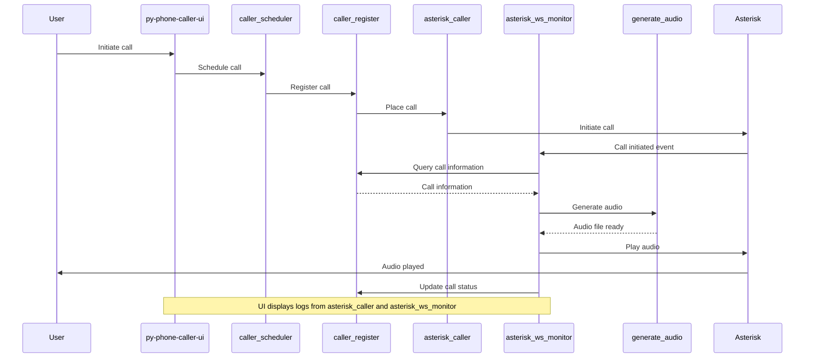
```mermaid
sequenceDiagram
    participant User
    participant UI as py-phone-caller-ui
    participant CS as caller_scheduler
    participant CR as caller_register
    participant AC as asterisk_caller
    participant WSM as asterisk_ws_monitor
    participant GA as generate_audio
    participant Asterisk

    User->>UI: Initiate call
    UI->>CS: Schedule call
    CS->>CR: Register call
    CR->>AC: Place call
    AC->>Asterisk: Initiate call
    Asterisk->>WSM: Call initiated event
    WSM->>CR: Query call information
    CR-->>WSM: Call information
    WSM->>GA: Generate audio
    GA-->>WSM: Audio file ready
    WSM->>Asterisk: Play audio
    Asterisk->>User: Audio played
    WSM->>CR: Update call status

    Note over WSM,UI: UI displays logs from asterisk_caller and asterisk_ws_monitor
```

### Scheduled Call Flow

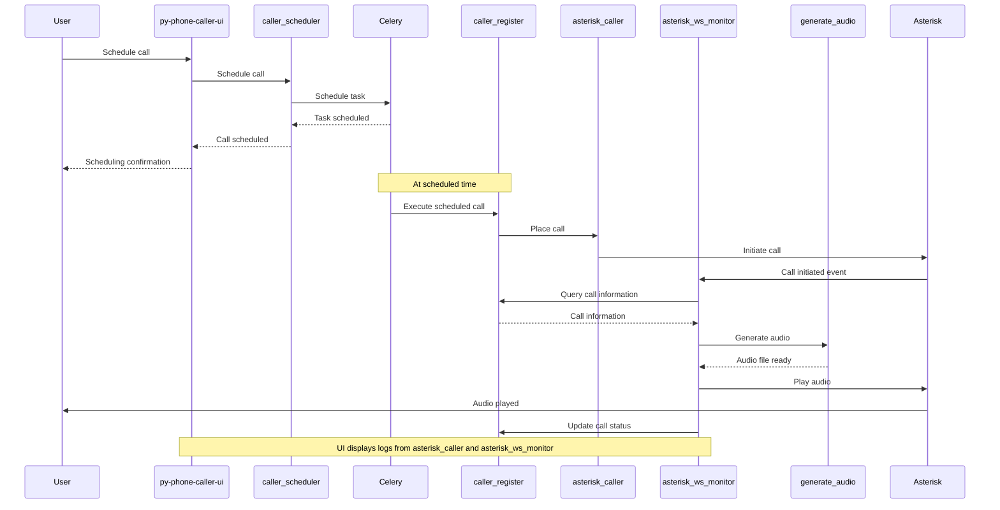
```mermaid
sequenceDiagram
    participant User
    participant UI as py-phone-caller-ui
    participant CS as caller_scheduler
    participant Celery
    participant CR as caller_register
    participant AC as asterisk_caller
    participant WSM as asterisk_ws_monitor
    participant GA as generate_audio
    participant Asterisk

    User->>UI: Schedule call
    UI->>CS: Schedule call
    CS->>Celery: Schedule task
    Celery-->>CS: Task scheduled
    CS-->>UI: Call scheduled
    UI-->>User: Scheduling confirmation

    Note over Celery,CR: At scheduled time
    Celery->>CR: Execute scheduled call
    CR->>AC: Place call
    AC->>Asterisk: Initiate call
    Asterisk->>WSM: Call initiated event
    WSM->>CR: Query call information
    CR-->>WSM: Call information
    WSM->>GA: Generate audio
    GA-->>WSM: Audio file ready
    WSM->>Asterisk: Play audio
    Asterisk->>User: Audio played
    WSM->>CR: Update call status

    Note over WSM,UI: UI displays logs from asterisk_caller and asterisk_ws_monitor
```

### Prometheus Alert Call Flow

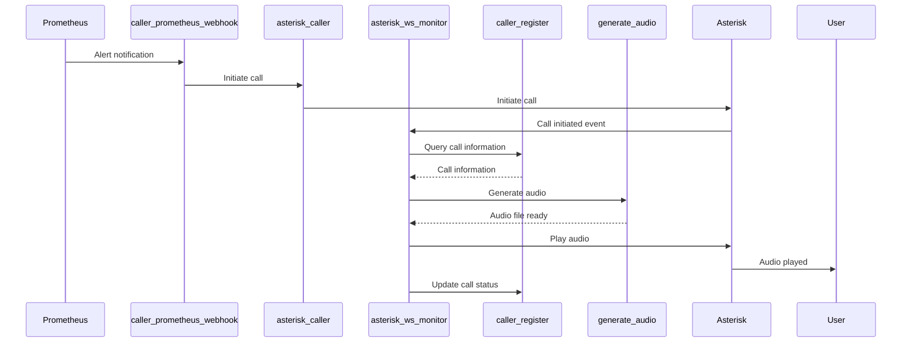
```mermaid
sequenceDiagram
    participant Prometheus
    participant PW as caller_prometheus_webhook
    participant AC as asterisk_caller
    participant WSM as asterisk_ws_monitor
    participant CR as caller_register
    participant GA as generate_audio
    participant Asterisk
    participant User

    Prometheus->>PW: Alert notification
    PW->>AC: Initiate call
    AC->>Asterisk: Initiate call
    Asterisk->>WSM: Call initiated event
    WSM->>CR: Query call information
    CR-->>WSM: Call information
    WSM->>GA: Generate audio
    GA-->>WSM: Audio file ready
    WSM->>Asterisk: Play audio
    Asterisk->>User: Audio played
    WSM->>CR: Update call status
```

### Failed Call Retry Flow

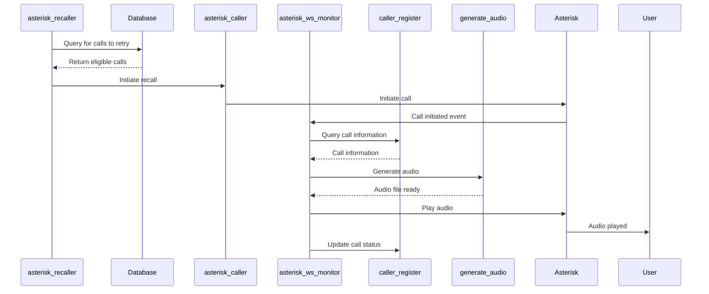
```mermaid
sequenceDiagram
    participant AR as asterisk_recaller
    participant DB as Database
    participant AC as asterisk_caller
    participant WSM as asterisk_ws_monitor
    participant CR as caller_register
    participant GA as generate_audio
    participant Asterisk
    participant User

    AR->>DB: Query for calls to retry
    DB-->>AR: Return eligible calls
    AR->>AC: Initiate recall
    AC->>Asterisk: Initiate call
    Asterisk->>WSM: Call initiated event
    WSM->>CR: Query call information
    CR-->>WSM: Call information
    WSM->>GA: Generate audio
    GA-->>WSM: Audio file ready
    WSM->>Asterisk: Play audio
    Asterisk->>User: Audio played
    WSM->>CR: Update call status
```

## SMS Flows

The py-phone-caller system supports sending SMS messages independently or in conjunction with phone calls. The following diagrams illustrate the main SMS flows:

### Manual SMS Flow

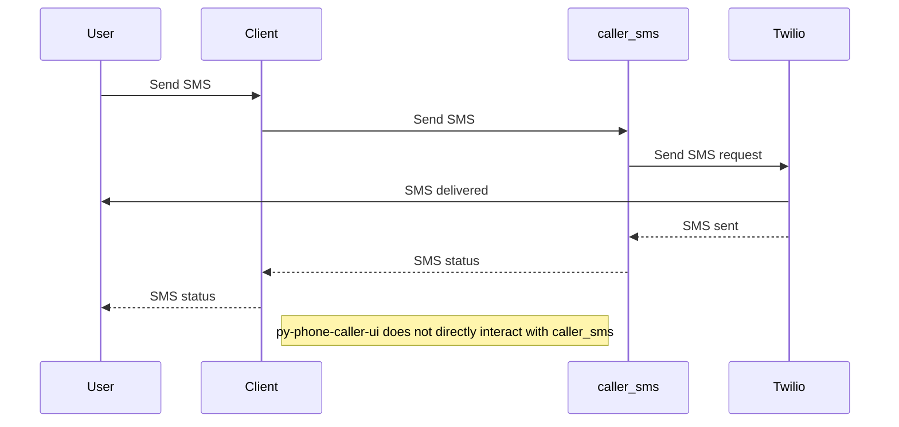
```mermaid
sequenceDiagram
    participant User
    participant Client
    participant SMS as caller_sms
    participant Twilio

    User->>Client: Send SMS
    Client->>SMS: Send SMS
    SMS->>Twilio: Send SMS request
    Twilio->>User: SMS delivered
    Twilio-->>SMS: SMS sent
    SMS-->>Client: SMS status
    Client-->>User: SMS status

    Note right of Client: py-phone-caller-ui does not directly interact with caller_sms
```

### Prometheus Alert SMS Flow

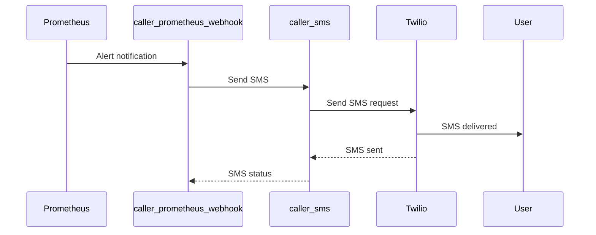
```mermaid
sequenceDiagram
    participant Prometheus
    participant PW as caller_prometheus_webhook
    participant SMS as caller_sms
    participant Twilio
    participant User

    Prometheus->>PW: Alert notification
    PW->>SMS: Send SMS
    SMS->>Twilio: Send SMS request
    Twilio->>User: SMS delivered
    Twilio-->>SMS: SMS sent
    SMS-->>PW: SMS status
```

## Prometheus Alert Flows

The py-phone-caller system can be triggered by Prometheus alerts through the caller_prometheus_webhook component. The following diagrams illustrate the different alert notification strategies:

### Call Only Alert Flow

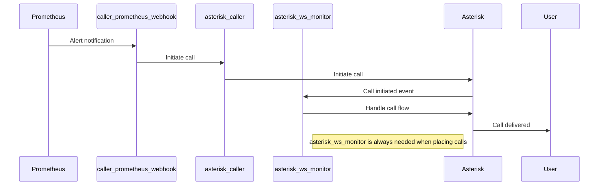
```mermaid
sequenceDiagram
    participant Prometheus
    participant PW as caller_prometheus_webhook
    participant AC as asterisk_caller
    participant WSM as asterisk_ws_monitor
    participant Asterisk
    participant User

    Prometheus->>PW: Alert notification
    PW->>AC: Initiate call
    AC->>Asterisk: Initiate call
    Asterisk->>WSM: Call initiated event
    WSM->>Asterisk: Handle call flow
    Asterisk->>User: Call delivered

    Note right of WSM: asterisk_ws_monitor is always needed when placing calls
```

### SMS Only Alert Flow

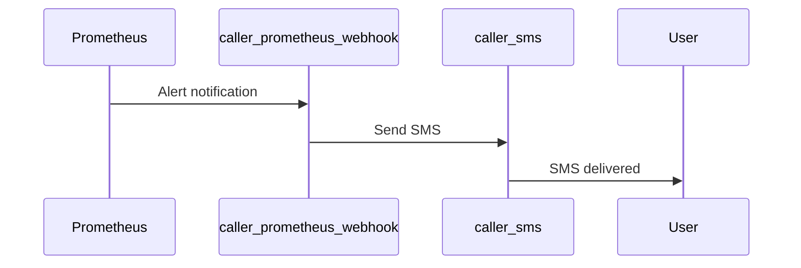
```mermaid
sequenceDiagram
    participant Prometheus
    participant PW as caller_prometheus_webhook
    participant SMS as caller_sms
    participant User

    Prometheus->>PW: Alert notification
    PW->>SMS: Send SMS
    SMS->>User: SMS delivered
```

### SMS Before Call Alert Flow

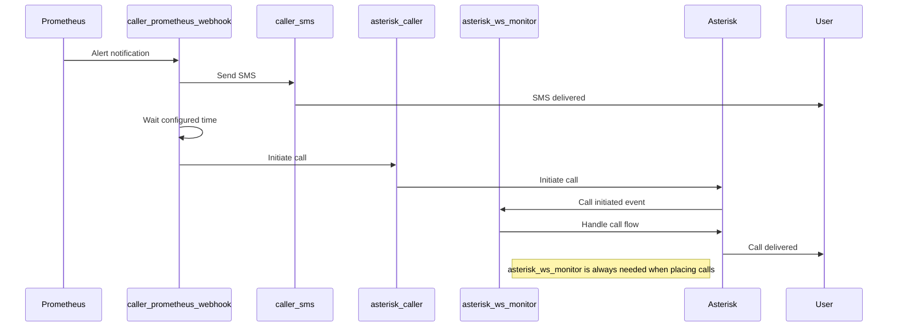
```mermaid
sequenceDiagram
    participant Prometheus
    participant PW as caller_prometheus_webhook
    participant SMS as caller_sms
    participant AC as asterisk_caller
    participant WSM as asterisk_ws_monitor
    participant Asterisk
    participant User

    Prometheus->>PW: Alert notification
    PW->>SMS: Send SMS
    SMS->>User: SMS delivered
    PW->>PW: Wait configured time
    PW->>AC: Initiate call
    AC->>Asterisk: Initiate call
    Asterisk->>WSM: Call initiated event
    WSM->>Asterisk: Handle call flow
    Asterisk->>User: Call delivered

    Note right of WSM: asterisk_ws_monitor is always needed when placing calls
```

### Call and SMS Alert Flow

```mermaid
sequenceDiagram
    participant Prometheus
    participant PW as caller_prometheus_webhook
    participant AC as asterisk_caller
    participant SMS as caller_sms
    participant User

    Prometheus->>PW: Alert notification
    PW->>AC: Initiate call
    PW->>SMS: Send SMS
    AC->>User: Call delivered
    SMS->>User: SMS delivered
```
