## VirtualBox Setup for py-phone-caller

In this guide, we will configure the two virtual machines in VirtualBox. The virtual machines are two, the FreePBX
server and the '**py-phone-caller**'

> First, we need to configure the VirtualBox networking options and later, as second step, import the virtual machines through the OVA files

### Main screen

Once the networking options are configured in our VirtualBox instance, we need to import the two virtual machines. This
screen *(or something like that, depending your setup)* is the result of the steps described in this guide.

The virtual machines are using a **NAT Network** *(10.22.22.0/24)* in order to make possible the interaction with
**py-phone-caller** and the **Asterisk PBX** *(FreePBX disbribution)*, and a **Host-only Adapter**
*(192.168.56.0/24)* in order to connect from the host system where VirtualBox is running.

The virtual machines have the following IP addresses:

* **py-phone-caller**: 192.168.56.102 / 10.22.22.105
* **freepbx**: 192.168.56.101 / 10.22.22.234

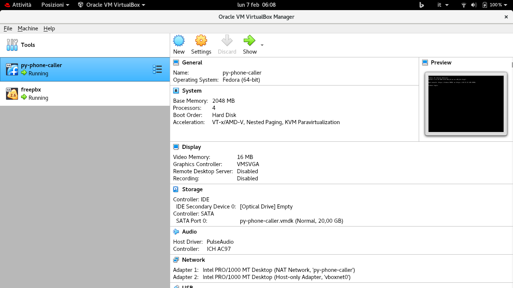

### VirtualBox Host Network Configuration

1. Open the '**File**' menu
2. Select the '**Host Network Manager...**'

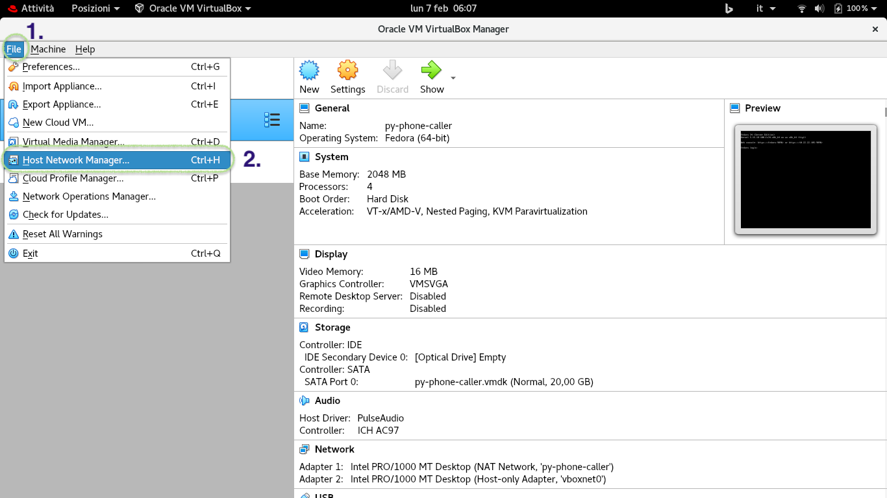

### Adding And Configuring a Host Network

> If the interface '**vboxnet0**' exists and is used by other virtual
> machines we can create a new one. Pay attention during the virtual machine
> configuration, the name of the network interface may be different than
> '**vboxnet0**'.

1. Select the '**vboxnet0**' network interface
2. Open the '**Properties**' item
3. Verify that the network interface has the IP address '*192.168.56.1*'
4. Click the '**Apply**' button

> the '**freepbx**' vm is using the IP '**192.168.56.101**' and the '**py-phone-caller**'
> is usig the IP address '**192.168.56.102**'.

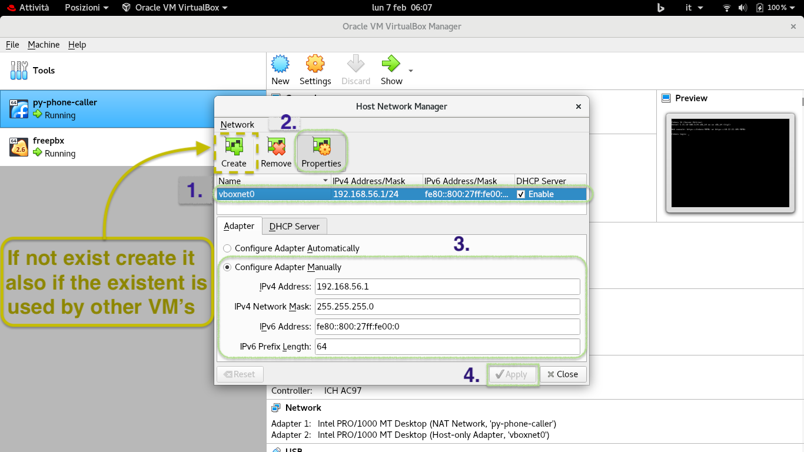

### The VirtualBox Preferences

1. Click on the '**File**'
2. Open the '**Preferences...**' item

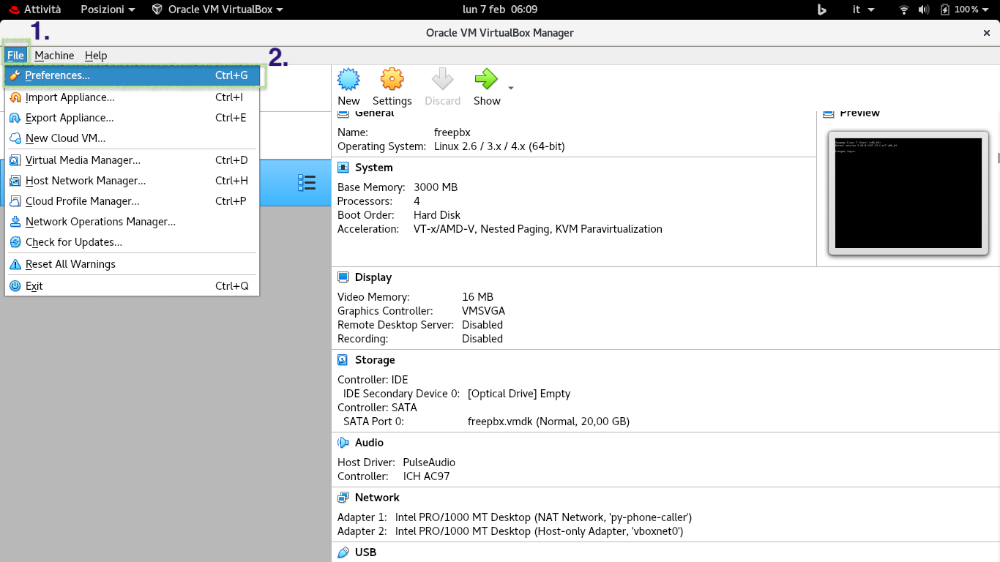

### VirtualBox Networking Settings

1. Select the '**Network**' item
2. Select the '**py-phone-caller**' network
3. Click on the icon with the gear

> 3-Yellow) if the network does not exist in our instance we need to create it,
> in order to do this click on the icon with the "**+**" sign.

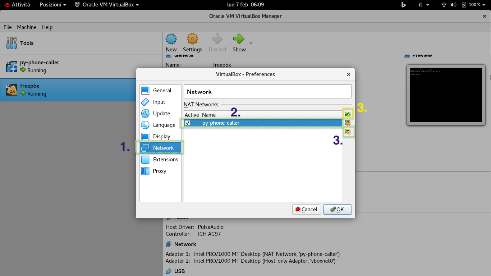

### VirtualBox NAT Network Details

1. Set the name to '**py-py-phone-caller**', Configure the range '**10.22.22.0/24**', be sure that the DHCP is enabled.
2. Click on the '**OK**' button.

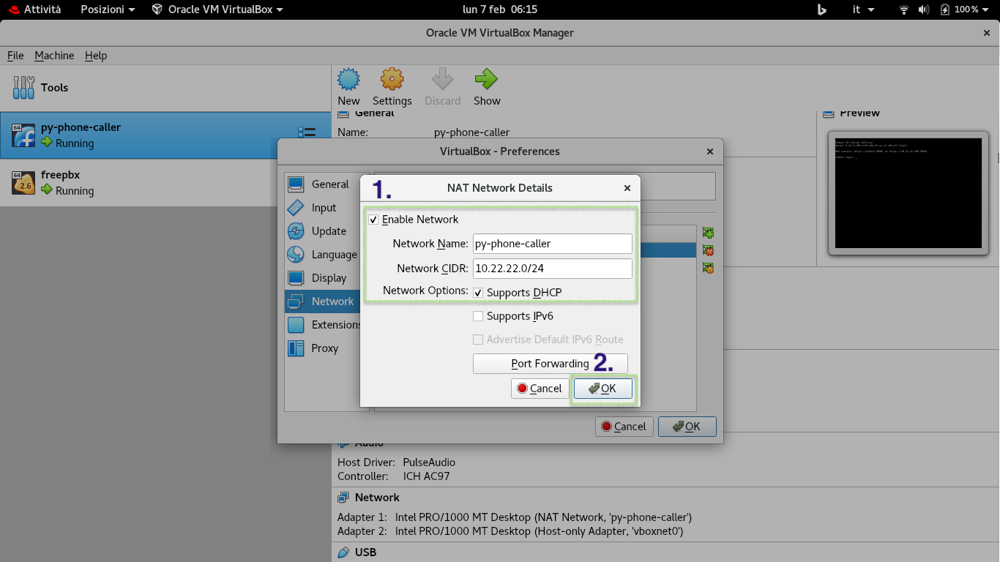

### Setting of 'py-phone-caller' Virtual Machine

1. Select the '**py-phone-caller**' virtual machine
2. Click with the right mouse button and select '**Settings...**'

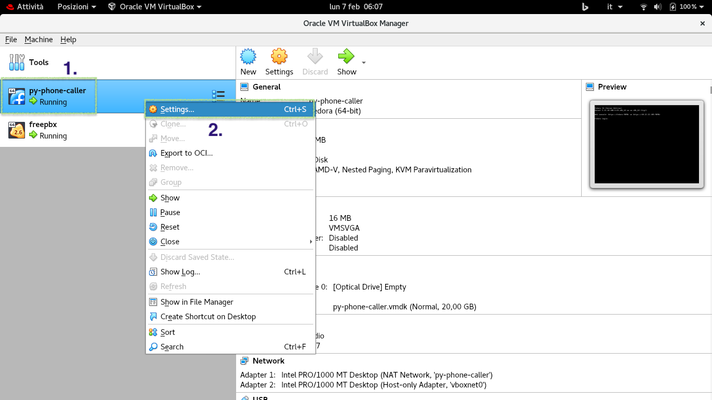

### First Network Interface Of The 'py-phone-caller' Virtual Machine

1. Select the '**Network**' option
2. By sure that the '**Attached to**' is configured in with '**NAT Network**' and the '**Name**' -> '**
   py-phone-caller**' *(the network created in the precedent steps)*
3. Assure that the checkbox is enabled in the '**Cable Connected**' option
4. Please wait, don't press '**OK**' We need to configure the '**Adapter 2**'

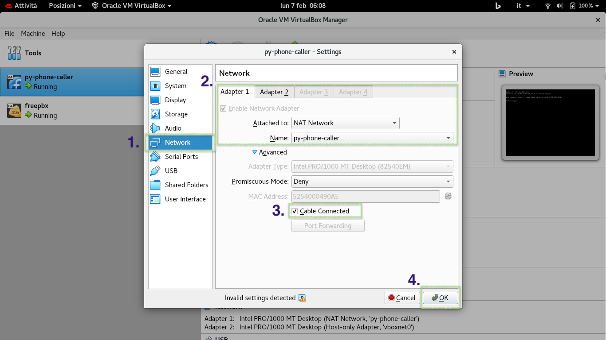

### Second Network Interface Of The 'py-phone-caller' Virtual Machine

1. Remain always on the '**Network**' section
2. Open the '**Adapter 2**' tab
3. By sure that the '**Attached to**' is configured in with '**Host-only Adapter**' and the '**Name**' -> '**
   vboxnet0**' *(the network created or modified in the precedent steps)*
4. Assure that the checkbox is enabled in the '**Cable Connected**' option
5. Cick on the '**OK**' button

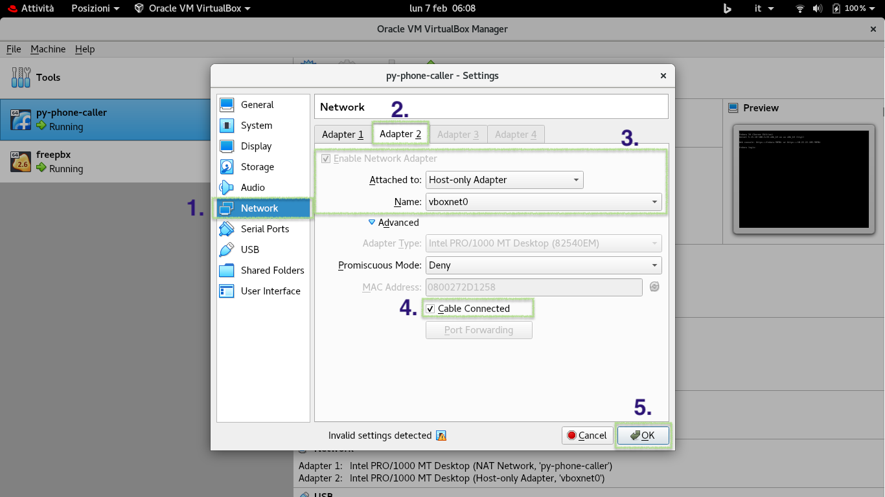

### The 'FreePBX' Virtual Machine

1. Select the '**freepbx**' virtual machine

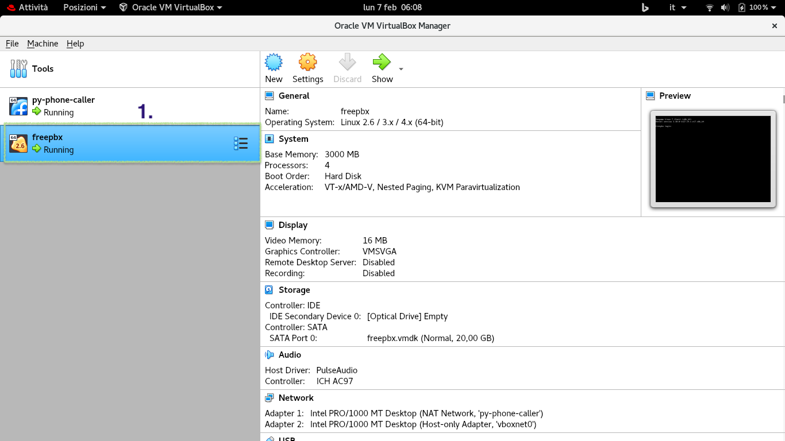

### Settings of 'FreePBX' Virtual Machine

1. Click with the right mouse button and select the '**Settings...**' option

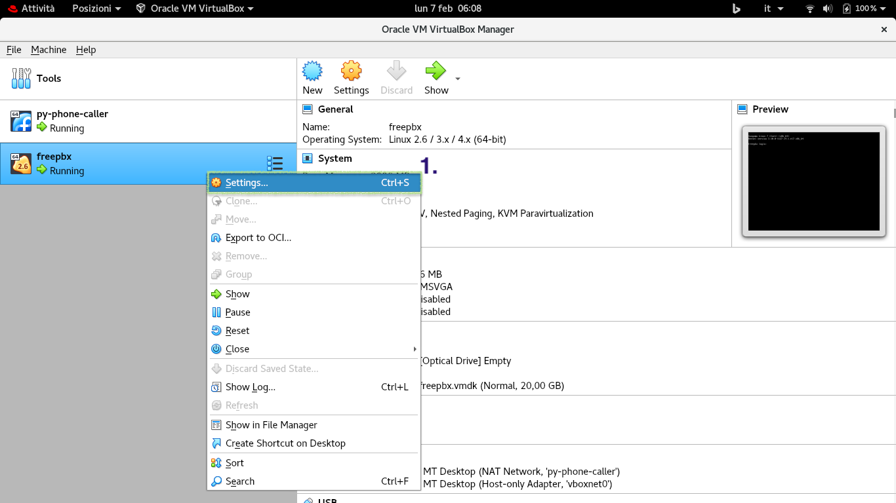

### First Network Interface Of The 'FreePBX' Virtual Machine

1. Select the '**Network**' option
2. By sure that the '**Attached to**' is configured in with '**NAT Network**' and the '**Name**' -> '**
   py-phone-caller**' *(the network created in the precedent steps)*
3. Assure that the checkbox is enabled in the '**Cable Connected**' option

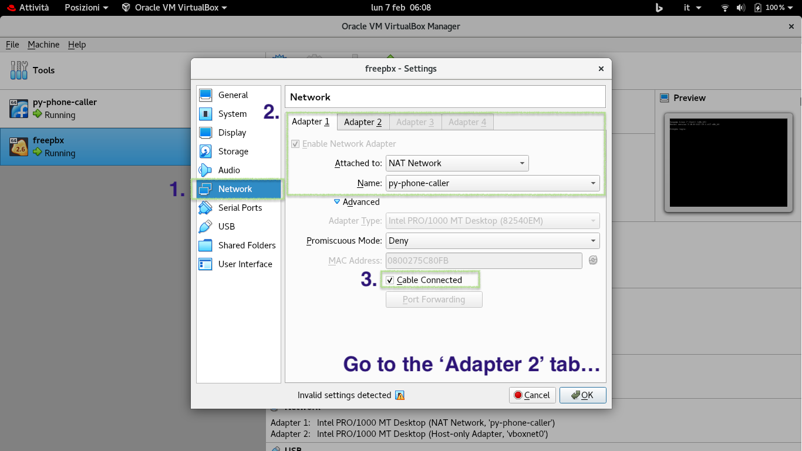

### Second Network Interface Of The 'FreePBX' Virtual Machine

1. Remain always on the '**Network**' section
2. Open the '**Adapter 2**' tab
3. By sure that the '**Attached to**' is configured in with '**Host-only Adapter**' and the '**Name**' -> '**
   vboxnet0**' *(the network created or modified in the precedent steps)*
4. Assure that the checkbox is enabled in the '**Cable Connected**' option
5. Cick on the '**OK**' button

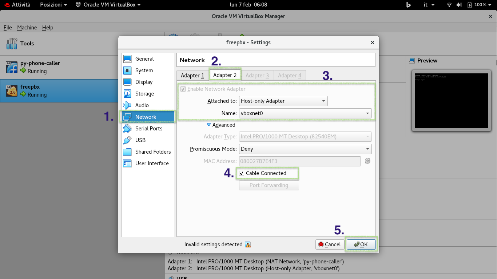

> Important: the name of the network '**vboxnet0**' can be different according to the previous setups of VirtualBox