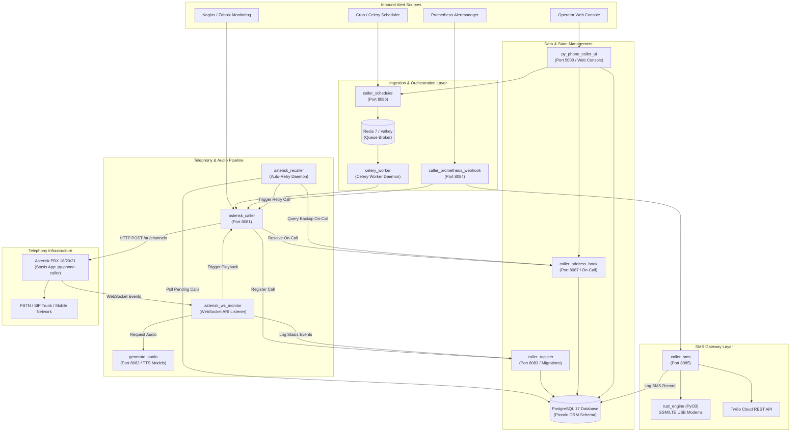
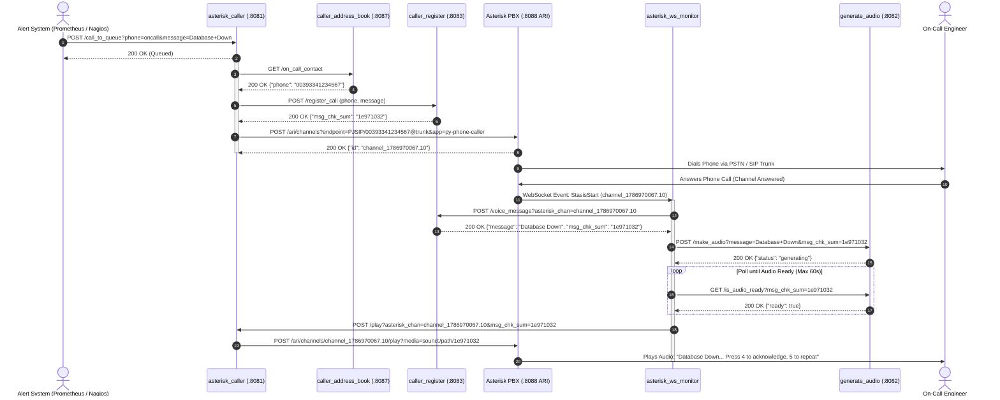
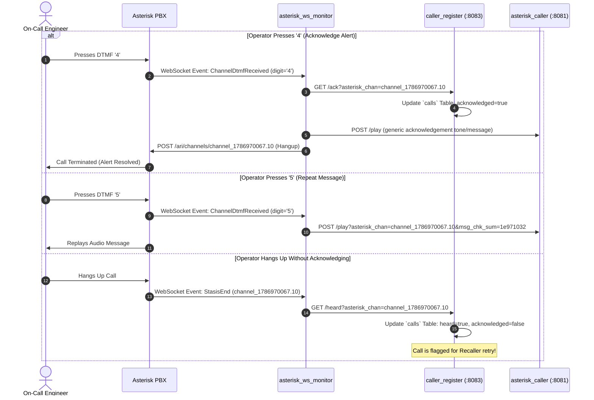
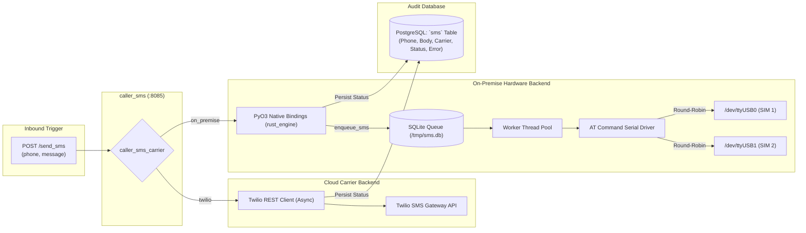
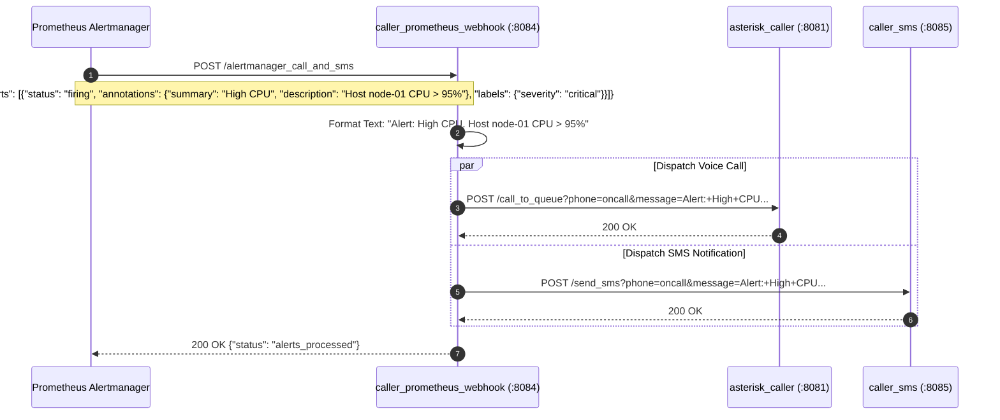
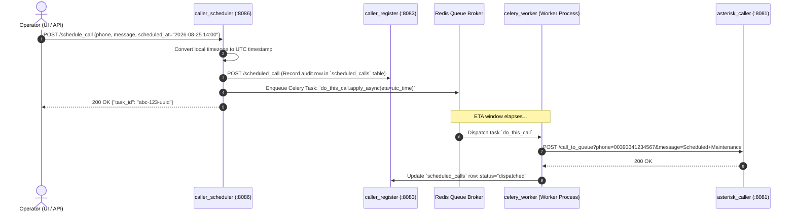

# 🏛️ py-phone-caller Architecture & Call Flows Guide

This document provides a comprehensive technical architecture and sequence flow specification for **py-phone-caller** (Release 1.0.0).

---

## 📑 Table of Contents

1. [High-Level Platform Architecture](#1-high-level-platform-architecture)
2. [Domain-Driven Data & Service Boundaries](#2-domain-driven-data--service-boundaries)
3. [The Core Call Lifecycle & Asterisk ARI Pipeline](#3-the-core-call-lifecycle--asterisk-ari-pipeline)
4. [Real-Time DTMF Acknowledgment & Interactive Dialplan Flow](#4-real-time-dtmf-acknowledgment--interactive-dialplan-flow)
5. [Intelligent Recaller & Backup Contact Escalation Flow](#5-intelligent-recaller--backup-contact-escalation-flow)
6. [Out-of-Band SMS Notification Architecture (Twilio & Rust Modem Engine)](#6-out-of-band-sms-notification-architecture-twilio--rust-modem-engine)
7. [Prometheus Alertmanager & Monitoring Ingestion Pipeline](#7-prometheus-alertmanager--monitoring-ingestion-pipeline)
8. [Scheduled Calls & Background Celery Worker Pipeline](#8-scheduled-calls--background-celery-worker-pipeline)
9. [Air-Gapped & Offline Architecture Principles](#9-air-gapped--offline-architecture-principles)

---

## 1. High-Level Platform Architecture

**py-phone-caller** is structured as an ecosystem of 11 decoupled microservices interacting over asynchronous HTTP REST APIs, WebSockets, Celery task queues, and shared PostgreSQL/Redis data stores.



---

## 2. Domain-Driven Data & Service Boundaries

Each stateful service in `py-phone-caller` encapsulates its specific business domain:

| Service | Domain Responsibility | Owned Database Tables | Primary HTTP Endpoints |
| :--- | :--- | :--- | :--- |
| **`caller_register`** | Central call registry, state tracker, and Piccolo ORM migration engine | `calls`<br>`scheduled_calls`<br>`asterisk_ws_events` | `POST /register_call`<br>`POST /voice_message`<br>`GET /heard`<br>`GET /ack` |
| **`caller_address_book`** | Contact directory and time-based on-call availability management | `address_book` | `POST /add_contact`<br>`PUT /modify_contact/{id}`<br>`GET /on_call_contact`<br>`GET /contacts_export_csv` |
| **`caller_sms`** | Multi-carrier SMS dispatch and delivery tracking | `sms` | `POST /send_sms`<br>`GET /get_sms` |
| **`py_phone_caller_ui`** | Operator web console, dashboard, session authentication, and reporting | `users` | `GET /`<br>`GET /calls`<br>`GET /address_book`<br>`GET /sms`<br>`POST /login` |
| **`generate_audio`** | Multi-engine offline neural text-to-speech audio synthesis | *Stateless (Local Audio Cache)* | `POST /make_audio`<br>`GET /is_audio_ready` |
| **`asterisk_caller`** | Call placement queue, Asterisk ARI originate client, and playback bridge | *Stateless (Async Worker Queue)* | `POST /call_to_queue`<br>`POST /place_call`<br>`POST /play` |

---

## 3. The Core Call Lifecycle & Asterisk ARI Pipeline

The following sequence diagram illustrates what happens from the moment an alert arrives until the synthesized voice message is played to the receiver over the telephony network:



---

## 4. Real-Time DTMF Acknowledgment & Interactive Dialplan Flow

When the call is in progress, the operator can interact with the call using their phone keypad:



---

## 5. Intelligent Recaller & Backup Contact Escalation Flow

The `asterisk_recaller` background service ensures no emergency call goes unhandled:

```mermaid
flowchart TD
    START([asterisk_recaller Loop Start]) --> POLL[Poll Database: Find Calls where<br/>acknowledged == false AND<br/>created_time >= NOW - seconds_to_forget]
    
    POLL --> FOUND{Any Unacknowledged<br/>Calls Found?}
    FOUND -- No --> SLEEP[Sleep for retry_interval_seconds] --> START
    
    FOUND -- Yes --> CHECK_ATTEMPTS{Attempt Count <<br/>times_to_dial?}
    
    CHECK_ATTEMPTS -- Yes --> RETRY_PRIMARY[Increment retry count in DB]
    RETRY_PRIMARY --> DISPATCH_RETRY[POST /place_call to asterisk_caller<br/>(Call Original Phone Number)]
    DISPATCH_RETRY --> SLEEP
    
    CHECK_ATTEMPTS -- No --> CHECK_BACKUP{backup_callee == false AND<br/>backup_attempts < max_times?}
    
    CHECK_BACKUP -- Yes --> GET_BACKUP[Query caller_address_book for<br/>Next Priority On-Call Contact]
    GET_BACKUP --> ESCALATE[Set backup_callee = true<br/>Reset attempt counter]
    ESCALATE --> DISPATCH_BACKUP[POST /place_call to asterisk_caller<br/>(Call Backup Escalation Number)]
    DISPATCH_BACKUP --> SLEEP
    
    CHECK_BACKUP -- No --> EXHAUSTED[Mark call as EXHAUSTED / FORGOTTEN]
    EXHAUSTED --> SLEEP
```

---

## 6. Out-of-Band SMS Notification Architecture (Twilio & Rust Modem Engine)

When an emergency requires out-of-band text messages, `caller_sms` routes delivery based on configuration:



### UTF-8 & UCS-2 Character Encoding
For on-premise USB modems, the native `rust_engine` evaluates message content:
- **Pure ASCII Messages**: Transmitted using standard GSM-7 text mode (`AT+CMGF=1`).
- **Accented / Non-ASCII Characters (e.g. `ù`, `é`, `à`, `€`, `ö`)**: Automatically switched to **UCS-2 16-bit encoding** (`AT+CSCS="UCS2"`, `AT+CSMP=17,167,0,8`, body converted to hexadecimal representation) ensuring 100% clean rendering on mobile devices without corruption.

---

## 7. Prometheus Alertmanager & Monitoring Ingestion Pipeline

The `caller_prometheus_webhook` service maps monitoring alert states to voice and SMS actions:



---

## 8. Scheduled Calls & Background Celery Worker Pipeline

For future alerts, maintenance reminders, and automated scheduled testing:



---

## 9. Air-Gapped & Offline Architecture Principles

**py-phone-caller** is designed from the ground up for strict air-gapped data centers:

1. **Zero Runtime CDNs**: The Web UI bundles Bootstrap, FontAwesome, and custom CSS locally under `src/py_phone_caller_ui/static/`. No external Google Fonts, JavaScript CDNs, or telemetry endpoints are contacted.
2. **Pre-Packaged TTS Models**: Machine learning models for Kokoro TTS, Piper, and Facebook MMS are pre-downloaded during container build or deployment setup into `pre_trained_models/`. Synthesis runs 100% on local CPUs with zero Hugging Face or PyPI network requests at runtime.
3. **Multi-Package UV Locking**: All Python dependencies are locked in a single root `uv.lock`. Offline container builds and Ansible synchronizations install exclusively from local caches or on-premise PyPI mirrors.
4. **Local Telemetry & Storage**: Telemetry spans and Prometheus metrics export over standard OTLP/HTTP to internal collectors without sending data outside the trusted network.
