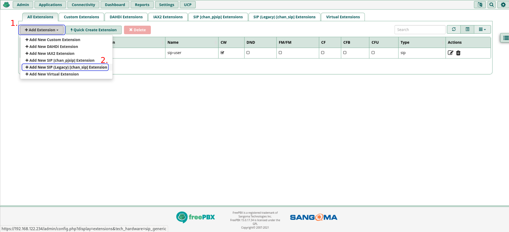
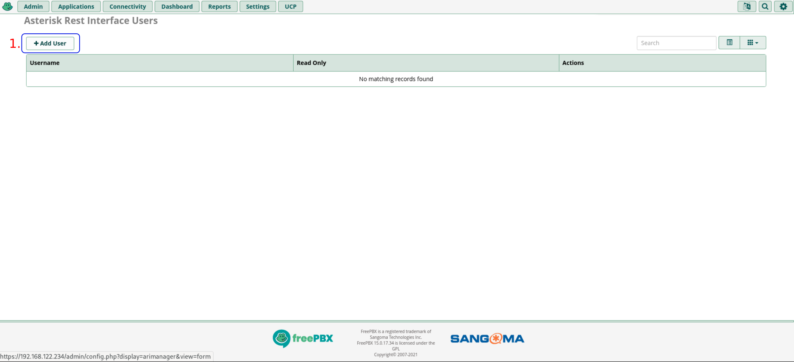
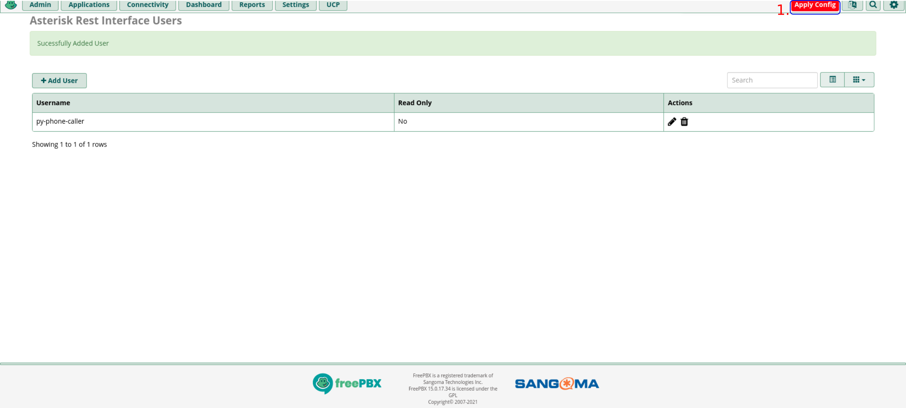

# 📞 FreePBX & Asterisk PBX Configuration Guide

This guide details the step-by-step configuration of **Asterisk PBX** and **FreePBX** for seamless integration with **py-phone-caller** (Release 1.0.0).

---

## 📑 Table of Contents

1. [Architectural Role of Asterisk & FreePBX](#1-architectural-role-of-asterisk--freepbx)
2. [Prerequisites & Network Ports](#2-prerequisites--network-ports)
3. [Configuring Outbound SIP / PJSIP Trunks (Visual)](#3-configuring-outbound-sip--pjsip-trunks-visual)
4. [Creating SIP / PJSIP Extensions for Testing](#4-creating-sip--pjsip-extensions-for-testing)
5. [Creating the Custom Extension & Stasis Dialplan](#5-creating-the-custom-extension--stasis-dialplan)
6. [Configuring Asterisk REST Interface (ARI) & WebSockets](#6-configuring-asterisk-rest-interface-ari--websockets)
7. [RTP, Codecs & NAT Network Settings](#7-rtp-codecs--nat-network-settings)
8. [Testing & Connectivity Verification](#8-testing--connectivity-verification)

---

## 1. Architectural Role of Asterisk & FreePBX

**py-phone-caller** uses the **Asterisk REST Interface (ARI)** to dynamically originate outbound phone calls, control audio playback, and capture real-time dual-tone multi-frequency (DTMF) keypad responses from on-call personnel.

```text
+-----------------------+                         +---------------------------+
|    asterisk_caller    |---(1. HTTP ARI POST)--->| Asterisk PBX / FreePBX    |
| (Outbound Controller) |                         | (ARI Port 8088 / SIP 5060)|
+-----------------------+                         +---------------------------+
                                                                |
+-----------------------+                         (2. Places Outbound Call)
|  asterisk_ws_monitor  |<--(3. WS Stasis Events)-+             |
| (Audio/Playback Loop) |                                       v
+-----------------------+                         +---------------------------+
                                                  | PSTN / SIP Trunk / Mobile |
                                                  +---------------------------+
```

---

## 2. Prerequisites & Network Ports

Ensure the following network communication is allowed between the **py-phone-caller** host/containers and the **Asterisk PBX**:

| Port / Protocol | Direction | Purpose | Default Value |
| :--- | :--- | :--- | :--- |
| **8088 / TCP** | App ➔ PBX | Asterisk HTTP ARI & WebSocket Events (`/ari/events`) | `8088` (or `8089` for TLS) |
| **5060 / UDP, TCP** | PBX ➔ Gateway | SIP Trunk Signaling (PJSIP or chan_sip) | `5060` |
| **10000–20000 / UDP**| Bidirectional | RTP Audio Media Streams | `10000:20000` |

---

## 3. Configuring Outbound SIP / PJSIP Trunks (Visual)

To route emergency calls out to landlines or mobile phones, configure a SIP or PJSIP trunk in the FreePBX GUI:

### Step 3.1: Navigate to Trunks
1. In the FreePBX top navigation menu, click **Connectivity**.
2. Select **Trunks**.


### Step 3.2: Add a New Trunk
1. Click the **+ Add Trunk** button.
2. Select **+ Add SIP (chan_pjsip) Trunk** (or chan_sip for legacy gateways).


### Step 3.3: Configure General Trunk Settings
1. Set the **Trunk Name** (e.g. `sip-provider`).
2. Set the **Outbound CallerID** to your organization's valid emergency caller ID.


### Step 3.4: Configure SIP Credentials & Server Details
1. Switch to the **pjsip Settings** (or **sip Settings**) tab.
2. Enter your VoIP provider's **SIP Server / Outbound Proxy**, **Username**, and **Secret / Password**.
3. Set **Context** to `from-trunk` and **Authentication** to `Outbound`.


### Step 3.5: Apply Config
Click **Submit** and then click the red **Apply Config** button at the top right of the FreePBX header.


---

## 4. Creating SIP / PJSIP Extensions for Testing

For lab environments and softphone verification (e.g. Linphone, Zoiper, MicroSIP):

### Step 4.1: Navigate to Extensions
Click **Applications** ➔ **Extensions** ➔ **+ Add Extension** ➔ **+ Add New PJSIP Extension**.


### Step 4.2: Configure Extension Credentials
1. Set **User Extension** (e.g. `2001`).
2. Set **Display Name** (e.g. `On-Call Test Phone`).
3. Set **Secret** (PJSIP password).





Click **Submit** and **Apply Config**.

---

## 5. Creating the Custom Extension & Stasis Dialplan

Asterisk needs a dialplan context that routes answered calls into the **Stasis** application managed by `asterisk_ws_monitor`.

### Step 5.1: Configure `extensions_custom.conf`
Log into your Asterisk/FreePBX server via SSH and edit `/etc/asterisk/extensions_custom.conf`:

```ini
[py-phone-caller-custom]
exten => s,1,NoOp(Starting py-phone-caller Stasis Application)
 same => n,Answer()
 same => n,Stasis(py-phone-caller)
 same => n,Hangup()
```

Reload Asterisk dialplan:
```bash
asterisk -rx "dialplan reload"
```

### Step 5.2: Register Custom Extension in FreePBX (Optional GUI Binding)
1. Go to **Applications** ➔ **Custom Extensions**.
2. Click **+ Add Custom Extension**.
3. Set **Custom Extension** to `999` and **Target** to `py-phone-caller-custom,s,1`.


---

## 6. Configuring Asterisk REST Interface (ARI) & WebSockets

Enable the HTTP server and create dedicated credentials for **py-phone-caller**:

### Step 6.1: Configure `/etc/asterisk/http.conf`
Ensure Asterisk's built-in HTTP server is active:

```ini
[general]
enabled=yes
bindaddr=0.0.0.0
bindport=8088
prefix=
```

### Step 6.2: Configure `/etc/asterisk/ari.conf`
Configure the ARI user matching your `settings.toml` or environment variables:

```ini
[general]
enabled = yes
pretty = yes
allowed_origins = *

[py-phone-caller]
type = user
read_only = no
password = change_me_to_a_secure_password
password_format = plain
```

### Step 6.3: GUI Alternative via FreePBX Asterisk REST Interface Users
1. Go to **Admin** ➔ **Asterisk REST Interface Users**.
2. Add user `py-phone-caller`, set **Read Only** to `No`, and configure your password.






Reload Asterisk ARI modules:
```bash
asterisk -rx "module reload res_http_server.so"
asterisk -rx "module reload res_ari.so"
```

---

## 7. RTP, Codecs & NAT Network Settings

For clean audio playback without one-way audio issues:

1. **Audio Codec**: Ensure **`alaw`** and **`ulaw`** (G.711) are enabled in your SIP trunk and extensions. `generate_audio` generates 8000 Hz 16-bit PCM WAV audio matching G.711 native sampling.
2. **NAT Settings (`/etc/asterisk/pjsip.conf` or SIP Settings GUI)**:
   - If Asterisk is behind NAT, configure `external_media_address` and `external_signaling_address`.
   - Set `local_net=192.168.0.0/16` (or your local subnet CIDR).

---

## 8. Testing & Connectivity Verification

From the **py-phone-caller** host, verify ARI connectivity with `curl`:

```bash
# 1. Test HTTP ARI API
curl -v -u py-phone-caller:change_me_to_a_secure_password \
  http://<asterisk-ip>:8088/ari/asterisk/info

# Expected output: HTTP 200 OK with Asterisk version information JSON
```

```bash
# 2. Test Stasis WebSocket Connection
uv run python -c "
import asyncio, websockets
async def test():
    uri = 'ws://py-phone-caller:change_me_to_a_secure_password@<asterisk-ip>:8088/ari/events?app=py-phone-caller'
    async with websockets.connect(uri) as ws:
        print('Connected successfully to Asterisk Stasis WebSocket!')
asyncio.run(test())
"
```

Once verified, configure `asterisk_host`, `asterisk_user`, and `asterisk_pass` in `src/config/settings.toml` or your deployment `.env` file!
