## How to Install This Stuff - Full Deployment Guide

> [!TIP]
> **Looking for the modern 1.0.0 deployment guide?**
> - For full A-to-Z production deployment (Ansible, Docker/Podman Compose, systemd): see **[Operator Installation Guide (A to Z)](OPERATOR_INSTALLATION_GUIDE.md)**.
> - For dedicated FreePBX & Asterisk ARI dialplan setup: see **[FreePBX & Asterisk Setup Guide](freepbx-asterisk-setup-guide.md)**.
> - For the complete API reference: see **[Services and Endpoints Reference](services-and-endpoints.md)**.
>
> *This document is retained as a comprehensive legacy architecture walk-through.*

### Preface

#### Some assumptions

> Please don't expose the endpoints publicly without any kind of protection. The setup is intended to be done inside your trusted network.

In this use case we assume that: the system is inside a LAN and protected by a firewall without allowing connections from outside (*we need to protect in some way, for example basic auth or a VPN, the exposed services if we want to publish it in the Internet*).

The IP addresses used in this guide are examples:
*   **Fedora Server (Podman Host)**: `192.168.122.104`
*   **Asterisk PBX (FreePBX)**: `192.168.122.234`

#### The Big Picture

The **py-phone-caller** components are represented using the *blue* boxes in our architecture diagrams. The third-party components or dependencies (like PostgreSQL and Redis) are the *green* boxes, and the *yellow* box represents the receiver of the *calls/messages*.

The system is designed as a set of decoupled microservices that communicate via REST APIs and share a centralized database.

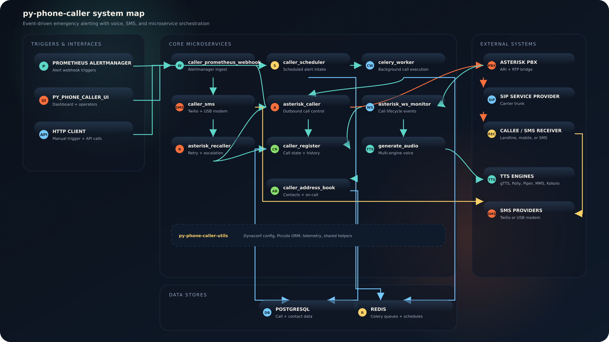

#### A Little Description Of The Components

The **py-phone-caller** ecosystem is composed of several specialized microservices. Each one handles a specific part of the notification flow. Using microservices allows us to scale parts of the system independently (for example, adding more `asterisk_caller` instances to handle more concurrent calls).

*   **asterisk_caller**
    *   *Role*: Has the responsibility to place the calls against the Asterisk PBX through the REST interface (ARI). It takes a phone number and a message, then tells Asterisk to create a new channel and dial the number.
    *   *Container repository*: `quay.io/py-phone-caller/asterisk_caller`
    *   *FROM*: `rockylinux:9-minimal` (base container image)
    *   *Endpoints*:
        *   `POST /place_call`: Used to initiate a new outbound call.
        *   `POST /asterisk_play`: Used to play an audio file to an existing channel.

*   **asterisk_ws_monitor**
    *   *Role*: This component acts as a permanent listener. It registers the "Stasis" application against Asterisk and maintains a WebSocket connection to receive real-time events.
    *   *Container repository*: `quay.io/py-phone-caller/asterisk_ws_monitor`
    *   *FROM*: `rockylinux:9-minimal`
    *   *Events handled*: `StasisStart`, `StasisEnd`, `ChannelDtmfReceived`.

*   **caller_register**
    *   *Role*: The "brain" and centralized registry. Every call attempt is recorded here. It tracks whether the user answered, whether they heard the message, and whether they acknowledged it by pressing a key.
    *   *Container repository*: `quay.io/py-phone-caller/caller_register`
    *   *Endpoints*:
        *   `GET /heard`: Called by Asterisk when the TTS message finishes playing.
        *   `GET /ack`: Called by Asterisk when the user presses '4'.

*   **generate_audio**
    *   *Role*: Used to create and host the audio files played by the Asterisk PBX. It uses sophisticated ML models (like Piper or Facebook MMS) to generate natural-sounding speech.
    *   *Container repository*: `quay.io/py-phone-caller/generate_audio`
    *   *FROM*: `rockylinux:9-minimal`
    *   *Note*: This image is optimized to include the models "baked in" for offline readiness.

*   **caller_prometheus_webhook**
    *   *Role*: The bridge between monitoring systems and the calling system. It receives standard Prometheus alerts and transforms them into phone calls or SMS messages.
    *   *Container repository*: `quay.io/py-phone-caller/caller_prometheus_webhook`
    *   *Endpoints*:
        *   `call_only`: used to originate a single call.
        *   `sms_only`: used to send a single SMS.
        *   `sms_before_call`: first, send an SMS and later originate a call (after a configurable wait).
        *   `call_and_sms`: used to send the SMS and place the call at the same time.

#### Current Limitations

Right now, within the current version, there's not a *global call traffic controller*. This means that every **Stasis application** instance can manage *only one call at once*. If you need to handle 10 concurrent calls, you should run 10 instances of `asterisk_caller` and `asterisk_ws_monitor`, each with a unique Stasis application name and a corresponding entry in the Asterisk dialplan.

> **Important**: The '**chan_pjsip**' (PJSIP channel) is not yet fully supported in all configurations. For the most stable results, we recommend using legacy '**chan_sip**' (Legacy) as shown in this guide.

---

### 1. Prerequisites

Before diving into the installation, let's look at the environment we are going to build.

*   **To send a SMS message**: A [Twilio account](https://www.twilio.com/sms) is required. You will need your Account SID, Auth Token, and a Twilio phone number.
*   **A PostgreSQL Database**: Used to store call logs, events, and schedules. We will run this in a container.
*   **A Redis Instance**: Used as a broker for Celery tasks (scheduling).

#### 1.1. Operating System and PBX

All the tests and working setups are running on:
*   **Fedora Server 34+** (IP Address: `192.168.122.104`)
*   **FreePBX 15+ (CentOS 7 based)** (IP Address: `192.168.122.234`)

> Please consider that the IP addresses will change according to your setup. Be sure to update them in the configuration files and dialplan.

---

### 2. Configuration of the Asterisk PBX

Some configurations are needed from the Asterisk side. In order to place calls to cell phones or landlines, we need to configure a **SIP Trunk**. If we choose to use only local extensions, we need to create a **SIP** or **IAX2** extension.

Last but not least, a *custom extension* and an **ARI** (*Asterisk REST Interface*) user are needed for use by **py-phone-caller**.

#### 2.1. Configuration of the SIP Trunk

> Used to place calls on the public phone network.

1.  First press the "**Connectivity**" button.
2.  Later press the "**Trunks**" button.

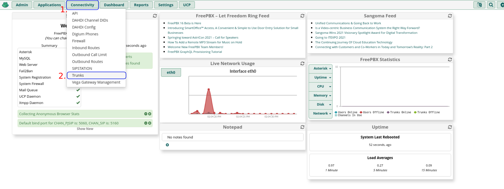

1.  Press the "**+ Add Trunk**" button.
2.  Press the "**+ Add SIP (chan_sip) Trunk**" button.

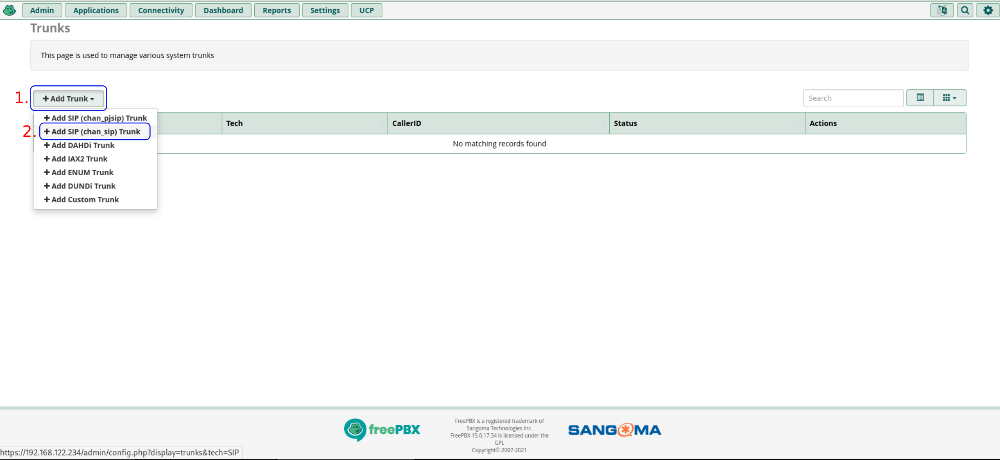

1.  Configure the "**Trunk Name**" (e.g., `sip-provider`).
2.  In the "**Outbound CallerID**" use your assigned number.
3.  Open the tab "**sip Settings**".

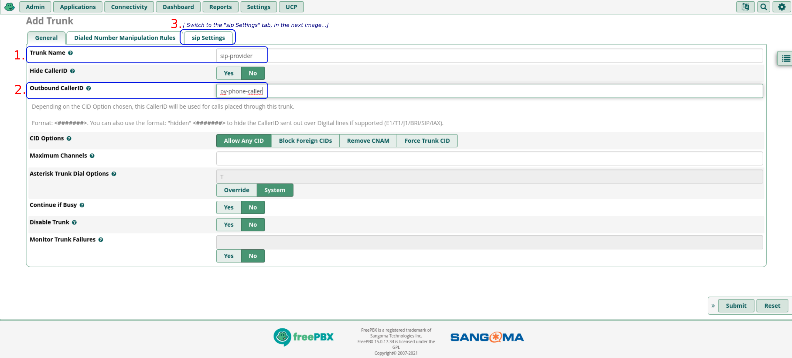

1.  Open the "**Outgoing**" tab.
2.  On the "**PEER Details**" section, insert the configuration provided by your provider.

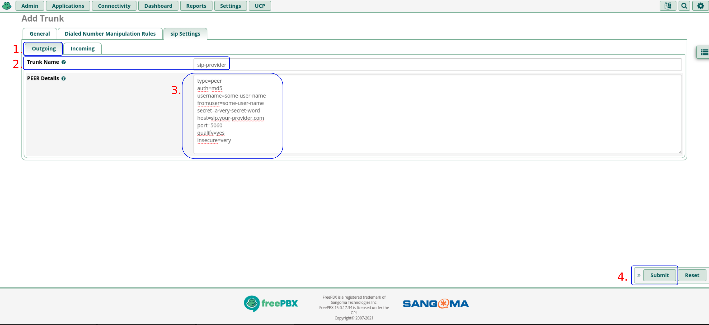

*   **PEER Details configuration example**:

```ini
type=peer
auth=md5
username=your-username
fromuser=your-username
secret=your-password
host=sip.provider.com
port=5060
qualify=yes
insecure=very
```

1.  Press the '**Apply Config**' button and wait for the reload.

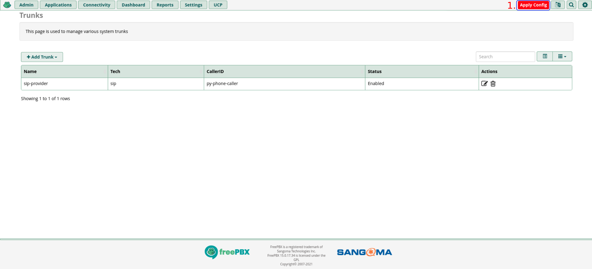
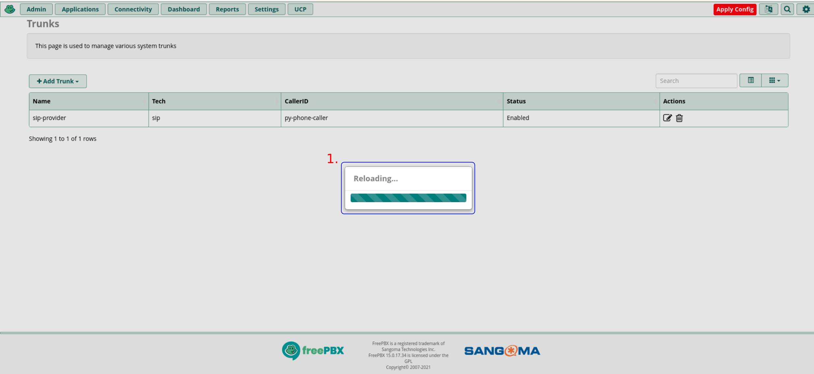

#### 2.2. Configuration of the Custom Extension (Dialplan)

Within this configuration, we'll be able to start a call and pass the control to **py-phone-caller**.

1.  Press the "**Admin**" button.
2.  Choose the "**Config Edit**" option.

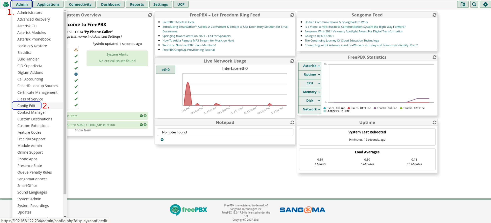

1.  Select '**extensions_custom.conf**'.
2.  Add the following dialplan logic:

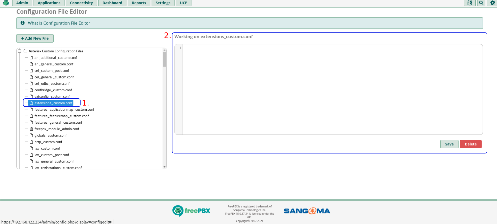

```ini
[py-phone-caller]
exten => 3216,1,Noop()
; 1. Play the initial greeting
same => n,Playback(greeting-message)
; 2. Hand control to the Stasis application
same => n,Stasis(py-phone-caller)
; 3. Notify the microservice that the message was heard
same => n,Set(RES=${CURL(http://192.168.122.104:8083/heard?asterisk_chan=${CHANNEL(uniqueid)})})
; 4. Prompt for acknowledgement
same => n,Playback(press-4-for-acknowledgement)
same => n,Playback(beep)
same => n,Read(get,"silence/1",,,,2)
; 5. Decision logic
same => n,Set(gotdigit=${ISNULL(${get})})
same => n,GotoIf(${gotdigit}=1?20)
same => e,Playback(vm-goodbye)
same => n,Set(NOTIFYACK=${IF($[ ${get} = 4]?3:0)})
same => n,Wait(1)
same => n,GotoIf(${NOTIFYACK}=3?30)
; 20: No input
same => 20,Set(NOTIFYACK=2)
same => 21,Playback(vm-goodbye)
same => 22,Wait(1)
same => 23,Hangup()
; 30: Acknowledged!
same => 30,Set(RES=${CURL(http://192.168.122.104:8083/ack?asterisk_chan=${CHANNEL(uniqueid)})})  
same => 31,Playback(vm-goodbye)
same => 32,Wait(1)
same => 33,Hangup()
```

1.  Check again the "**Working on extensions_custom.conf**" text area in order to validate the new settings.

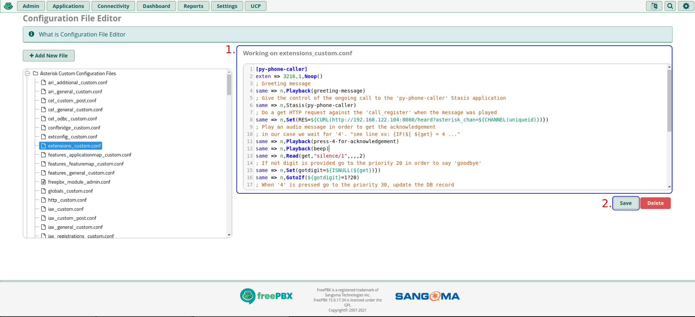

1.  Save the changes by pressing the "**Save**" button.
2.  **Apply Config**.

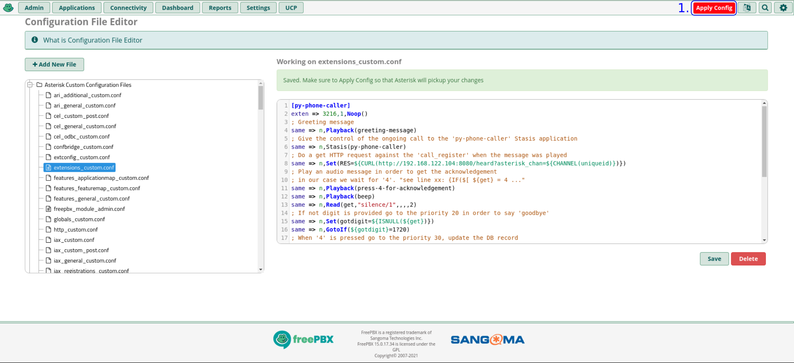

1. Wait until the configuration reloading process is done.

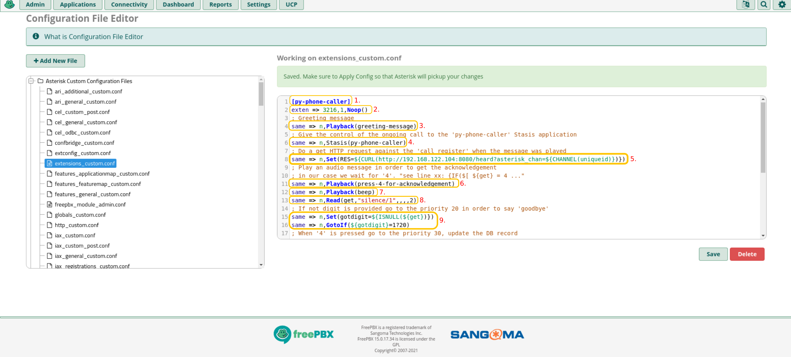

#### 2.3. Creating a Standard Extension (The Callee)

> Used to call a soft-phone or VoIP phone instead of a landline.

1.  Press "**Applications**" -> "**Extensions**".
2.  Select "**+ Add Extension**" -> "**Add New SIP (Legacy) [chan_sip] Extension**".

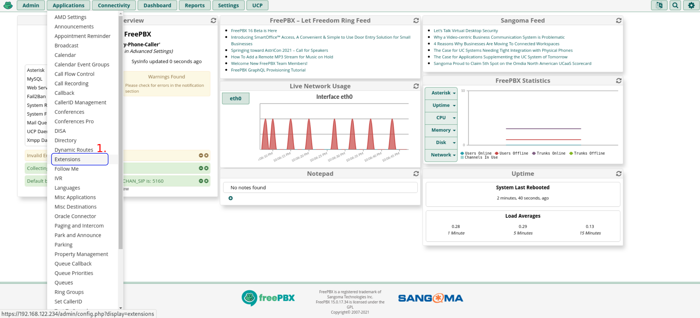

1.  Set "**User Extension**" to `1614`.
2.  Set a strong "**Secret**".
3.  **Submit** and **Apply Config**.

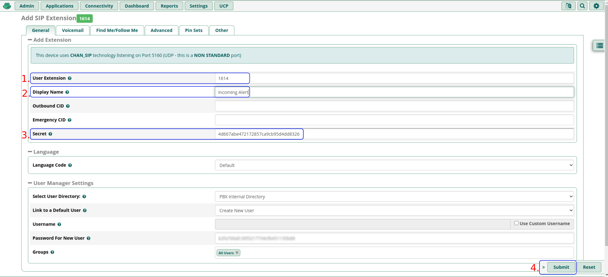

#### 2.4. Configuration of the Asterisk ARI User

This user is vital for the WebSocket monitor and the caller service.

1.  Press "**Settings**" -> "**Asterisk REST Interface Users**".
2.  Press "**+ Add User**".

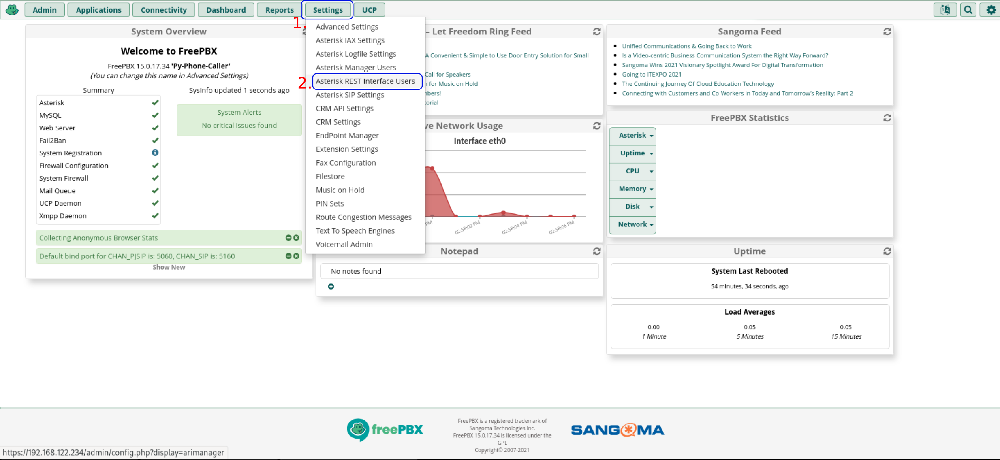

1.  Set name to `py-phone-caller`.
2.  Set "**Read Only**" to "**No**".
3.  **Submit** and **Apply Config**.

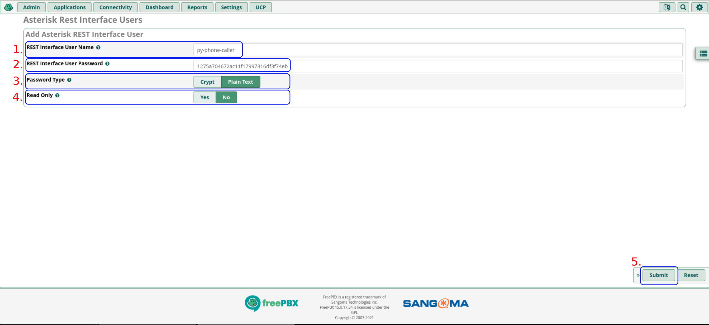

---

### 3. Creating and Transferring Audio Files

Asterisk needs static files for the dialplan.

**1. Install tools on Fedora**:
```bash
[fedora@fedora ~]$ sudo dnf -y install espeak-ng sox
```

**2. Generate files**:
```bash
[fedora@fedora ~]$ espeak -s 140 -g 4 -w /tmp/greeting-message_22050.wav "Hello, this is a recorded message from the Alerting System."
[fedora@fedora ~]$ espeak -s 140 -g 4 -w /tmp/press-4-for-acknowledgement_22050.wav "Please, Press the number 'four' to acknowledge this call."
```

**3. Resample to 8000Hz Mono**:
```bash
[fedora@fedora ~]$ sox /tmp/greeting-message_22050.wav -r 8000 -c 1 /tmp/greeting-message.wav 
[fedora@fedora ~]$ sox /tmp/press-4-for-acknowledgement_22050.wav -r 8000 -c 1 /tmp/press-4-for-acknowledgement.wav
```

**4. Transfer to PBX**:
```bash
[fedora@fedora ~]$ scp /tmp/*.wav root@192.168.122.234:/var/lib/asterisk/sounds/en/
[root@freepbx ~]# chown asterisk.asterisk /var/lib/asterisk/sounds/en/*.wav
```

---

### 4. Installing Dependencies on Fedora Server

Before we can run our microservices, we need to install the core container engine and some helper utilities. These steps need to be done as '**root**'.

Become root user:
```bash
[fedora@fedora ~]$ sudo -i
```

Install Podman and its plugins:
```bash
[root@fedora ~]# dnf -y install podman podman-plugins podman-docker
Last metadata expiration check: 0:42:59 ago on Wed 28 Jul 2021 23:31:23 PM CEST.
Dependencies resolved.
====================================================================================================
 Package                   Architecture   Version                     Repository               Size
====================================================================================================
Installing:
 podman                    x86_64         3:3.2.3-1.fc34              updates                  12 M
 podman-docker             noarch         3:3.2.3-1.fc34              updates                 177 k
 podman-plugins            x86_64         3:3.2.3-1.fc34              updates                 2.6 M
Installing dependencies:
 conmon                    x86_64         2:2.0.29-2.fc34             updates                  53 k
 container-selinux         noarch         2:2.164.1-1.git563ba3f.fc34 updates                  48 k
 containernetworking-plugins x86_64       1.0.0-0.2.rc1.fc34          updates                 8.9 M
 containers-common         noarch         4:1-21.fc34                 updates                  61 k

Transaction Summary
====================================================================================================
Install  20 Packages

Total download size: 25 M
Installed size: 123 M
Is this ok [y/N]: y
[...]
Complete!
```

Dropping the '**root**' privileges:
```bash
[root@fedora ~]# exit
logout
```

---

### 5. Deployment with Podman

#### 5.1. Preparation

Clone the repo and create directories:
```bash
[fedora@fedora ~]$ git clone https://github.com/your-repo/py-phone-caller.git
[fedora@fedora ~]$ cd py-phone-caller
[fedora@fedora ~]$ mkdir -p /opt/py-phone-caller/{config,audio}
[fedora@fedora ~]$ cp src/config/{settings.toml,.secrets.toml} /opt/py-phone-caller/config/
```

#### 5.2. Podman Network

```bash
[fedora@fedora ~]$ podman network create --subnet=172.19.0.0/24 py-phone-caller
```

#### 5.3. Infrastructure (DB & Redis)

**PostgreSQL**:
```bash
[fedora@fedora ~]$ podman run -d --name=postgres_db --network=py-phone-caller \
  --ip=172.19.0.50 --restart=always \
  -e POSTGRES_PASSWORD=StrongDBPassword \
  -v pgdata:/var/lib/postgresql/data \
  docker.io/library/postgres:13-alpine
```

**Redis**:
```bash
[fedora@fedora ~]$ podman run -d --name=redis_queue --network=py-phone-caller \
  --ip=172.19.0.60 --restart=always \
  docker.io/library/redis:alpine
```

#### 5.4. Building Images

```bash
[fedora@fedora py-phone-caller]$ cd src
[fedora@fedora src]$ ./build_all_images.sh
```

#### 5.5. Running the Microservices

We'll run all 10 services. Note the volume mounts for configuration and audio. We use the `:Z` flag on volume mounts to handle SELinux permissions correctly in rootless Podman.

> **Good news**, we can always use the same **configuration directory** and override the settings with environmental variables that have priority over the values in the configuration file.

```bash
# 1. Caller Register (The Database manager)
# It handles automatic migrations and records all call states.
podman run -d --name caller_register --network py-phone-caller -p 8083:8083 \
  -v /opt/py-phone-caller/config:/app/config:Z caller_register

# 2. Asterisk WS Monitor (The Event Listener)
# This MUST be running for any call to progress beyond the initial dial.
podman run -d --name asterisk_ws_monitor --network py-phone-caller \
  -v /opt/py-phone-caller/config:/app/config:Z \
  -v /opt/py-phone-caller/audio:/app/audio:Z asterisk_ws_monitor

# 3. Asterisk Caller (The Call Initiator)
# It tells Asterisk to start the call via the ARI REST API.
podman run -d --name asterisk_caller --network py-phone-caller -p 8081:8081 \
  -v /opt/py-phone-caller/config:/app/config:Z asterisk_caller

# 4. Generate Audio (The TTS factory)
# Converts alert text to WAV files. It uses Piper or MMS engines.
podman run -d --name generate_audio --network py-phone-caller -p 8082:8082 \
  -v /opt/py-phone-caller/config:/app/config:Z \
  -v /opt/py-phone-caller/audio:/app/audio:Z generate_audio

# 5. Py-Phone-Caller UI (The Dashboard)
# Accessible on port 5000. Use UI_USER_RESET_PASSWORD=true for the first run.
podman run -d --name py_phone_caller_ui --network py-phone-caller -p 5000:5000 \
  -v /opt/py-phone-caller/config:/app/config:Z \
  -e UI_USER_RESET_PASSWORD=true py_phone_caller_ui

# 6. Caller Scheduler (The Planner)
# Enqueues future calls into Redis.
podman run -d --name caller_scheduler --network py-phone-caller -p 8086:8086 \
  -v /opt/py-phone-caller/config:/app/config:Z caller_scheduler

# 7. Celery Worker (The Background Processor)
# Picks up tasks from Redis and executes them.
podman run -d --name celery_worker --network py-phone-caller \
  -v /opt/py-phone-caller/config:/app/config:Z \
  py_phone_caller_ui \
  -m celery -A py_phone_caller_utils.tasks.celery_task worker --loglevel=info

# 8. Caller Address Book (The Directory)
# Manages contacts and on-call rotations.
podman run -d --name caller_address_book --network py-phone-caller -p 8087:8087 \
  -v /opt/py-phone-caller/config:/app/config:Z caller_address_book

# 9. Caller SMS (The Twilio Bridge)
# Sends SMS notifications asynchronously.
podman run -d --name caller_sms --network py-phone-caller -p 8085:8085 \
  -v /opt/py-phone-caller/config:/app/config:Z caller_sms

# 10. Prometheus Webhook (The Entry Point)
# Receives alerts from Prometheus AlertManager.
podman run -d --name caller_prometheus_webhook --network py-phone-caller -p 8084:8084 \
  -v /opt/py-phone-caller/config:/app/config:Z caller_prometheus_webhook

# 11. Asterisk Recaller (The Nagging Service)
# Retries failed calls found in the DB.
podman run -d --name asterisk_recaller --network py-phone-caller \
  -v /opt/py-phone-caller/config:/app/config:Z asterisk_recaller
```

---

### 6. Systemd Integration & Rootless Persistence

In a rootless Podman setup, containers are managed by the user session. By default, when you log out, the containers might be stopped or suspended. To prevent this and ensure our notification system is always online, we need to enable "lingering" for the user and integrate with `systemd`.

#### 6.1. Enable User Lingering

This command tells the system to start a user manager for your user at boot and keep it running even after you log out.

```bash
[fedora@fedora ~]$ sudo loginctl enable-linger $USER
```

#### 6.2. Generating and Enabling Unit Files

Podman has a built-in command to generate systemd unit files from running containers. This is much easier than writing them manually.

```bash
[fedora@fedora ~]$ mkdir -p ~/.config/systemd/user
[fedora@fedora ~]$ cd ~/.config/systemd/user

# Generate unit files for our core stack
[fedora@fedora user]$ for container in postgres_db redis_queue caller_register asterisk_ws_monitor asterisk_caller generate_audio py_phone_caller_ui; do
    podman generate systemd --name $container --files --restart-policy=always
done

# Reload the user systemd daemon to pick up the new files
[fedora@fedora user]$ systemctl --user daemon-reload

# Enable and start the services
[fedora@fedora user]$ systemctl --user enable --now container-postgres_db.service
[fedora@fedora user]$ systemctl --user enable --now container-redis_queue.service
[fedora@fedora user]$ systemctl --user enable --now container-caller_register.service
[fedora@fedora user]$ systemctl --user enable --now container-asterisk_ws_monitor.service
[fedora@fedora user]$ systemctl --user enable --now container-asterisk_caller.service
[fedora@fedora user]$ systemctl --user enable --now container-generate_audio.service
[fedora@fedora user]$ systemctl --user enable --now container-py_phone_caller_ui.service
```

#### 6.3. Verifying the Service Status

You can check the status of your services using `systemctl --user status`.

```bash
[fedora@fedora user]$ systemctl --user status container-py_phone_caller_ui.service
● container-py_phone_caller_ui.service - Podman container-py_phone_caller_ui.service
     Loaded: loaded (/home/fedora/.config/systemd/user/container-py_phone_caller_ui.service; enabled; vendor preset: enabled)
     Active: active (running) since Mon 2026-01-11 22:00:00 CEST; 5min ago
       Docs: man:podman-generate-systemd(1)
   Main PID: 1234 (conmon)
[...]
```

---

### 7. Verification and Testing

Once the system is up and running, it's time to verify that all the pieces are working together.

#### 7.1. Accessing the Web UI

Open your browser and navigate to `http://192.168.122.104:5000`. You should see the login screen.

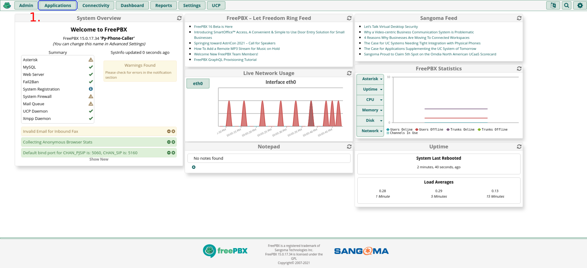

To find your administrative password, check the logs of the UI container:
```bash
[fedora@fedora ~]$ podman logs py_phone_caller_ui | grep "Admin password"
[2026-01-11 22:01:05] INFO: Admin user exists. Admin password reset to: xK9j-P2qL-8vR4
```

#### 7.2. Functional Test: Placing a Call

We can simulate an alert by sending an HTTP POST request to the `asterisk_caller` service. This will trigger a call to the specified number and play the TTS message.

```bash
[fedora@fedora ~]$ curl -X POST http://localhost:8081/place_call \
  -H "Content-Type: application/json" \
  -d '{
    "phone_number": "1614",
    "message": "Attention! This is a functional test of the py-phone-caller system. Please acknowledge by pressing four."
  }'
```

If everything is correct:
1.  Your VoIP phone (extension 1614) will ring.
2.  When you answer, you will hear the greeting message.
3.  Then you will hear the TTS message generated on the fly.
4.  Finally, it will ask you to press '4'.
5.  Check the UI "Calls" section; the call should appear as "Heard" and then "Acknowledged" after you press '4'.

#### 7.3. Verifying the SMS Gateway

If you have configured Twilio, test the SMS service:

```bash
[fedora@fedora ~]$ curl -X POST http://localhost:8085/send_sms \
  -H "Content-Type: application/json" \
  -d '{
    "phone_number": "+1234567890",
    "message": "Verification SMS from your new py-phone-caller installation!"
  }'
```

---

### 8. Firewall Configuration

If you want to access the services from other machines in your LAN, you MUST open the ports in the Fedora firewall.

```bash
[fedora@fedora ~]$ sudo -i
[root@fedora ~]# firewall-cmd --new-zone=py-phone-caller --permanent
[root@fedora ~]# firewall-cmd --zone=py-phone-caller --add-source=192.168.122.0/24 --permanent

# Open the UI and Microservice ports
[root@fedora ~]# for port in 5000 8081 8082 8083 8084 8085 8086 8087; do
    firewall-cmd --zone=py-phone-caller --add-port=${port}/tcp --permanent
done

[root@fedora ~]# firewall-cmd --reload
[root@fedora ~]# firewall-cmd --get-active-zones
FedoraServer
  interfaces: enp1s0
py-phone-caller
  sources: 192.168.122.0/24
```

---

### 9. Troubleshooting

Even the best installations can run into trouble. Here are some of the most common issues and how to solve them.

*   **ARI Authentication Failed**:
    *   *Symptoms*: `asterisk_caller` or `asterisk_ws_monitor` logs show 401 Unauthorized.
    *   *Solution*: Double-check the username (`py-phone-caller`) and password in `/opt/py-phone-caller/config/.secrets.toml` against what you configured in the FreePBX ARI Users menu. Ensure "**Read Only**" is set to "**No**" in FreePBX.

*   **Database Connection Errors**:
    *   *Symptoms*: Services crash at startup with `ConnectionRefusedError` or `psycopg2.OperationalError`.
    *   *Solution*: Verify that the `postgres_db` container is running (`podman ps`). Check if the IP `172.19.0.50` matches your `settings.toml`. If you changed the password in `.secrets.toml`, you MUST restart the services.

*   **Audio not playing in Asterisk**:
    *   *Symptoms*: The call is placed, you answer, but there is silence.
    *   *Solution*: 
        1. Check the `asterisk_ws_monitor` logs. It might be failing to reach the `generate_audio` service.
        2. Verify that the generated `.wav` files exist in `/opt/py-phone-caller/audio` on the Fedora host.
        3. Ensure Asterisk has permissions to read the static files in `/var/lib/asterisk/sounds/en/`.

*   **Containers not starting after a reboot**:
    *   *Symptoms*: `podman ps` is empty after a system reboot.
    *   *Solution*: Ensure you executed `sudo loginctl enable-linger $USER`. Verify the systemd units are enabled: `systemctl --user list-unit-files | grep container`.

*   **Prometheus Alerts not triggering calls**:
    *   *Symptoms*: AlertManager shows successful delivery to the webhook, but nothing happens.
    *   *Solution*: Check the `caller_prometheus_webhook` logs. It might be failing to reach `asterisk_caller` or the phone number resolution in `caller_address_book` might be failing.

---
> **Done!** You have a fully functional, modern automated calling system. If you enjoyed this guide, remember to keep your system updated and your secrets secure.
