# 💻 VirtualBox Lab Setup for py-phone-caller

This guide explains how to configure a two-virtual-machine lab environment in **VirtualBox** for testing **py-phone-caller** alongside **Asterisk / FreePBX**.

---

## 📑 Table of Contents

1. [Lab Topology & Network Architecture](#1-lab-topology--network-architecture)
2. [Configuring the VirtualBox Host-Only Network](#2-configuring-the-virtualbox-host-only-network)
3. [Configuring the VirtualBox NAT Network](#3-configuring-the-virtualbox-nat-network)
4. [Configuring Network Adapters for py-phone-caller VM](#4-configuring-network-adapters-for-py-phone-caller-vm)
5. [Configuring Network Adapters for FreePBX / Asterisk VM](#5-configuring-network-adapters-for-freepbx--asterisk-vm)
6. [Connectivity Verification](#6-connectivity-verification)

---

## 1. Lab Topology & Network Architecture

The lab setup isolates telephony and inter-service communication inside a VirtualBox **NAT Network**, while providing management access from the virtualization host via a **Host-Only Adapter**:

- **NAT Network (`10.22.22.0/24`)**: Internal communication between **py-phone-caller** and the **Asterisk PBX**.
- **Host-Only Network (`192.168.56.0/24`)**: Access from your physical workstation to the Web UI (`http://192.168.56.102:5000`) and FreePBX admin interface (`http://192.168.56.101`).

```text
[ Physical Workstation / Browser ]
           |
   (Host-Only Network: 192.168.56.0/24)
           |
           +---> [ py-phone-caller VM ] (192.168.56.102 / 10.22.22.105)
           |            |
           |    (NAT Network: 10.22.22.0/24)
           |            |
           +---> [ FreePBX / Asterisk VM ] (192.168.56.101 / 10.22.22.234)
```

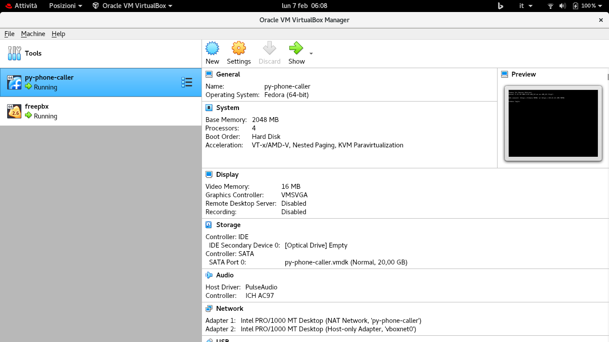

---

## 2. Configuring the VirtualBox Host-Only Network

1. Open VirtualBox, click **File** in the top menu, and select **Host Network Manager...**

   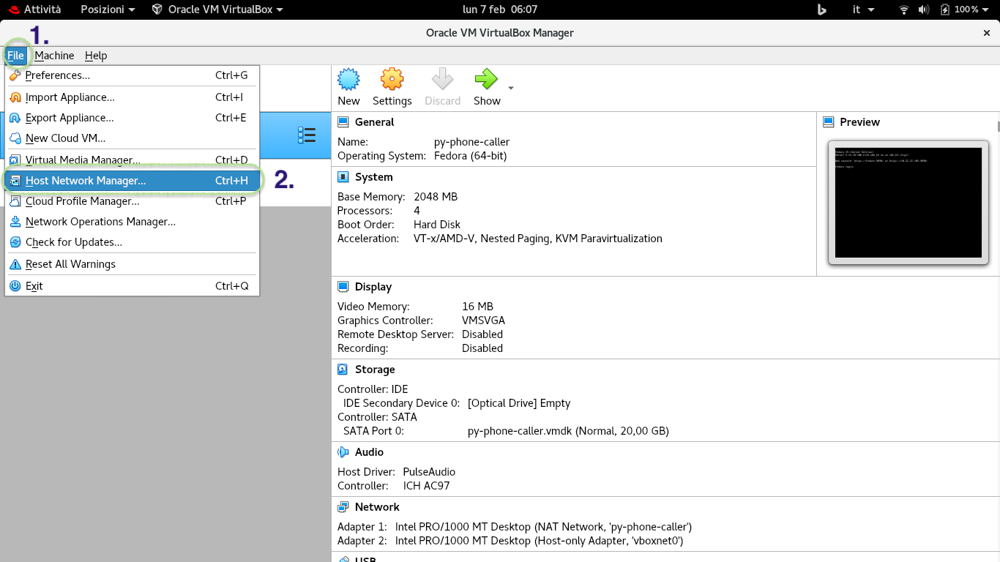

2. Select `vboxnet0` (or create a new host-only adapter by clicking **Create**).
3. Under **Properties**, ensure the IPv4 configuration is set to:
   - **IPv4 Address**: `192.168.56.1`
   - **IPv4 Network Mask**: `255.255.255.0`
4. Click **Apply**.

   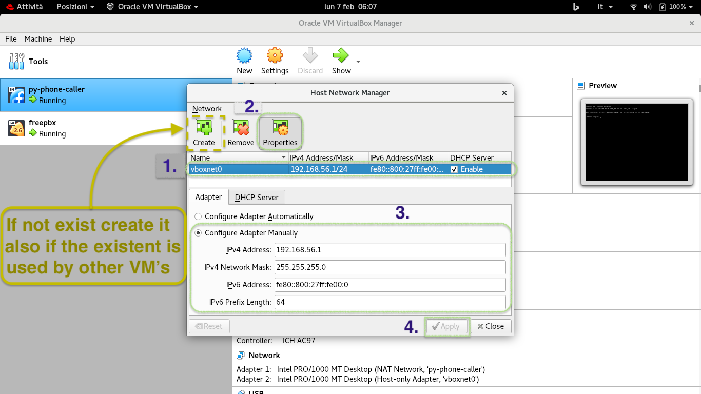

---

## 3. Configuring the VirtualBox NAT Network

1. In the top menu, click **File** ➔ **Preferences...** (or **Tools** ➔ **Network**).

   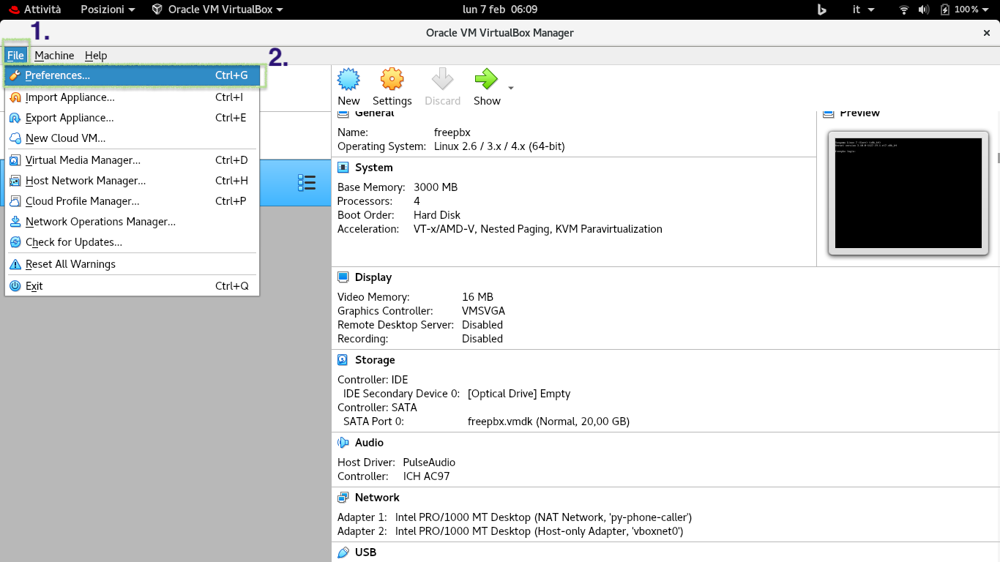

2. Select **Network** in the left sidebar.
3. If `py-phone-caller` does not exist, click the **+** button to add a new NAT Network.
4. Click the gear icon (**Edit**) on the network.

   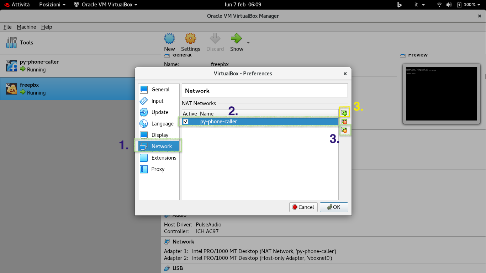

5. Configure:
   - **Network Name**: `py-phone-caller`
   - **IPv4 Prefix / CIDR**: `10.22.22.0/24`
   - **Enable DHCP**: Checked (`Yes`)
6. Click **OK**.

   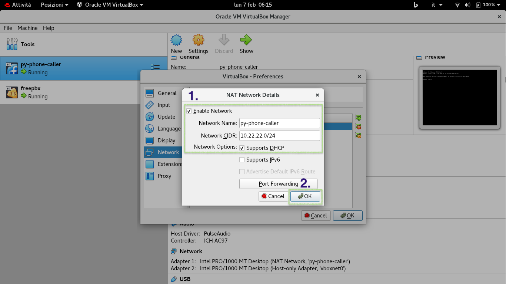

---

## 4. Configuring Network Adapters for py-phone-caller VM

1. Select the `py-phone-caller` virtual machine, right-click, and select **Settings...**

   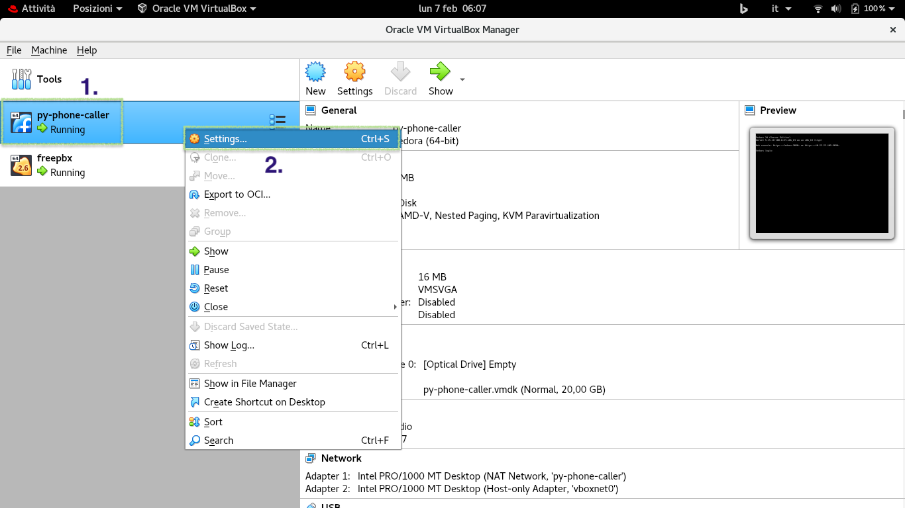

2. Click **Network** in the sidebar.
3. Under **Adapter 1**:
   - **Attached to**: `NAT Network`
   - **Name**: `py-phone-caller`
   - **Cable Connected**: Checked (`Yes`)

   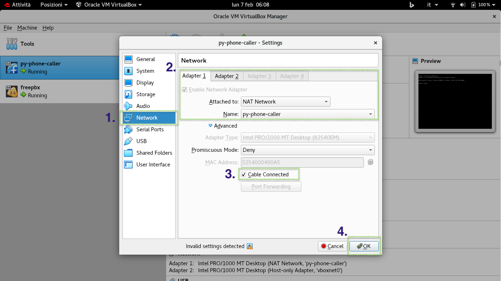

4. Under **Adapter 2**:
   - Check **Enable Network Adapter**
   - **Attached to**: `Host-only Adapter`
   - **Name**: `vboxnet0`
   - **Cable Connected**: Checked (`Yes`)
5. Click **OK**.

   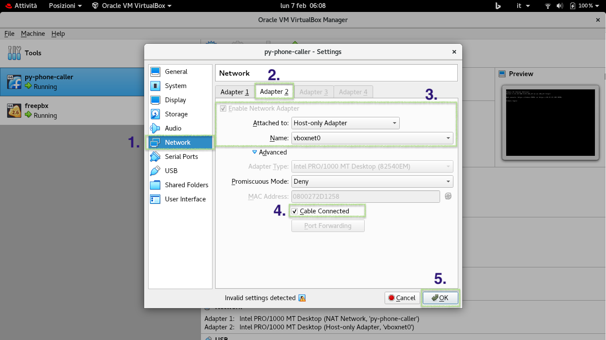

---

## 5. Configuring Network Adapters for FreePBX / Asterisk VM

1. Select the `freepbx` virtual machine, right-click, and select **Settings...**

   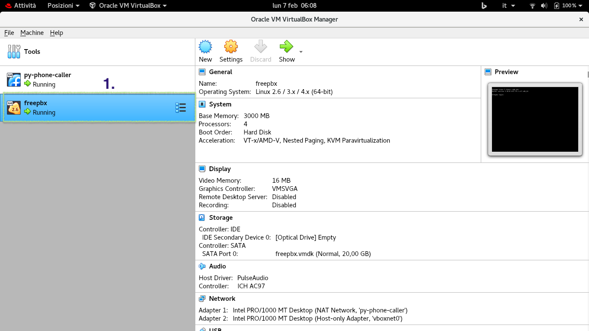
   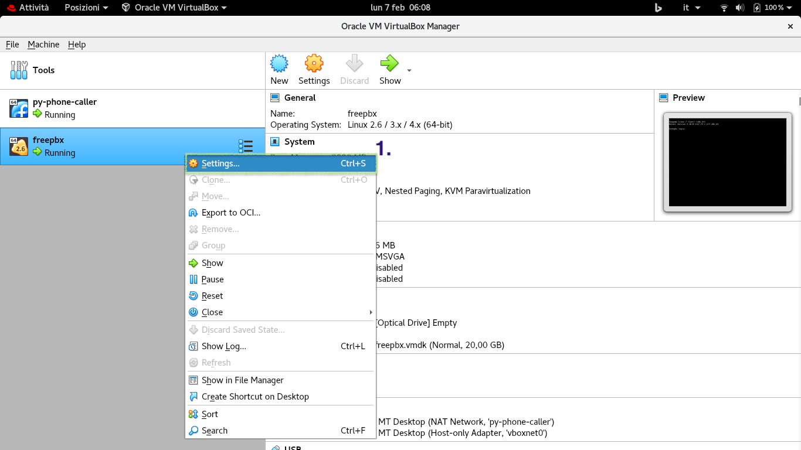

2. Under **Adapter 1**:
   - **Attached to**: `NAT Network`
   - **Name**: `py-phone-caller`
   - **Cable Connected**: Checked (`Yes`)

   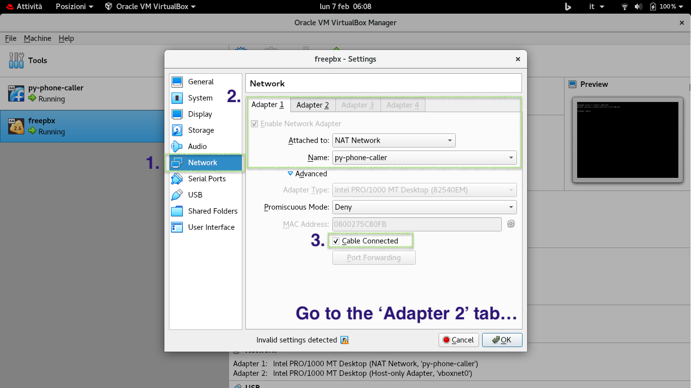

3. Under **Adapter 2**:
   - Check **Enable Network Adapter**
   - **Attached to**: `Host-only Adapter`
   - **Name**: `vboxnet0`
   - **Cable Connected**: Checked (`Yes`)
4. Click **OK**.

   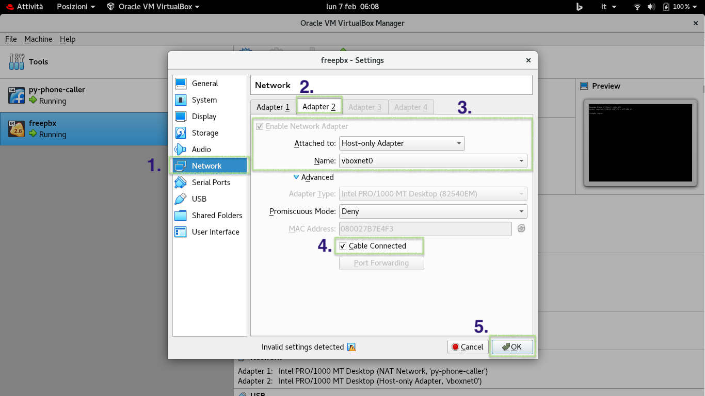

---

## 6. Connectivity Verification

Boot both virtual machines and test connectivity:

1. From your host workstation:
   - Ping FreePBX: `ping 192.168.56.101`
   - Ping py-phone-caller: `ping 192.168.56.102`
   - Open Web UI: `http://192.168.56.102:5000`
2. From inside the `py-phone-caller` VM:
   - Test Asterisk ARI: `curl -u py-phone-caller:password http://10.22.22.234:8088/ari/asterisk/info`
