# Web UI Tour

py-phone-caller provides a secure operator UI for scheduling calls, managing on-call coverage, and inspecting PBX events. This tour walks the end-to-end workflow from login to acknowledgment.

<a id="feature-tiles"></a>
## &#9635; Feature Tiles [&#9733;](#feature-tiles)
| Alertmanager Webhooks | Scheduled Voice Alerts | Managed Call Lifecycle |
| --- | --- | --- |
| Retries + Acknowledgment | On-call Coverage Planner | PBX Event Telemetry |
| Timezone-aware Routing | Contact Directory | Secure Operator Access |
| CSV Audit Exports | Fast Search + Filters | User Management |

<a id="mini-toc"></a>
## &#8801; Mini TOC [&#9733;](#mini-toc)
- [Feature Tiles](#feature-tiles)
- [At a glance](#at-a-glance)
- [Access & Navigation](#access-and-navigation)
- [Core Lists](#core-lists)
- [Contacts & On-call Coverage](#contacts-and-on-call-coverage)
- [Scheduling a Call](#scheduling-a-call)
- [Live Call Execution](#live-call-execution)
- [PBX Observability](#pbx-observability)
- [Alerting Integration](#alerting-integration)
- [Wrap-up](#wrap-up)

<a id="at-a-glance"></a>
## &#9678; At a glance [&#9733;](#at-a-glance)
- Secure access gate and login flow
- Unified navigation for calls, events, scheduling, and contacts
- On-call windows and calendar coverage
- Scheduled calls with text-to-speech messages
- Managed call lifecycle with retries and acknowledgments
- PBX event stream with JSON payloads and CSV export
- Alertmanager webhook integration

<a id="access-and-navigation"></a>
## &#9654; Access & Navigation [&#9733;](#access-and-navigation)
<a id="access-gate"></a>
### Access gate [&#9733;](#access-gate)
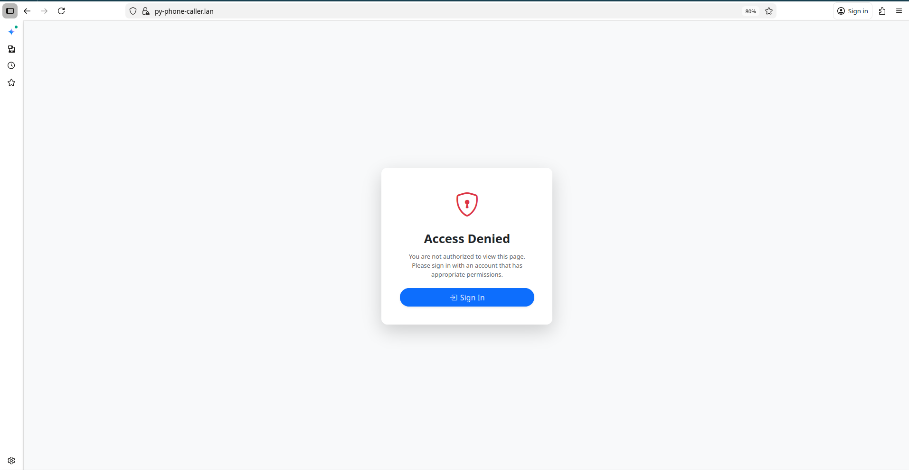
Auth gate blocks unauthenticated access; sign-in required.

<a id="login"></a>
### Login [&#9733;](#login)
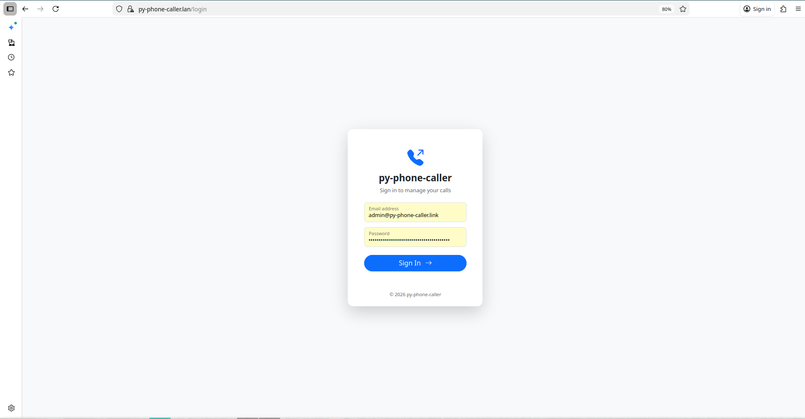
Credential form for authenticated UI access _(the initial credentials are created when the Web UI starts)_.

<a id="dashboard"></a>
### Dashboard [&#9733;](#dashboard)

Primary navigation to Managed Calls, PBX Events, Schedule Call, and Address Book.

<a id="core-lists"></a>
## &#9636; Core Lists [&#9733;](#core-lists)
<a id="managed-calls-empty-state"></a>
### Managed Calls (empty state) [&#9733;](#managed-calls-empty-state)
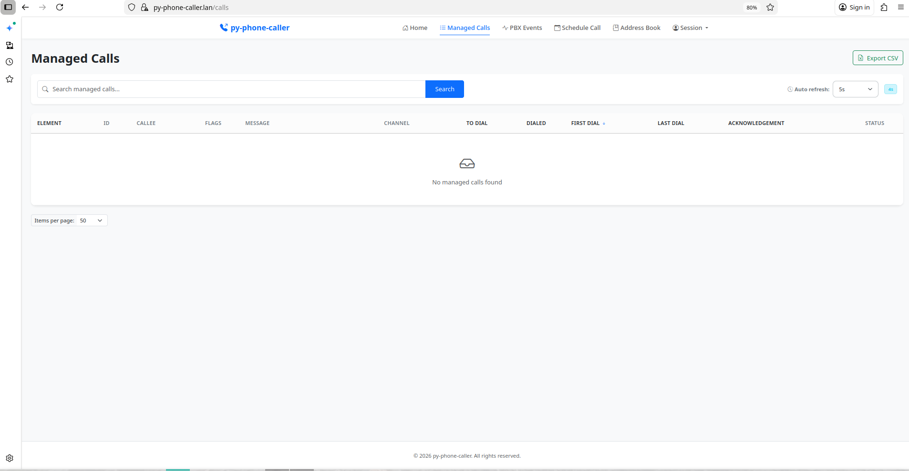
Managed Calls table with search, auto-refresh, and CSV export.

<a id="pbx-events-empty-state"></a>
### PBX Events (empty state) [&#9733;](#pbx-events-empty-state)
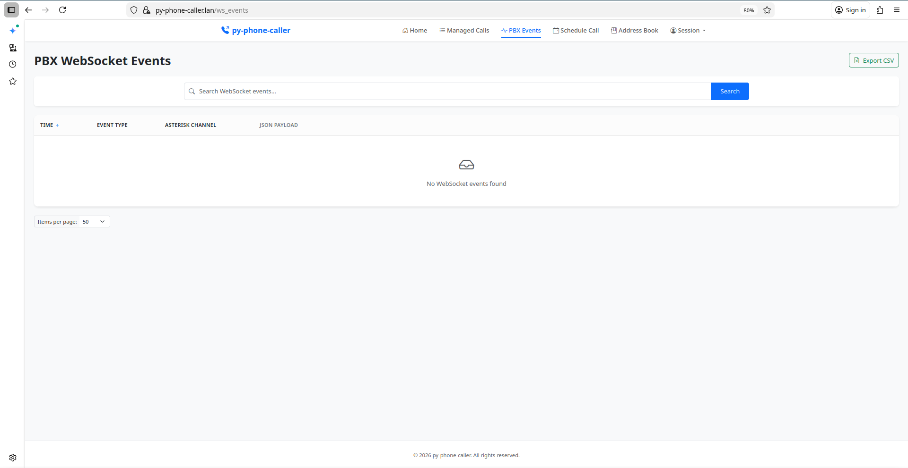
WebSocket event stream with filter and export controls.

<a id="scheduled-calls-empty-state"></a>
### Scheduled Calls (empty state) [&#9733;](#scheduled-calls-empty-state)
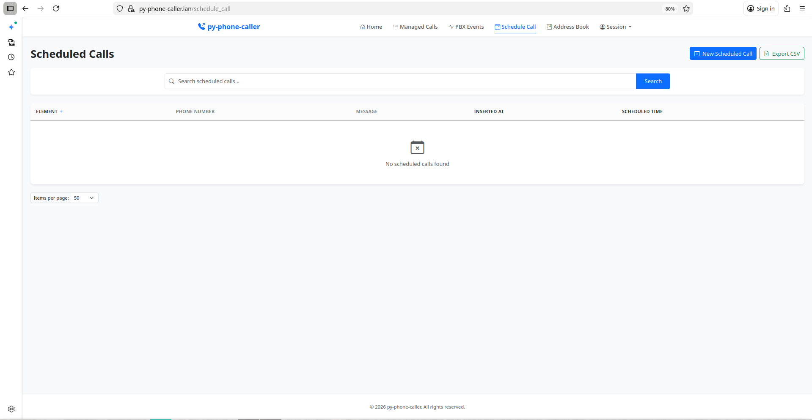
Scheduled Calls queue with a one-click create action.

<a id="address-book-empty-state"></a>
### Address Book (empty state) [&#9733;](#address-book-empty-state)
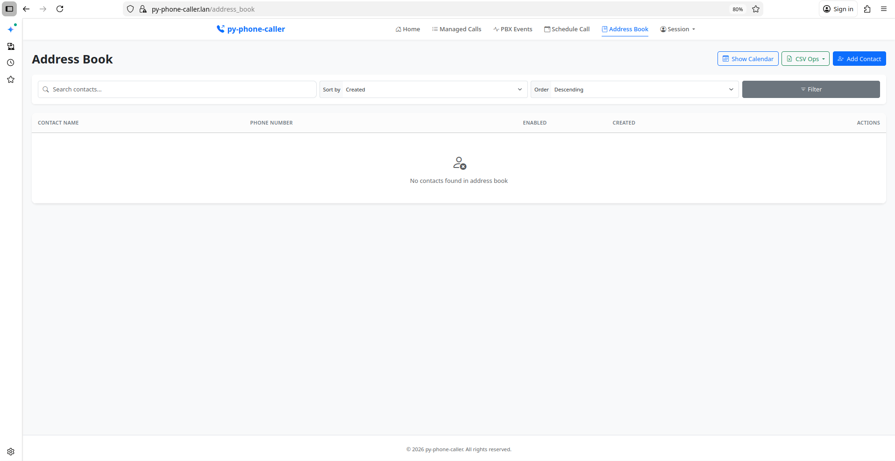
Contacts list with search, sort, filters, calendar access, and CSV tools.

<a id="user-management"></a>
### User Management [&#9733;](#user-management)
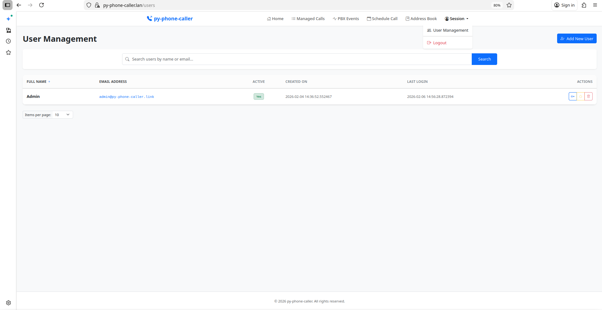
User list with active status, last login, and admin actions.

<a id="contacts-and-on-call-coverage"></a>
## &#9742; Contacts & On-call Coverage [&#9733;](#contacts-and-on-call-coverage)
<a id="add-contact"></a>
### Add Contact [&#9733;](#add-contact)
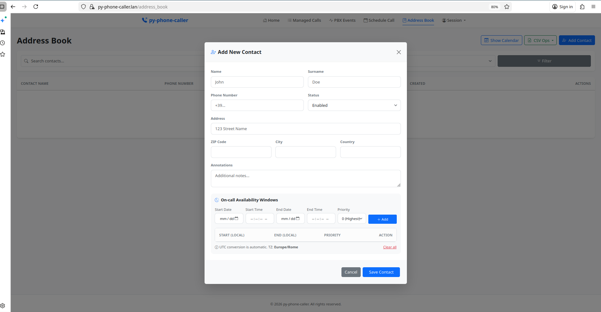
Contact creation modal with profile fields and on-call windows.

<a id="on-call-calendar"></a>
### On-call Calendar [&#9733;](#on-call-calendar)
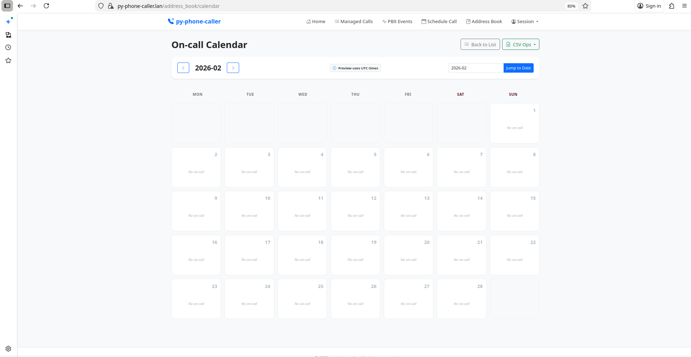
Monthly calendar with UTC preview and navigation.

<a id="define-availability-window"></a>
### Define Availability Window [&#9733;](#define-availability-window)
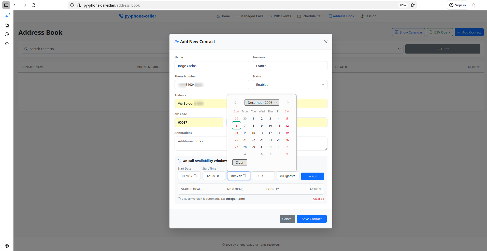
Date/time picker and priority for precise on-call coverage.

<a id="saved-contact-window"></a>
### Saved Contact Window [&#9733;](#saved-contact-window)
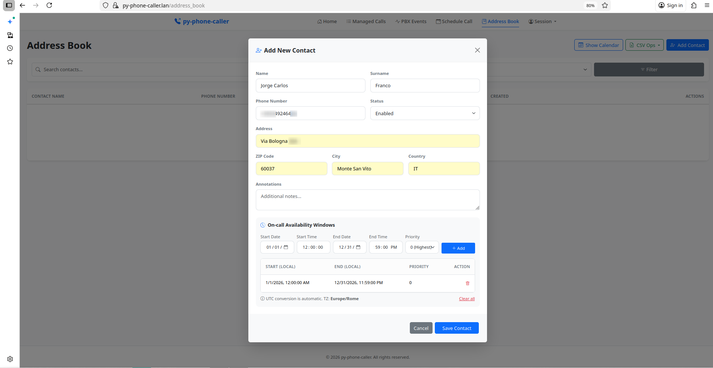
Saved availability window listed with local timezone.

<a id="calendar-populated"></a>
### Calendar Populated [&#9733;](#calendar-populated)
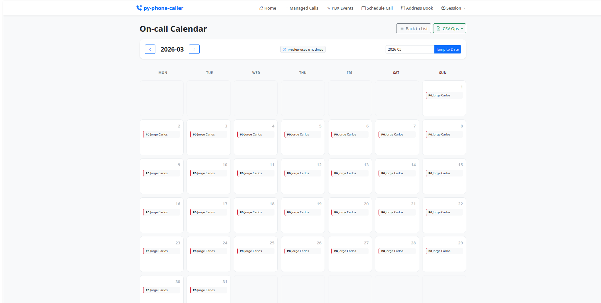
On-call blocks shown across the calendar.

<a id="scheduling-a-call"></a>
## &#8987; Scheduling a Call [&#9733;](#scheduling-a-call)
<a id="new-call-modal"></a>
### New Call Modal [&#9733;](#new-call-modal)
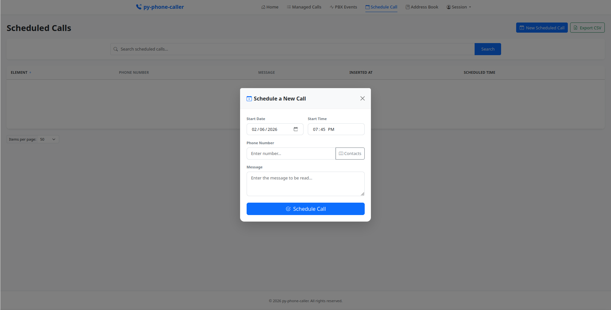
Schedule call modal with date/time, number, and message fields.

<a id="pick-contact"></a>
### Pick Contact [&#9733;](#pick-contact)
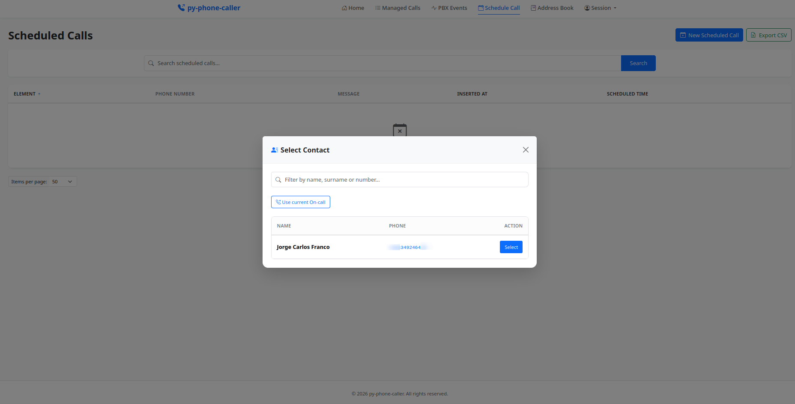
Contact picker with search and "Use current On-call" shortcut.

<a id="text-to-speech-message"></a>
### Text-to-Speech Message [&#9733;](#text-to-speech-message)
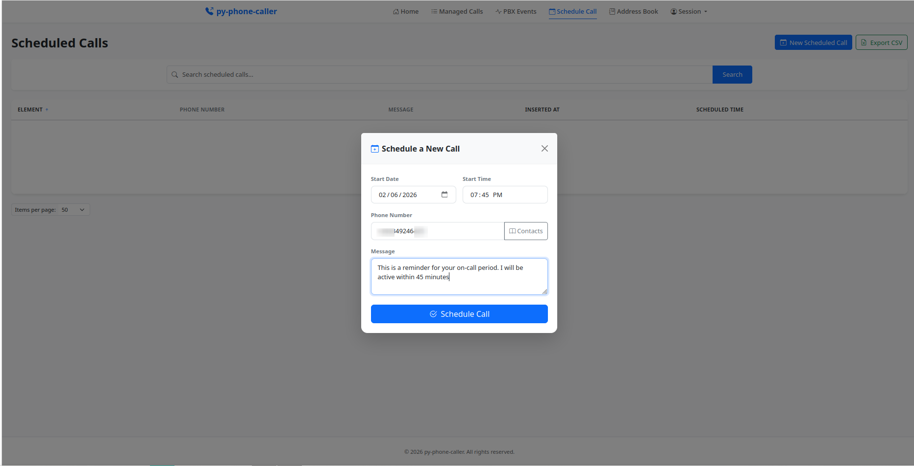
Message entry for text-to-speech delivery _(the time on this screenshot differs from the next screenshots, because the placed call was another)_.

<a id="scheduled-queue"></a>
### Scheduled Queue [&#9733;](#scheduled-queue)
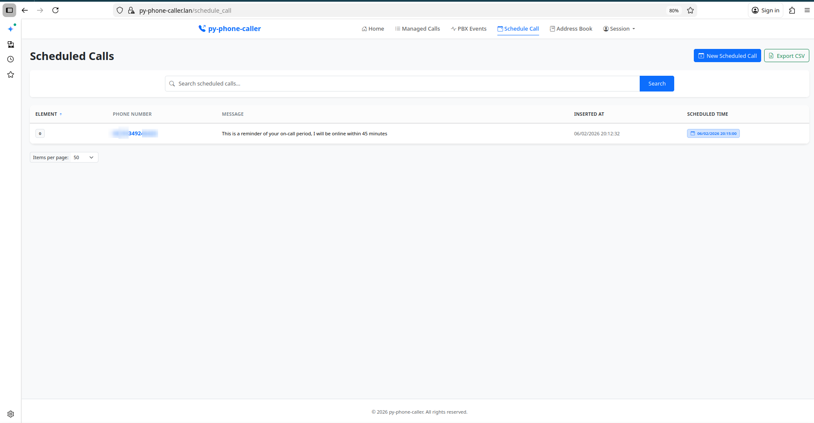
Scheduled call record with message, inserted time, and schedule time.

<a id="live-call-execution"></a>
## &#9658; Live Call Execution [&#9733;](#live-call-execution)
<a id="call-placing"></a>
### Call Placing [&#9733;](#call-placing)

Managed call in dialing state with counters and ack control.

<a id="retry-on-no-answer"></a>
### Retry on No Answer [&#9733;](#retry-on-no-answer)
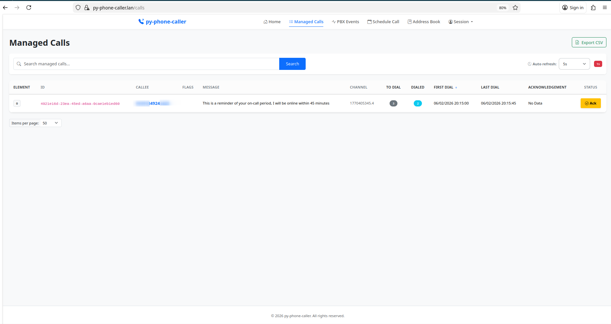
Retry attempt tracking when the callee does not answer.

<a id="call-acknowledged"></a>
### Call Acknowledged [&#9733;](#call-acknowledged)
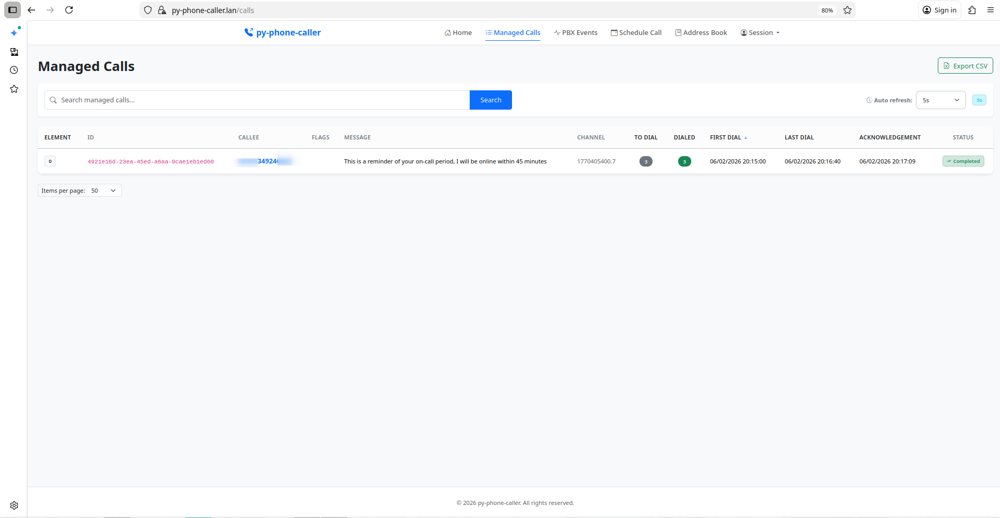
Completed call with DTMF acknowledgment (key 4) timestamp.

<a id="pbx-observability"></a>
## &#9677; PBX Observability [&#9733;](#pbx-observability)
<a id="pbx-event-trace"></a>
### PBX Event Trace [&#9733;](#pbx-event-trace)
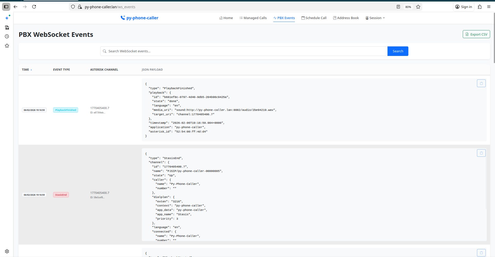
Structured PBX event JSON tied to the call for troubleshooting.

<a id="alerting-integration"></a>
## &#9888; Alerting Integration [&#9733;](#alerting-integration)
External systems can trigger calls via HTTP. Alertmanager is shown below.

Note: example of HTTP **POST** request from the Alertmanager
```http request
POST http://py-phond-caller.lan:8084/call_only
Content-Type: application/json

{
   "receiver":"webhook",
   "status":"firing",
   "alerts":[
      {
         "status":"firing",
         "labels":{
            "alertname":"TestAlertFromAlertmanager",
            "instance":"localhost:9090",
            "job":"prometheus"
         },
         "annotations":{
            "description":"Shakespeare sonnets generally focus on the themes of love and life. The first 126 are directed to a young man whom the speaker urges to marry",
            "summary":"our summary"
         },
         "startsAt":"2021-03-02T21:52:26.558311875+01:00",
         "endsAt":"0001-01-01T00:00:00Z",
         "generatorURL":"http://prometheus:9090/graph"
      }
   ],
   "groupLabels":{
      "alertname":"TestAlertFromAlertmanager",
      "job":"prometheus"
   },
   "commonLabels":{
      "alertname":"TestAlertFromAlertmanager",
      "instance":"localhost:9090",
      "job":"prometheus"
   },
   "commonAnnotations":{
      "description":"our description",
      "summary":"our summary"
   },
   "externalURL":"http://alertmanager:9093",
   "version":"4",
   "groupKey":"{}:{alertname=\"TestAlertFromAlertmanager\", job=\"prometheus\"}"
}
```

<a id="alertmanager-call"></a>
### Alertmanager Call [&#9733;](#alertmanager-call)
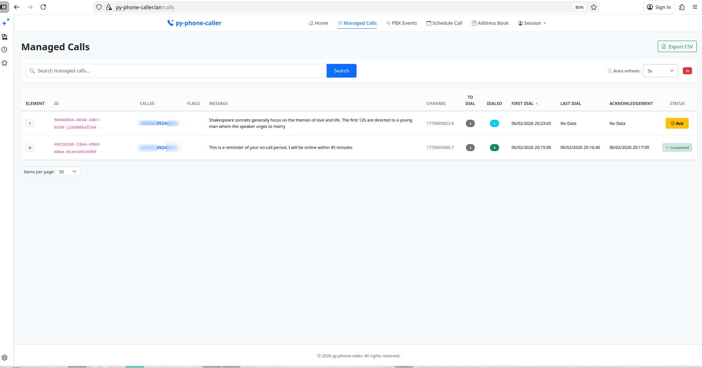
Alertmanager-triggered call visible in Managed Calls.

<a id="alertmanager-acknowledged"></a>
### Alertmanager Acknowledged [&#9733;](#alertmanager-acknowledged)
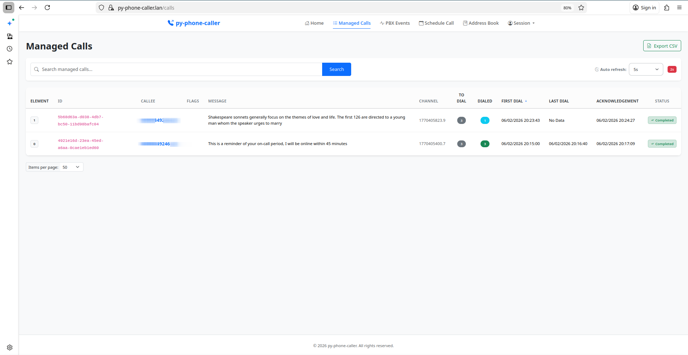
Alert-driven call completed and acknowledged.

<a id="wrap-up"></a>
## &#10004; Wrap-up [&#9733;](#wrap-up)
py-phone-caller keeps the critical path tight: schedule or trigger a call, monitor execution, and confirm acknowledgment, with PBX-level telemetry on demand.
